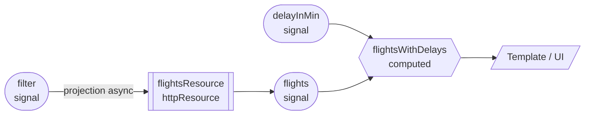

# 03 · Reactive Design with Signals
> cap.3 · pp.61-86 — *Modern Angular* v3.0.0

Finora i [[signal]] servivano solo a dire ad Angular *quando* aggiornare i binding del template. Qui si fa il salto: si usano i signal per un design **reattivo e dichiarativo**. Invece di descrivere *come* aggiornare i valori dipendenti, si descrive *da cosa* sono derivati; il framework tiene tutto in sync. Ne risulta un codice più mantenibile e meno soggetto a errori. L'analogia è il foglio di calcolo: si definiscono formule che derivano valori da altre celle, e quando cambia la sorgente le celle dipendenti si aggiornano da sole.

I mattoni sono tre (**computed signals**, **resources**, **effects**), più la semantica sottostante (auto-tracking, untracking, [[glossario#glitch-free|glitch-free]]). Si chiude assemblando il tutto in un **reactive flow** (flusso reattivo: i valori si propagano da soli lungo le dipendenze) sulla `flight-search` del [[02-signal-based-components|cap.2]].

## Building Blocks of Reactive Design
> pp.61-74

### Computed Signals
> pp.61-63

Un [[computed]] definisce un signal di sola lettura che **deriva** il proprio valore da altri signal; quando le dipendenze cambiano, ricalcola. Esempio: la rotta di volo derivata da `from` e `to` del signal `filter`.

```ts
// src/app/domains/ticketing/feature-booking/flight-search/flight-search.ts
import { Component, computed, signal } from '@angular/core';
import { FormField, form } from '@angular/forms/signals';

@Component({ /* ... */ })
export class FlightSearch {
  protected readonly filter = signal({ from: 'Hamburg', to: 'Graz' });
  protected readonly filterForm = form(this.filter);

  // si aggiorna automaticamente quando cambia filter
  protected readonly flightRoute = computed(
    () => `${this.filter().from} to ${this.filter().to}`,
  );
  // ... rest of component
}
```

```html
<h2>Search Route: {{ flightRoute() }}</h2>
```

Quando l'utente cambia i criteri di ricerca via form, `filter` cambia, `flightRoute` si ricalcola e Angular aggiorna la rotta mostrata.

I computed sono **lazy**: ricalcolano solo quando qualcuno li legge (dal template o tramite il getter nel codice, cioè quando il valore serve davvero), non a ogni cambio della dipendenza. Quando un mattone osserva un signal per i suoi cambiamenti, si dice che lo **traccia** (track). A volte, però, conviene leggere un signal dentro un `computed` *senza* tracciarlo: per questo Angular offre [[untracked]].

```ts
protected readonly from = computed(() => this.filter().from);
protected readonly to = computed(() => this.filter().to);

// traccia solo 'from', non 'to'
protected readonly flightRoute = computed(() => {
  const origin = this.from();                      // tracked
  const destination = untracked(() => this.to());  // NOT tracked
  return `${origin} → ${destination}`;
});
```

Qui `flightRoute` si aggiorna solo quando cambia `from`, non `to`: controllo fine della reattività.

> [!tip]
> Per derivare un valore, preferire sempre `computed`: è dichiarativo, lazy e tracciato automaticamente. Gli `effect` vanno lasciati solo agli effetti collaterali veri.

Collegamenti: [[computed]] · [[untracked]] · [[signal]]

### Resources
> pp.63-72

I computed derivano valori **sincroni** (disponibili subito); per i dati **asincroni** (che arrivano più tardi, es. fetch dal backend) servono le [[resource]]. Tutte usano signal sia per la richiesta sia per il risultato: in pratica prendono signal in ingresso (i criteri di ricerca) e, in modo asincrono, ne producono altri in uscita (i dati caricati). Angular ne offre tre implementazioni: `httpResource`, `rxResource` e `resource` (Promise-based).

> [!info|label:Angular 22+ · resource: API stabile]
> Tutte e tre le resource hanno **lasciato lo stato experimental con Angular 22** e fanno ora parte della Signal API stabile.

#### httpResource
Già vista nel [[02-signal-based-components|cap.2]], è l'API di alto livello per il caso più comune, la richiesta HTTP. La prima funzione ritorna la richiesta da eseguire; internamente Angular la converte in un computed, così traccia i signal letti al suo interno e ri-fetcha ogni volta che cambiano (e parte subito alla creazione). Ritornando `undefined`, la funzione **disattiva** la resource.

```ts
import { httpResource } from '@angular/common/http';
import { Flight, FlightZodSchema } from '../../data/flight';

protected readonly flightsResource = httpResource<Flight[]>(
  () => {
    const filter = this.filter();
    if (!filter.from || !filter.to) {
      return undefined;                 // disattiva la resource
    }
    return {
      url: `https://demo.angulararchitects.io/api/flight`,
      params: { from: filter.from, to: filter.to },
    };
  },
  {
    defaultValue: [],
    parse: (raw) => FlightZodSchema.array().parse(raw),  // valida + trasforma
  },
);

protected readonly flights = this.flightsResource.value;
protected readonly isLoading = this.flightsResource.isLoading;
protected readonly error = this.flightsResource.error;
```

Il secondo argomento è un oggetto di opzioni: `defaultValue` evita di gestire `undefined` prima che la prima richiesta sia completata. La novità è `parse`: trasforma e **valida** la risposta grezza prima di metterla in `value`. Delegando a uno schema [Zod](https://zod.dev/) si riportano in vita anche i tipi persi nella serializzazione JSON (es. una proprietà `date` torna `Date`). Sotto il cofano usa `HttpClient`, quindi supporta tutte le sue feature, fra cui gli [[glossario#interceptor-httpinterceptor|interceptor]] (i filtri che intercettano ogni richiesta/risposta HTTP per modificarla, cap.12).

#### rxResource
Usa un loader sotto forma di proprietà `stream` che ritorna un `Observable` (può emettere più valori nel tempo) per popolare i signal di stato e risultato (`isLoading`, `error`, `value`).

```ts
import { rxResource } from '@angular/core/rxjs-interop';

protected readonly flightsResource = rxResource({
  params: () => ({ ...this.filter() }),
  stream: (loaderParams) => {
    const c = loaderParams.params;        // dati semplici, NON signal
    return this.find(c.from, c.to);
  },
  defaultValue: [],
});
```

Come per `httpResource`, `params` diventa un computed: quando cambia un signal letto lì, il loader si ri-triggera (e parte alla creazione; ritornando `undefined` da `params` lo si disattiva). Al loader i parametri arrivano come **dati ordinari**, non come signal. È l'ideale quando si ha già un servizio basato su Observable o serve la potenza di RxJS per comporre stream complessi. Dal punto di vista del consumer resta una resource come `httpResource`; internamente, però, delega a uno stream Observable.

```ts
// il loader delega a un metodo che usa HttpClient
find(from: string, to: string, urgent = false): Observable<Flight[]> {
  const url = `https://demo.angulararchitects.io/api/flight`;
  const headers = { Accept: 'application/json' };
  const params = { from, to, urgent };
  return this.http.get<Flight[]>(url, { headers, params });
}
```

> [!tip]
> `rxResource` vive in `@angular/core/rxjs-interop`, il package per fare da ponte tra RxJS e signal: `toSignal` (Observable → Signal) e `toObservable` (il contrario).

#### resource (Promise-based)
È l'implementazione base che sta sotto sia a `httpResource` sia a `rxResource`. Si usa raramente in modo diretto. Differenza: un `loader` che ritorna una **Promise** invece di uno `stream` che ritorna un Observable. API e semantica, dal punto di vista del chiamante, restano identiche.

```ts
import { Component, resource, signal } from '@angular/core';

protected readonly flightsResource = resource({
  params: () => ({ from: this.filter().from, to: this.filter().to }),
  loader: (loaderParams) => {
    const c = loaderParams.params;
    const abortSignal = loaderParams.abortSignal;   // per la cancellazione
    return this.findPromise(c.from, c.to, abortSignal);
  },
  defaultValue: [],
});
```

Tutte le resource gestiscono le [[glossario#race-condition|race condition]] (quando più richieste partono ravvicinate e rischiano di "tagliarsi la strada", facendo arrivare prima una risposta vecchia): con richieste in rapida successione si usa solo il risultato dell'ultima, scartando le risposte più vecchie che arrivano in ritardo. `httpResource` e `rxResource` *cancellano* le richieste obsolete; `resource`, lavorando con le Promise (non cancellabili), ne **ignora** semplicemente il risultato. Per cancellare davvero, la funzione chiamata deve rispettare un `AbortSignal` passato via i parametri del loader (API del browser, **niente a che vedere** con i signal di Angular):

```ts
import { firstValueFrom, Subject, takeUntil } from 'rxjs';

findPromise(
  from: string,
  to: string,
  abortSignal?: AbortSignal,
): Promise<Flight[]> {
  const aborted = new Subject<void>();
  abortSignal?.addEventListener('abort', () => {
    aborted.next();
  });
  const flightsObservable = this.find(from, to).pipe(takeUntil(aborted));
  return firstValueFrom(flightsObservable);
}
```

Quando l'`AbortSignal` emette l'evento `abort`, `takeUntil(aborted)` completa l'Observable: questo provoca l'unsubscribe e quindi la cancellazione della richiesta HTTP in corso. `firstValueFrom` converte poi l'Observable in Promise (necessario perché `HttpClient` ritorna sempre un Observable).

> [!warning]
> `AbortSignal` non è un signal Angular: è l'API del browser per cancellare operazioni async. Non confondere i due "signal".

> [!warning]
> In un'app reale `findPromise` non lo si scriverebbe: si terrebbe l'Observable che già si ha e si userebbe `rxResource`. Esiste solo a scopo dimostrativo.

#### Composing Resources via Snapshots
> [!info|label:Angular 21.2+ · snapshot() e resourceFromSnapshots]
> Coi computed derivare un valore è facile: si leggono altri signal dentro un `computed` e si ottiene un nuovo signal. Con le **resource**, invece, prima non era possibile: si potevano proiettare solo singole proprietà (`value`/`error`/`isLoading`), non lo stato intero. Da **Angular 21.2** ogni resource espone il signal **`snapshot()`**, che racchiude `status` + `value` in un singolo oggetto signal-aware. Lo si legge con un [[linked-signal]], lo si trasforma e se ne ottiene uno snapshot derivato; **`resourceFromSnapshots`** lo ri-converte in resource. La resource di partenza mantiene la sua logica di load; quella derivata ci applica sopra solo una trasformazione.

```ts
// src/app/domains/luggage/data/with-min-weight.ts
import {
  linkedSignal,
  Resource,
  resourceFromSnapshots,
  ResourceSnapshot,
  Signal,
} from '@angular/core';

// filtra i risultati di una resource per un peso minimo
export function withMinWeight(
  input: Resource<Luggage[]>,
  minWeight: Signal<number>,
): Resource<Luggage[]> {
  const derived = linkedSignal<
    { snap: ResourceSnapshot<Luggage[]>; min: number },
    ResourceSnapshot<Luggage[]>
  >({
    source: () => ({ snap: input.snapshot(), min: minWeight() }),
    computation: ({ snap, min }) =>
      snap.status === 'resolved'
        ? { ...snap, value: snap.value.filter((item) => item.weight >= min) }
        : snap,
  });
  return resourceFromSnapshots(derived);
}
```

Se cambia la resource sorgente o il signal `minWeight`, la `computation` si ri-esegue e la resource derivata resta coerente con i suoi input.

Caso d'uso tipico (`withPreviousValue`, helper di esempio del team Angular): **tenere visibile l'ultimo valore caricato durante un reload**, invece di mostrare `undefined` in mezzo. Si legge il `previous` nella `computation` (l'ultimo snapshot prodotto dalla resource derivata) e, quando la sorgente passa in `loading`, si ricopia il valore già `resolved`. Il ramo `error` fa lo stesso: invece di propagare l'errore, riscrive lo snapshot a `resolved` mantenendo l'ultimo valore buono (in un'app reale l'errore verrebbe segnalato a un service che mostra una notifica).

```ts
// src/app/domains/shared/util-common/with-previous-value.ts
// da: https://github.com/angular/angular/commit/1ba9b7a
import {
  linkedSignal,
  Resource,
  resourceFromSnapshots,
  ResourceSnapshot,
} from '@angular/core';

export function withPreviousValue<T>(input: Resource<T>): Resource<T> {
  const derived = linkedSignal<ResourceSnapshot<T>, ResourceSnapshot<T>>({
    source: input.snapshot,
    computation: (snap, previous) => {
      if (snap.status === 'loading' && previous?.value?.status === 'resolved') {
        return { ...snap, value: previous.value.value };
      }
      if (snap.status === 'error' && previous?.value?.status === 'resolved') {
        // qui si notificherebbe un service per mostrare l'errore
        return {
          status: 'resolved',
          value: previous.value.value,
        };
      }
      return snap;
    },
  });
  return resourceFromSnapshots(derived);
}
```

> [!info|label:Angular 21.2+ · Comporre resource con gli snapshot]
> Prima di Angular 21.2 questo tipo di composizione richiedeva codice di raccordo scritto a mano (plumbing custom: l'idraulica che collega i pezzi) in ogni componente, oppure spostare la logica in un costrutto di livello più alto come la NgRx SignalStore ([[09-ngrx-signal-store]]). Con le API snapshot, le trasformazioni si impacchettano in piccoli helper riutilizzabili.

Collegamenti: [[resource]] · [[linked-signal]] · [[02-signal-based-components]] (intro a `httpResource`)

### Effects
> pp.72-74

Come un computed, un [[effect]] ri-esegue quando cambia un signal che legge; ma **non ritorna un valore**: esegue un <a href="../glossario/#/docs/concetti-programmazione?id=side-effect" target="_blank" rel="noopener">side effect</a> (logging, DOM, canvas, librerie terze).

```ts
// src/app/domains/ticketing/feature-booking/flight-search/flight-search.ts
import { Component, effect, signal } from '@angular/core';

constructor() {
  // gira ad ogni cambio di filter
  effect(() => {
    const filter = this.filter();
    console.log('From:', filter.from);
    console.log('To:', filter.to);
  });
}
```

Gli effect vanno creati in un **injection context** ([[injection-context|cap.5]]): il costruttore e i field initializer (l'assegnazione del valore iniziale a una proprietà di classe) del componente lo sono sempre. Il costruttore è il posto giusto, un po' come cablare una casa quando la si costruisce per poi limitarsi a usarla. Vanno però usati con **parsimonia**: una catena di effect che si attivano a vicenda è un incubo da debuggare, quindi dove possibile si preferiscono i computed.

Regola pratica: gli effect si usano per il **rendering** non esprimibile via data binding — toast, disegno su canvas, librerie ignare dei signal. Esempio reale: mostrare un toast d'errore con `MatSnackBar` di Angular Material.

```ts
import { MatSnackBar } from '@angular/material/snack-bar';

private readonly snackBar = inject(MatSnackBar);

constructor() {
  this.showError();
}

private showError() {
  effect(() => {
    const error = this.error();
    if (error || this.filter().to === 'error') {
      const message = 'Error loading flights: ' + error;
      this.snackBar.open(message, 'OK');
    }
  });
}
```

Per logica che **legge/manipola il DOM**, l'effect deve girare *dopo* il rendering. Angular offre una famiglia di API dedicate:

```ts
afterRenderEffect(() => { /* manipolazione DOM, reattiva ai signal */ });
afterNextRender(()   => { /* dopo il PROSSIMO ciclo, una volta sola */ });
afterEveryRender(()  => { /* dopo OGNI ciclo, indipendente dai signal */ });
```

`afterRenderEffect` per misurare dimensioni, scrollare a una posizione, integrare librerie di charting; `afterNextRender`/`afterEveryRender` per logica DOM dopo i cicli di rendering a prescindere dai cambi di signal.

> [!tip]
> «Rendering», qui, va inteso in senso ampio: non solo «disegnare sullo schermo», ma il **passo finale** in cui un valore calcolato **esce** dalla logica dell'app e va dove diventa osservabile o viene conservato. Di norma è la **UI** (lo si mostra), ma può essere anche la **console** (`console.log`) o il **`localStorage`** (lo si salva) — in ogni caso un <a href="../glossario/#/docs/concetti-programmazione?id=side-effect" target="_blank" rel="noopener">side effect</a>, il momento in cui il dato lascia l'app.

Collegamenti: [[effect]] · [[injection-context]]

## Signal Semantics in Angular
> pp.75-82

### Signals in the Component Lifecycle
Un effect creato nel costruttore non parte subito: Angular **ne rinvia l'esecuzione** finché il componente non è inizializzato. Quindi quando gira può leggere in sicurezza gli input.

```ts
@Component({ /* ... */ })
export class FlightCard {
  readonly item = input.required<Flight>();
  constructor() {
    // console.log('Item:', this.item());  // ❌ input non ancora inizializzato
    effect(() => console.log('Item:', this.item()));  // ✅ OK
  }
  // per lo stesso motivo è sicuro leggere gli input dentro un computed:
  protected readonly flightRoute = computed(
    () => `${this.item().from} to ${this.item().to}`,
  );
}
```

Leggere un input direttamente nel costruttore darebbe errore: il costruttore gira all'istanziazione del componente, e solo dopo Angular fa il primo data binding.

### Debouncing Signals via `debounced`
> [!info|label:Angular 22+ · Debounce dei signal]
> **`debounced(sig, ms)`** dà ai signal una nozione di **tempo** che di per sé non hanno: a differenza degli Observable, non offrono operatori come `debounceTime`/`throttle`. L'helper (**Angular 22**) prende un signal e ritorna un `Resource<T>` il cui valore insegue quello del signal con un ritardo configurabile; `status()` è `'loading'` mentre un nuovo valore è ancora in attesa nella finestra di [[glossario#debounce-debouncing|debounce]] (la pausa che si aspetta prima di reagire: se arrivano nuovi cambiamenti, il timer riparte, comodo per un indicatore discreto).
> ```ts
> import { debounced, effect, signal } from '@angular/core';
>
> const filter = signal('');
> const debouncedFilter = debounced(filter, 300); // 300ms
> effect(() => console.log(debouncedFilter.value()));
> ```
> Mentre `filter` si aggiorna a ogni cambiamento, `debouncedFilter.value()` lo raggiunge solo dopo che l'input è rimasto stabile per 300 ms. Per il caso più comune (debounce dell'input di un form prima di una search/validazione) Signal Forms offre l'helper dedicato `debounce()` (da `@angular/forms/signals`, per-campo, sullo schema): lo si incontra in [[05-state-management-services-signals|cap.5]] (Linked Signals with a Setter) e in dettaglio in [[06-signal-forms|cap.6]].

Collegamenti: [[debounced]].

### Auto-Tracking and the Reactive Context
Angular traccia automaticamente tutti i signal letti dentro un [[reactive-context]]. Dal punto di vista dello sviluppatore i contesti reattivi sono **due**: **template** ed **effect**. I signal letti dentro un computed sono tracciati quando il computed è letto in un template o in un effect (si usa il contesto di questi ultimi). Il tracking è anche **transitivo**: vale per i signal letti in un metodo/funzione chiamato dentro il contesto.

```ts
constructor() {
  // l'effect traccia tutti i signal letti in logCriteria
  effect(() => { this.logCriteria(); });
}
private logCriteria(): void {
  const filter = this.filter();   // tracciato automaticamente
  console.log('Criteria:', filter.from, '→', filter.to);
}
```

Quando l'effect serve davvero per il rendering (es. ridisegnare un diagramma su canvas al cambio dei valori sottostanti), questo comportamento è esattamente ciò che si vuole.

> [!warning]
> Il tracking transitivo è insidioso: guardando l'effect non è ovvio cosa traccia. Non chiamare **business logic** dentro un effect:
> ```ts
> effect(() => {
>   const criteria = this.criteria();
>   this.businessService.executeLogic(criteria);  // ❌
> });
> ```
> Se `executeLogic` legge altri signal internamente (`isLoading`, `userId`...), anche quelli vengono tracciati → re-run inattesi (es. cancella altri record a ogni cambio di `isLoading`/`userId`). Inoltre, a differenza della Resource API, **l'effect non gestisce le race condition**: chiamate sovrapposte possono sovrascriversi.

### Discussing Explicit Effects
Con [[untracked]] dentro un effect si traccia *solo* ciò che si vuole esplicitamente:

```ts
// 👍 si ri-esegue solo quando cambia criteria
effect(() => {
  const criteria = this.criteria();
  untracked(() => {
    this.businessService.executeLogic(criteria);
  });
});
```

Risolve il problema sopra ma rende il codice meno trasparente, non è nello spirito reattivo (dove i valori derivano l'uno dall'altro), può creare catene e cicli difficili da debuggare e **non** affronta le race condition. Pattern molto dibattuto nella community.

### Untracking
Per evitare memory leak (perdite di memoria: oggetti che restano agganciati e non vengono mai liberati) Angular smette di tracciare quando il mattone sottostante (es. il componente) è distrutto, **e** quando un signal non viene più letto durante un run:

```ts
effect(() => {
  if (isDelayed()) {
    console.log(delay());   // delay tracciato solo se isDelayed è true
  }
});
```

Se `isDelayed` diventa `false`, `delay` non è più letto → non più tracciato → i suoi cambi non ri-triggerano l'effect. Per tracciarlo **sempre**, lo si legge fuori dalla condizione (di solito all'inizio):

```ts
effect(() => {
  const isDelayedValue = isDelayed();
  const delayValue = delay();          // sempre letto → sempre tracciato
  if (isDelayedValue) {
    console.log(delayValue);
  }
});
```

Vale identico per `computed` e per i signal usati nei template.

> [!info|label:Memory leak in Angular]
> È, in concreto, memoria che il programma continua a occupare **anche se non gli serve più**, perché un riferimento la tiene ancora agganciata e la <a href="../glossario/#/docs/concetti-programmazione?id=garbage-collection" target="_blank" rel="noopener">garbage collection</a> non può recuperarla. Il caso da manuale in Angular è una **subscription RxJS mai chiusa**:
> ```ts
> constructor() {
>   // ogni secondo aggiorna qualcosa; nessuno chiude la subscription
>   interval(1000).subscribe(() => this.refresh());
> }
> ```
> Navigando via, il componente viene distrutto **ma la subscription resta viva**: `interval` continua a tenere il callback, e il callback (via closure) tiene vivo l'intero componente — istanza, template, dati. Tornando sulla rotta cinquanta volte, in memoria restano cinquanta componenti-zombie: un riferimento involontario li rende ancora *raggiungibili*, così l'occupazione cresce e basta.
> I **signal** sono meno esposti, ed è il senso di *Untracking* qui sopra: è il framework a possedere il grafo delle dipendenze, e quando il componente muore quegli archi cadono da soli, senza nessun oggetto-subscription da ricordarsi di chiudere. Per il codice RxJS che resta, la chiusura automatica alla distruzione si ottiene con `takeUntilDestroyed()` o `DestroyRef.onDestroy()`, nel [[11-directives-templates-containers|cap.11]].

### Glitch-Free Property
I signal sono **glitch-free**: un consumer reattivo (template/effect) non vede mai stati intermedi incoerenti. Se si cambiano più signal di fila, il contesto gira **una sola volta** con i valori finali.

```ts
constructor() {
  effect(() => {
    const filter = this.filter();
    console.log('from:', filter.from);
    console.log('to:', filter.to);
  });
  setTimeout(() => {
    this.filter.update((filter) => ({ ...filter, from: 'Paris' }));
    this.filter.update((filter) => ({ ...filter, from: 'Frankfurt' }));
    this.filter.update((filter) => ({ ...filter, from: 'New York' }));
    this.filter.update((filter) => ({ ...filter, to: 'Berlin' }));
    this.filter.update((filter) => ({ ...filter, to: 'Zurich' }));
    this.filter.update((filter) => ({ ...filter, to: 'London' }));
  }, 2000);
}
```

Dopo 2 secondi l'effect gira **una volta** e stampa `New York` / `London`. Vantaggio: niente stati incoerenti né rendering inutili.

> [!warning]
> Proprio perché glitch-free, i signal **non** servono a rappresentare eventi o stream temporali: i messaggi rapidamente seguiti da altri vanno persi. Per quegli scenari si usano RxJS/Observable.

### Equality and Immutability
Quando si aggiorna un signal, Angular controlla se il valore è **davvero** cambiato, per evitare aggiornamenti inutili dei signal dipendenti e re-render. Di default usa l'uguaglianza stretta `===`. Su primitivi (stringhe, numeri) va bene; su **oggetti/array** `===` confronta il *riferimento*, non il contenuto.

```ts
const count = signal(0);
count.set(0); count.set(0); count.set(0);   // nessun update: 0 === 0
```

Quindi per gli oggetti occorre creare **nuove istanze** copiando le parti immutate (spread):

```ts
flight.update((flight) => ({
  ...flight,        // shallow copy dell'oggetto originale
  date: newDate,
  delayed: true,
}));
```

L'istanza risultante è nuova, quindi Angular rileva il cambio e aggiorna signal dipendenti e UI. Questa è l'[[equality-immutability|immutabilità]]: non si modifica il contenuto, si creano nuove versioni quando serve.

> [!info|label:Immutability e OnPush]
> La stessa logica vale per la strategia **OnPush** del [[glossario#change-detection|change detection]]: nel `@for ... track flight.id`, Angular confronta con `===` il vecchio e il nuovo oggetto `flight` per decidere quale `FlightCard` ridisegnare. Se il riferimento non cambia, la card non viene toccata.

> [!warning]
> Aggiornare un oggetto/array **mutandolo** (push, assegnazione di proprietà) lascia lo stesso riferimento → `===` dà `true` → Angular **non** rileva il cambio e la UI non si aggiorna. Creare sempre nuove istanze.

Si può passare una **equality function** custom (secondo parametro di `signal`), ma serve raramente (soprattutto in application code) e di solito confonde più che aiutare.

Collegamenti: [[reactive-context]] · [[untracked]] · [[equality-immutability]] · [[linked-signal]] (per stato che dipende da una sorgente ma resta scrivibile)

## Establishing a Reactive Flow
> pp.82-86

### Thinking in Terms of the Signal Graph
Angular mantiene in background un [[glossario#signal-graph|signal graph]]: la struttura che dice come signal, computed e consumer (effect, template) dipendono tra loro — cioè come i dati fluiscono nell'app. Ragionare per grafo rende naturale costruire il flusso. Esempio: oltre ai `flights` c'è un `delayInMin` (valore client-side, cioè calcolato nel browser, che simula un ritardo sul primo volo); il flow parte da `filter`, è proiettato asincronamente in `flights` via `flightsResource`, poi `flights` si combina con `delayInMin` in un computed `flightsWithDelays`, che è ciò che il template mostra.



### Implementing the Reactive Flow
Si aggiungono il signal `delayInMin` e il computed `flightsWithDelays` al componente:

```ts
// src/app/domains/ticketing/feature-booking/flight-search/flight-search.ts
import { JsonPipe } from '@angular/common';
import {
  ChangeDetectionStrategy,
  Component,
  computed,
  inject,
  signal,
} from '@angular/core';
import { httpResource } from '@angular/common/http';
import { FormField, form } from '@angular/forms/signals';
import { Flight } from '../../data/flight';
import { FlightCard } from '../../ui/flight-card/flight-card';

@Component({
  selector: 'app-flight-search',
  imports: [FormField, FlightCard, JsonPipe],
  templateUrl: './flight-search.html',
  changeDetection: ChangeDetectionStrategy.OnPush,
})
export class FlightSearch {
  protected readonly filter = signal({ from: 'Graz', to: 'Hamburg' });
  protected readonly filterForm = form(this.filter);
  protected readonly flightsResource = httpResource<Flight[]>(/* ... */);
  protected readonly flights = this.flightsResource.value;
  protected readonly error = this.flightsResource.error;
  protected readonly isLoading = this.flightsResource.isLoading;

  protected readonly delayInMin = signal(0);
  protected readonly flightsWithDelays = computed(() =>
    toFlightsWithDelays(this.flights(), this.delayInMin()),
  );
  protected readonly basket = signal<Record<number, boolean>>({});

  protected search(): void {
    this.flightsResource.reload();
  }

  protected updateBasket(flightId: number, selected: boolean): void {
    this.basket.update((basket) => ({ ...basket, [flightId]: selected }));
  }

  protected delay(): void {
    this.delayInMin.update((delayInMin) => delayInMin + 15);
  }
}
```

Il computed delega a una **funzione pura** fuori dalla classe, che rispetta l'immutabilità (nuovo flight + nuovo array):

```ts
function toFlightsWithDelays(flights: Flight[], delay: number): Flight[] {
  if (flights.length === 0) {
    return [];
  }
  const ONE_MINUTE = 1000 * 60;
  const oldFlights = flights;
  const oldFlight = oldFlights[0];
  const oldDate = new Date(oldFlight.date);
  const newDate = new Date(oldDate.getTime() + delay * ONE_MINUTE);
  const newFlight = { ...oldFlight, date: newDate.toISOString() };
  return [newFlight, ...flights.slice(1)];   // nuovo array, nuovo oggetto
}
```

> [!tip]
> Funzioni pure fuori dalla classe > metodi: non accedono allo stato dell'istanza (più facili da ragionare) e, non prendendo signal come argomenti, **obbligano** a leggere i signal *prima* di chiamarle, es. direttamente dentro il `computed` → si vede a colpo d'occhio quali signal influenzano il valore derivato.

Il punto chiave del design: `delay()` aggiorna **solo** `delayInMin`, non l'array `flights`. Nell'approccio classico si dovrebbe ricordare *quando e dove* aggiornare l'array, perdendo la visione d'insieme e rendendo difficile capire come si è arrivati a un certo stato. Il template lega `flightsWithDelays` invece di `flights`:

```html
<!-- .../ticketing/feature-booking/flight-search/flight-search.html -->
<button type="button" (click)="delay()" [disabled]="flights().length === 0">Delay</button>

@for (flight of flightsWithDelays(); track flight.id) {
  <div class="col-xs-12 col-sm-6 col-md-4 col-lg-3">
    <app-flight-card [item]="flight" [selected]="basket()[flight.id]"
                     (selectedChange)="updateBasket(flight.id, $event)">
      <button [routerLink]="['../flight-edit', flight.id, { showDetails: true }]">
        Edit
      </button>
    </app-flight-card>
  </div>
}
```

Collegamenti: [[computed]] · [[resource]] · [[equality-immutability]] · [[02-signal-based-components]]

## Ripasso lampo

<details>
<summary>Perché preferire <code>computed</code> a <code>effect</code> per derivare un valore? Cosa significa che i computed sono *lazy*?</summary>

Un `computed` è **dichiarativo** (descrive *da cosa* deriva il valore), tracciato automaticamente e read-only; un `effect` non ritorna un valore e serve solo per side effect, va usato con parsimonia e può innescare catene difficili da debuggare. *Lazy* significa che un `computed` ricalcola **solo quando viene letto** (in un template o tramite il getter nel codice), non a ogni cambio della dipendenza.

</details>

<details>
<summary>Tre resource a confronto: differenza tra <code>httpResource</code>, <code>rxResource</code> e <code>resource</code>? Come si **disattiva** una resource e come gestiscono le race condition?</summary>

`httpResource` è l'API di alto livello per la richiesta HTTP (usa `HttpClient`, supporta gli interceptor); `rxResource` usa uno `stream` che ritorna un `Observable` (ideale se si hanno già servizi RxJS); `resource` è la base Promise-based (un `loader` che ritorna una Promise), raramente usata in diretta. Si **disattiva** ritornando `undefined` dalla request/`params` function. Tutte gestiscono le race condition usando solo il risultato dell'ultima richiesta: `httpResource`/`rxResource` **cancellano** le richieste obsolete, `resource` ne **ignora** il risultato (le Promise non sono cancellabili; serve un `AbortSignal`).

</details>

<details>
<summary>Quali sono i due *reactive context* dal punto di vista dello sviluppatore? Cos'è il tracking transitivo e perché rende rischioso chiamare business logic in un effect?</summary>

I due contesti reattivi sono il **template** e l'**effect** (i `computed` usano il contesto di chi li legge). Il tracking è **transitivo**: vengono tracciati anche i signal letti in metodi/funzioni chiamati dentro il contesto. Chiamare business logic in un `effect` è rischioso perché se quella logica legge altri signal internamente (`isLoading`, `userId`...) anche quelli vengono tracciati → re-run inattesi; per giunta l'effect, a differenza della Resource API, **non gestisce le race condition**.

</details>

<details>
<summary>Cosa garantisce la proprietà *glitch-free*? Perché i signal non sono adatti agli stream di eventi?</summary>

*Glitch-free* garantisce che un consumer reattivo (template/effect) **non veda mai stati intermedi incoerenti**: cambiando più signal di fila, il contesto gira **una sola volta** con i valori finali. Proprio per questo i signal **non** sono adatti a eventi/stream temporali: i valori intermedi (messaggi rapidamente seguiti da altri) vengono persi. Per quegli scenari si usano RxJS/Observable.

</details>

<details>
<summary>Perché aggiornando un oggetto/array bound occorre creare una nuova istanza? Che relazione c'è con <code>===</code> e con OnPush?</summary>

Sull'aggiornamento Angular confronta col precedente usando `===`. Su oggetti/array `===` confronta il **riferimento**, non il contenuto: se lo si muta in place (push, assegnazione di proprietà) il riferimento resta lo stesso → `===` dà `true` → Angular non rileva il cambio e la UI non si aggiorna. Creando una **nuova istanza** (spread) il riferimento cambia e il cambio viene rilevato. Lo stesso `===` è usato da **OnPush** nel `@for ... track flight.id` per decidere quale `FlightCard` ridisegnare.

</details>

<details>
<summary>Cosa permettono di fare gli **Snapshot** delle resource (Angular 21.2+) e quale problema risolvono?</summary>

Prima si potevano derivare solo singole proprietà di una resource (`value`/`error`/`isLoading`), non lo stato intero. Da Angular 21.2 ogni resource espone `snapshot()` (`status` + `value` in un unico oggetto signal-aware): lo si trasforma con un [[linked-signal]] e lo si ri-converte in resource con `resourceFromSnapshots`. Permette di **comporre** resource in helper riutilizzabili — es. filtrare i risultati (`withMinWeight`) o mantenere visibile l'ultimo valore caricato durante un reload (`withPreviousValue`) invece di mostrare `undefined`.

</details>

**In sintesi:**
- Design reattivo = **dichiarativo**: si descrivono le relazioni tra valori (computed/resource), Angular propaga i cambi. I `computed` derivano valori sincroni e lazy; le `resource` proiettano async input → output gestendo le race condition (stabili da Angular 22).
- Gli `effect` solo per i side effect dell'"ultimo miglio" (toast, canvas, logging), creati nell'injection context (costruttore), con parsimonia. Per il DOM post-render: `afterRenderEffect`/`afterNextRender`/`afterEveryRender`.
- Semantica: auto-tracking (transitivo) nei reactive context; `untracked` per escludere; glitch-free (un run coi valori finali); equality `===` → **immutabilità obbligatoria** per oggetti/array (anche per OnPush).
- Si ragiona per **signal graph** e si delega ai computed (con funzioni pure esterne): lo stato sorgente si aggiorna in un punto solo, i valori derivati seguono.
