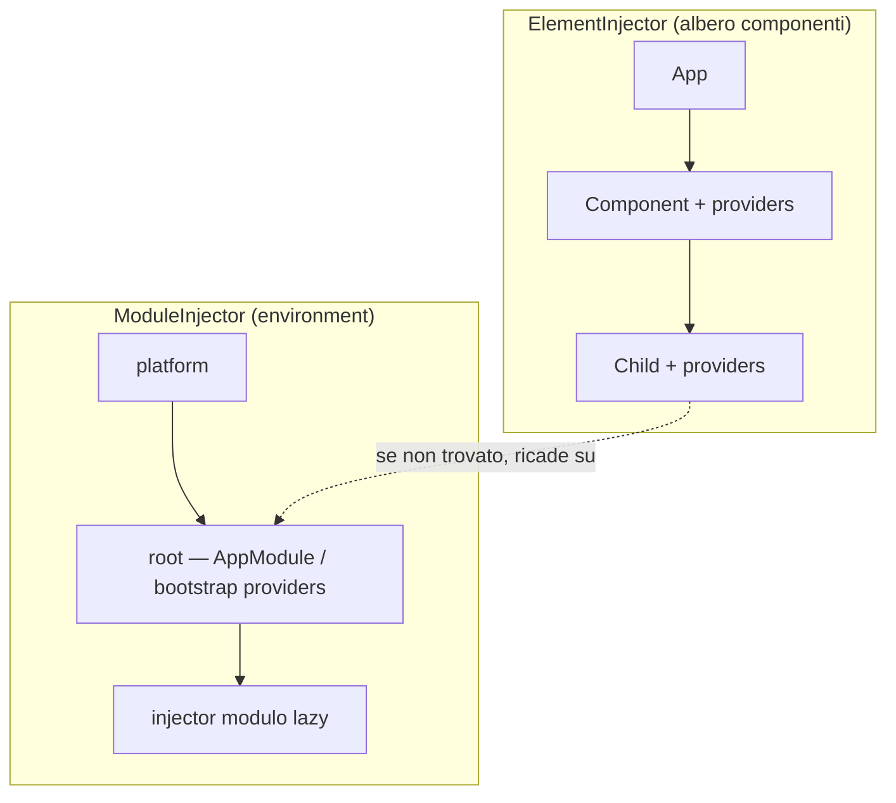

# Dependency Injection classica
> Cert Angular · l'API DI *senza* `inject()` — decoratori, provider espliciti e injector gerarchici; nel vault la DI è coperta in forma moderna ([[05-state-management-services-signals]])

La **dependency injection** (DI: una classe non costruisce le proprie dipendenze ma le riceve da un *injector*) in Angular classico ruota attorno a `@Injectable`, ai **provider** dichiarati negli array `providers`, e all'**injection via costruttore**. La cert la chiede perché ogni codebase pre-`inject()` (e gran parte di quelle attuali) configura la DI così, e perché injector gerarchici e resolution modifier sono un tema d'esame ricorrente.

## `@Injectable` e `providedIn`
Il decoratore `@Injectable` marca una classe come iniettabile; l'opzione `providedIn` la **auto-registra** in un injector senza doverla elencare in un `providers`, rendendola **tree-shakable** (se nessuno la inietta, il bundler la elimina).

```ts
import { Injectable } from '@angular/core';

@Injectable({ providedIn: 'root' })   // singleton a livello applicazione
export class FlightService {}
```

I valori di `providedIn`:
- **`'root'`** — un singolo singleton condiviso da tutta l'app (il caso quasi sempre corretto).
- **`'platform'`** — un singleton dell'injector *platform*, condiviso da **più applicazioni** Angular sulla stessa pagina (scenario raro: micro-frontend, più `bootstrap` nella stessa pagina).
- **`'any'`** — un'istanza **distinta per ogni injector** che lo richiede: singleton per il codice eager, ma ogni modulo lazy ne riceve una copia propria.

## Provider: token e recipe
Un provider dice all'injector **come** ottenere il valore per un dato **token** (la chiave di ricerca). I provider si dichiarano in un array `providers` — su `@NgModule`, su `@Component`/`@Directive`, o (moderno) a livello di route/applicazione.

Due tipi di token:

```ts
// 1) Class token: la classe È il token
@Injectable({ providedIn: 'root' })
export class Logger {}

export class FlightSearch {
  constructor(private logger: Logger) {}   // il tipo funge da chiave
}
```

```ts
// 2) InjectionToken<T>: per valori NON-classe (config, stringhe, interfacce)
import { InjectionToken } from '@angular/core';

export interface AppConfig {
  baseUrl: string;
  pageSize: number;
}

// il factory rende il token tree-shakable e auto-provided in root
export const APP_CONFIG = new InjectionToken<AppConfig>('app.config', {
  providedIn: 'root',
  factory: () => ({ baseUrl: '/api', pageSize: 20 }),
});
```

Un'interfaccia TypeScript **non** può fare da token: sparisce alla compilazione, quindi a runtime non esiste una chiave. Per iniettare valori tipizzati da un'interfaccia serve un `InjectionToken<T>`.

## Le quattro recipe
La **recipe** è la parte del provider che dice all'injector *come* produrre il valore dietro un token. Nella forma estesa il provider è l'oggetto `{ provide: TOKEN, ...recipe }`, e la chiave che accompagna `provide` seleziona una fra quattro strategie: fornire una classe da istanziare, un valore già pronto, una factory che lo costruisce, oppure un alias verso un altro token.

```ts
@NgModule({
  providers: [
    // useClass: fornisci un'implementazione dietro il token
    { provide: Logger, useClass: BetterLogger },

    // useValue: fornisci un valore già pronto (nessuna istanziazione)
    { provide: APP_CONFIG, useValue: { baseUrl: '/api', pageSize: 20 } },

    // useFactory: costruisci il valore con una funzione;
    // deps elenca (nell'ordine) le dipendenze passate alla factory
    {
      provide: FlightService,
      useFactory: (http: HttpClient, cfg: AppConfig) =>
        new FlightService(http, cfg.baseUrl),
      deps: [HttpClient, APP_CONFIG],
    },

    // useExisting: alias — lo STESSO singleton dietro due token
    { provide: OldLogger, useExisting: Logger },
  ],
})
export class CoreModule {}
```

Lo short-hand `providers: [FlightService]` equivale a `{ provide: FlightService, useClass: FlightService }`. Differenza chiave tra `useClass` e `useExisting`: `useClass` istanzia una classe **nuova**; `useExisting` restituisce l'istanza **già esistente** di un altro token (nessuna nuova creazione).

## Provider multipli: `multi: true`
Con `multi: true` più provider per lo **stesso** token non si sovrascrivono ma vengono **raccolti in un array**. È il meccanismo dietro token come `HTTP_INTERCEPTORS`, `NG_VALIDATORS` e (storicamente) `APP_INITIALIZER`.

```ts
providers: [
  { provide: HTTP_INTERCEPTORS, useClass: AuthInterceptor, multi: true },
  { provide: HTTP_INTERCEPTORS, useClass: LoggingInterceptor, multi: true },
  // inject(HTTP_INTERCEPTORS) → [AuthInterceptor, LoggingInterceptor]
]
```

Senza `multi: true` il secondo provider **sovrascriverebbe** il primo, restituendo un solo valore. `multi: true` va messo su **tutti** i provider dello stesso token.

## Injector gerarchici: `ModuleInjector` vs `ElementInjector`
Angular non ha un solo injector, ma **due gerarchie parallele**:

- **`ModuleInjector`** (o *environment injector*) — popolato da `providedIn`, dagli array `providers` degli `@NgModule` e dalle provider function. La sua gerarchia va da `platform` a `root`, fino all'injector dei **moduli lazy**.
- **`ElementInjector`** — creato per ogni elemento del DOM che ospita un componente/direttiva con un proprio `providers` (o `viewProviders`). Segue l'albero dei componenti.



Ordine di risoluzione: Angular parte dall'`ElementInjector` del componente che chiede la dipendenza, **sale** l'albero degli `ElementInjector` fino alla radice, e **solo poi** passa alla gerarchia dei `ModuleInjector`. Vince il primo provider trovato, e da qui una conseguenza pratica: un `providers` dichiarato a livello di componente "oscura" (shadowing) quello root per l'intero sotto-albero di quel componente.

## Resolution modifier (forma decorator)
I **resolution modifier** sono decoratori che si applicano ai parametri del costruttore per cambiare *come* l'injector risolve quella singola dipendenza: da dove cominciare a cercarla, dove fermarsi, e cosa fare se non la trova. Con l'injection via costruttore sono quattro, e si possono combinare tra loro.

```ts
import { Optional, Self, SkipSelf, Host } from '@angular/core';

@Component({ /* ... */ })
export class FlightCard {
  constructor(
    @Optional() private logger: Logger | null,   // null se non trovato, invece di errore
    @Self() private local: CardConfig,            // cerca SOLO nell'injector corrente
    @SkipSelf() private parent: BasketService,    // salta il corrente, parte dal padre
    @Host() private host: FormContainer,          // limite superiore: si ferma al componente host
  ) {}
}
```

- **`@Optional()`** — se il token manca, inietta `null` invece di lanciare `NullInjectorError`.
- **`@Self()`** — cerca solo nell'`ElementInjector` corrente, senza risalire.
- **`@SkipSelf()`** — ignora l'injector corrente e comincia dal padre (utile per raggiungere un servizio del contenitore, non la propria istanza locale).
- **`@Host()`** — pone il **limite superiore** della ricerca all'`ElementInjector` del componente host; utile per direttive che devono agganciarsi solo al proprio host.

> [!warning]
> Insidie da esame:
> - **Interfaccia come token**: non funziona, perché le interfacce TypeScript non esistono a runtime. Serve una **classe** o un `InjectionToken<T>`.
> - **`useFactory` senza `deps`**: gli argomenti della factory arrivano `undefined`. Le dipendenze vanno elencate, nell'ordine, in `deps`.
> - **Provider ripetuto senza `multi: true`**: l'ultimo **sovrascrive** i precedenti invece di aggiungersi. Per collezioni (es. interceptor) serve `multi: true` su tutti.
> - **`@Self()` su una dipendenza non provista localmente**: `NullInjectorError`, perché `@Self` non risale la gerarchia. Conviene combinarlo con `@Optional()` se la dipendenza può mancare.
> - `providers` a livello **componente** crea un'istanza **per ogni istanza di componente** (nell'`ElementInjector`), non un singleton: attenzione a metterci per errore uno store condiviso.

> [!info] vs Modern
> Il moderno inietta con la funzione [[inject]]`(Token)` invece dei parametri del costruttore, chiamata in un [[injection-context]]; i resolution modifier diventano **opzioni**: `inject(Token, { optional: true, self: true, skipSelf: true, host: true })`. I [[providers]] si dichiarano con le **provider function** (`bootstrapApplication(App, { providers: [...] })`, `provideX()`) e i singleton con `providedIn: 'root'` / [[service|@Service()]]. Tutto questo è già nel vault, in [[05-state-management-services-signals]] (qui non ripetuto). Le **recipe** (`useClass`/`useValue`/`useFactory`/`useExisting`) e `multi: true` restano invece **identiche** nei due mondi: cambia *come* si legge la dipendenza, non *come* si configura il provider.

> [!info] Stato attuale
> `@Injectable` e la constructor injection **non sono deprecati** e restano pienamente supportati (Angular 22+). Per il codice nuovo la guida ufficiale preferisce [[inject]]: è più componibile, tree-shakable e senza i limiti dei decoratori di parametro. `providedIn: 'root'` è tuttora la via consigliata per i singleton (nel vault, da Angular 22, l'annotazione equivalente è [[service|@Service()]]). Fonte: [angular.dev/guide/di](https://angular.dev/guide/di) e [angular.dev/guide/di/hierarchical-dependency-injection](https://angular.dev/guide/di/hierarchical-dependency-injection).

## Ripasso lampo

**1.** Quando serve un `InjectionToken<T>` invece di usare la classe come token?
> [!success]- Risposta
> Quando la dipendenza **non è una classe**: un valore di configurazione, una stringa, una funzione, o un valore tipizzato da un'**interfaccia**. Le interfacce spariscono alla compilazione, quindi non esistono a runtime e non possono fare da token; un `InjectionToken<T>` fornisce una chiave concreta (spesso con `factory` + `providedIn: 'root'` per renderlo tree-shakable).

**2.** Differenza tra `useClass`, `useValue`, `useFactory` (con `deps`) e `useExisting`?
> [!success]- Risposta
> `useClass` istanzia una classe dietro il token; `useValue` fornisce un valore già pronto senza istanziare nulla; `useFactory` costruisce il valore con una funzione, i cui argomenti vengono iniettati elencandoli in `deps` (nell'ordine); `useExisting` è un **alias** che restituisce l'istanza già esistente di un altro token, senza crearne una nuova.

**3.** Cosa fa `multi: true` e cosa succede senza?
> [!success]- Risposta
> Con `multi: true` più provider per lo stesso token vengono raccolti in un **array** (es. `HTTP_INTERCEPTORS`). Senza, l'ultimo provider **sovrascrive** i precedenti e l'injector restituisce un solo valore. `multi: true` va messo su tutti i provider dello stesso token.

**4.** `ModuleInjector` vs `ElementInjector` e in che ordine Angular risolve una dipendenza?
> [!success]- Risposta
> Il `ModuleInjector` (environment) è popolato da `providedIn`/`@NgModule.providers`/provider function con gerarchia `platform → root → moduli lazy`; l'`ElementInjector` nasce sugli elementi con `providers`/`viewProviders` e segue l'albero dei componenti. Angular parte dall'`ElementInjector` del richiedente, **sale** l'albero degli ElementInjector, e **solo dopo** passa ai ModuleInjector; vince il primo provider trovato.

**5.** A cosa servono `@Optional`, `@Self`, `@SkipSelf`, `@Host`?
> [!success]- Risposta
> `@Optional` inietta `null` invece di lanciare errore se il token manca. `@Self` cerca solo nell'injector corrente, senza risalire. `@SkipSelf` salta il corrente e parte dal padre. `@Host` pone il limite superiore della ricerca all'injector del componente host.

**In sintesi:**
- `@Injectable({ providedIn: 'root' | 'platform' | 'any' })` auto-registra un servizio tree-shakable; `'root'` è quasi sempre la scelta giusta.
- Token = class token oppure `InjectionToken<T>` (obbligatorio per valori non-classe/interfacce); recipe = `useClass`/`useValue`/`useFactory`(+`deps`)/`useExisting`.
- `multi: true` trasforma più provider dello stesso token in un array; senza, l'ultimo vince.
- Due gerarchie di injector (`ElementInjector` prima, poi `ModuleInjector`); i resolution modifier `@Optional`/`@Self`/`@SkipSelf`/`@Host` regolano la ricerca.
- Equivalente moderno = [[inject]] + opzioni + provider function, in [[05-state-management-services-signals]]; le recipe e `multi` restano identiche.
