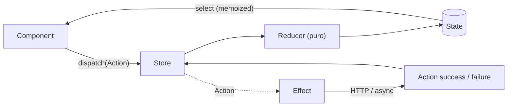

# NgRx Store (Redux)
> 🎓 Cert Angular · non coperto dal *Modern Angular* (il vault usa il NgRx **Signal** Store)

**NgRx Store** (`@ngrx/store`) è l'implementazione del pattern **Redux** per Angular: un unico **store** globale contiene tutto lo stato dell'app, che cambia **solo** in risposta ad **action** (oggetti che descrivono "cosa è successo"), applicate da **reducer** puri. La cert lo chiede perché è stato per anni lo standard di state management delle grandi codebase Angular, e perché il suo modello mentale (flusso unidirezionale, immutabilità, selector memoizzati, side effect isolati) è concettualmente distinto dal Signal Store del vault moderno.

## Principi Redux
Tre regole fondamentali, valide anche in NgRx:
- **Single source of truth** — un solo store, un solo albero di stato immutabile per tutta l'app.
- **Lo stato è read-only** — non si muta mai direttamente; si **dispatcha** un'action che descrive l'intenzione.
- **I cambiamenti avvengono con funzioni pure** — i reducer, dato `(stato, action)`, ritornano un **nuovo** stato senza side effect.

Ne deriva un **flusso unidirezionale**: l'intenzione entra come action, il reducer calcola il nuovo stato, i componenti leggono via selector. I side effect (HTTP, timer) stanno fuori dai reducer, negli **Effects**.



## Action — `createAction` / `props`
Un'**action** ha un `type` univoco (per convenzione `'[Source] Event'`) e, opzionalmente, un payload dichiarato con `props<{...}>()`. `createAction` ritorna un **action creator**: una funzione che, chiamata, produce l'oggetto action tipizzato.

```ts
// flight.actions.ts
import { createAction, props } from '@ngrx/store';
import { Flight } from './flight';

export const loadFlights = createAction(
  '[Flight Search] Load Flights',            // origine: la UI che scatena l'azione
  props<{ from: string; to: string }>(),     // payload tipizzato
);

export const loadFlightsSuccess = createAction(
  '[Flight API] Load Flights Success',       // origine: l'esito del backend
  props<{ flights: Flight[] }>(),
);

export const loadFlightsFailure = createAction(
  '[Flight API] Load Flights Failure',
  props<{ error: string }>(),
);

// action senza payload
export const clearFlights = createAction('[Flight Search] Clear');
```

Chiamata: `loadFlights({ from: 'Graz', to: 'Hamburg' })` → `{ type: '[Flight Search] Load Flights', from: 'Graz', to: 'Hamburg' }`.

> [!tip]
> Il pattern **trigger / success / failure** (tre action per un'operazione async) è la convenzione standard: l'action di trigger parte dalla UI, le altre due dall'Effect a seconda dell'esito. La parte `[Source]` del type deve identificare **chi** scatena l'action (utile nei DevTools).

## Reducer — `createReducer` / `on`
Il **reducer** è una **funzione pura** che, dato lo stato corrente e un'action, ritorna il nuovo stato. `createReducer` associa una serie di handler `on(action, fn)` ai type delle action; le action non gestite lasciano lo stato invariato.

```ts
// flight.reducer.ts
import { createReducer, on } from '@ngrx/store';
import * as FlightActions from './flight.actions';
import { Flight } from './flight';

export interface FlightState {
  flights: Flight[];
  loading: boolean;
  error: string | null;
}

export const initialState: FlightState = {
  flights: [],
  loading: false,
  error: null,
};

export const flightReducer = createReducer(
  initialState,
  on(FlightActions.loadFlights, (state) => ({
    ...state,                                  // nuovo oggetto, mai mutazione in place
    loading: true,
    error: null,
  })),
  on(FlightActions.loadFlightsSuccess, (state, { flights }) => ({
    ...state,
    flights,                                   // il payload è già destrutturato e tipizzato
    loading: false,
  })),
  on(FlightActions.loadFlightsFailure, (state, { error }) => ({
    ...state,
    error,
    loading: false,
  })),
);
```

> [!warning]
> Insidie da esame sui reducer:
> - **Devono essere puri**: niente HTTP, niente `Date.now()`, niente `console.log`, nessuna mutazione. Ogni side effect va in un **Effect**.
> - **Immutabilità**: si ritorna sempre un **nuovo** oggetto (`{ ...state, ... }`), mai `state.flights.push(...)`. Mutare in place rompe l'`OnPush`/le sottoscrizioni e il time-travel dei DevTools.
> - Un reducer non "chiama" un altro reducer: **ogni** reducer riceve **ogni** action; reagisce solo a quelle che ha registrato con `on`.

## Selector — `createSelector` / `createFeatureSelector`
I **selector** sono funzioni pure che estraggono/derivano una porzione di stato. `createFeatureSelector` prende lo slice di una feature dalla sua **chiave** nello store; `createSelector` compone selector esistenti e **memoizza** il risultato: ricalcola solo quando uno degli input cambia (per riferimento), altrimenti restituisce il valore cachato.

```ts
// flight.selectors.ts
import { createFeatureSelector, createSelector } from '@ngrx/store';
import { FlightState } from './flight.reducer';

// 'flightSearch' = la chiave con cui la feature è registrata nello store
export const selectFlightState =
  createFeatureSelector<FlightState>('flightSearch');

export const selectFlights = createSelector(
  selectFlightState,
  (state) => state.flights,
);

export const selectLoading = createSelector(
  selectFlightState,
  (state) => state.loading,
);

// selector composto da altri selector (ricalcola solo se selectFlights cambia)
export const selectFlightCount = createSelector(
  selectFlights,
  (flights) => flights.length,
);
```

> [!tip]
> La **memoizzazione** è il motivo per cui non si mette logica derivata nel componente: un `createSelector` che filtra/ordina viene ricalcolato solo quando cambia il suo input, non a ogni change detection. È l'equivalente classico dei `withComputed` del Signal Store.

## Effects — `@ngrx/effects`
Gli **Effects** (`@ngrx/effects`) isolano i **side effect**: ascoltano lo stream di tutte le action (`Actions`), filtrano quelle di interesse con `ofType`, eseguono lavoro async (tipicamente una chiamata a un service) e **mappano il risultato a nuove action** (successo/fallimento). Non toccano lo stato direttamente: lo fanno indirettamente dispatchando action che i reducer gestiscono.

```ts
// flight.effects.ts
import { inject, Injectable } from '@angular/core';
import { Actions, createEffect, ofType } from '@ngrx/effects';
import { catchError, map, of, switchMap } from 'rxjs';
import * as FlightActions from './flight.actions';
import { FlightService } from './flight.service';

@Injectable()
export class FlightEffects {
  private readonly actions$ = inject(Actions);           // stream di TUTTE le action
  private readonly flightService = inject(FlightService);

  loadFlights$ = createEffect(() =>
    this.actions$.pipe(
      ofType(FlightActions.loadFlights),                 // filtra sul type
      switchMap(({ from, to }) =>                        // annulla la richiesta precedente
        this.flightService.find(from, to).pipe(
          map((flights) => FlightActions.loadFlightsSuccess({ flights })),
          catchError((err) =>
            of(FlightActions.loadFlightsFailure({ error: String(err) })),
          ),
        ),
      ),
    ),
  );
}
```

- `ofType(loadFlights)` filtra lo stream sulle sole action di quel type (accetta più action).
- L'**operatore di flattening** riflette la semantica delle chiamate sovrapposte: `switchMap` (annulla la precedente, tipico per le ricerche), `concatMap` (accoda), `mergeMap` (parallelo), `exhaustMap` (ignora le nuove mentre una è in corso, anti doppio-submit).
- Di default l'Effect **ri-dispatcha** l'action che emette. Un Effect che non deve dispatchare (es. logging, navigazione) si dichiara con `createEffect(() => ..., { dispatch: false })`.

> [!warning]
> Il `catchError` va messo **sull'inner observable** (dentro `switchMap`), non sull'outer: se lo stream esterno (`actions$`) emette un errore, l'Effect **muore** e smette di reagire per sempre. Gestendo l'errore nell'inner e ritornando un `of(...failure())`, l'outer resta vivo. È una domanda-trabocchetto classica.

## Wiring: `StoreModule` / `EffectsModule`
Nel mondo classico (NgModule) lo store e gli effect si registrano con la convenzione `forRoot`/`forFeature` (vedi [[ngmodules]]).

```ts
// app.module.ts — root
import { StoreModule } from '@ngrx/store';
import { EffectsModule } from '@ngrx/effects';
import { StoreDevtoolsModule } from '@ngrx/store-devtools';

@NgModule({
  imports: [
    StoreModule.forRoot({}),                     // store root (reducer map globali o vuota)
    EffectsModule.forRoot([]),                   // effects root
    StoreDevtoolsModule.instrument({ maxAge: 25 }),
  ],
})
export class AppModule {}
```

```ts
// flight.module.ts — feature (tipicamente lazy-loaded)
@NgModule({
  imports: [
    StoreModule.forFeature('flightSearch', flightReducer),  // chiave + reducer
    EffectsModule.forFeature([FlightEffects]),
  ],
})
export class FlightModule {}
```

> [!warning]
> La chiave passata a `StoreModule.forFeature('flightSearch', ...)` **deve coincidere** con quella di `createFeatureSelector<FlightState>('flightSearch')`. Un mismatch non dà errore di compilazione: il selector restituisce `undefined` a runtime.

## Consumare lo store: `dispatch` / `select`
Il componente inietta lo `Store`, **dispatcha** action per esprimere l'intenzione e **seleziona** slice di stato come `Observable` (letti nel template con la pipe `async`).

```ts
import { Component, inject } from '@angular/core';
import { Store } from '@ngrx/store';
import * as FlightActions from './flight.actions';
import { selectFlights, selectLoading } from './flight.selectors';

@Component({ /* ... */ })
export class FlightSearchComponent {
  private readonly store = inject(Store);

  readonly flights$ = this.store.select(selectFlights);   // Observable<Flight[]>
  readonly loading$ = this.store.select(selectLoading);

  search(from: string, to: string): void {
    this.store.dispatch(FlightActions.loadFlights({ from, to }));
  }
}
```

```html
<div *ngIf="loading$ | async">Loading…</div>
<div *ngFor="let f of flights$ | async">{{ f.from }} → {{ f.to }}</div>
```

`store.select(selector)` restituisce un `Observable`; `store.dispatch(action)` inietta l'action nel flusso. Lo store è anch'esso un `Observable` dell'intero stato.

## Cenno: `@ngrx/entity`
Quando lo stato è una **collection** di entità identificate da un ID, `@ngrx/entity` riduce il boilerplate: normalizza in `{ ids: [], entities: {} }` e offre updater CRUD pronti + selector pronti.

```ts
import { createEntityAdapter, EntityAdapter, EntityState } from '@ngrx/entity';

export interface FlightState extends EntityState<Flight> {  // aggiunge ids + entities
  loading: boolean;
}

export const adapter: EntityAdapter<Flight> = createEntityAdapter<Flight>();

export const initialState: FlightState = adapter.getInitialState({ loading: false });

// nel reducer si usano gli updater: adapter.setAll, addOne, updateOne, removeOne, upsertMany…
on(FlightActions.loadFlightsSuccess, (state, { flights }) =>
  adapter.setAll(flights, { ...state, loading: false }),
);

// selector pronti (all/entities/ids/total)
export const { selectAll, selectEntities, selectIds, selectTotal } =
  adapter.getSelectors();
```

È l'equivalente classico di `withEntities` del Signal Store: stessa idea (entity map + ids + updater), API a funzioni invece che a feature.

> [!info] vs Modern
> Il vault moderno **non** usa il pattern Redux con `@ngrx/store`: usa il **NgRx Signal Store** (`@ngrx/signals`), dove lo stato è fatto di **signal** e lo store si compone di *features* (`withState`, `withComputed`, `withMethods`…). I concetti si mappano così: reducer/selector → `patchState` + `withComputed`; Effects → `rxMethod`/`withMutations`; `@ngrx/entity` → `withEntities`; e c'è persino un'**Event API** (Flux/Redux) opzionale. Tutto questo è già spiegato → [[09-ngrx-signal-store]] (qui non ripetuto).

> [!info] Stato attuale
> NgRx Store (Redux) **non è deprecato**: è mantenuto e resta la scelta per chi vuole il pattern Redux "puro" con time-travel debugging. La versione attuale offre API **funzionali/standalone** che affiancano i moduli classici: `provideStore(reducers)`, `provideState(feature)`, `provideEffects([...])` al posto di `StoreModule`/`EffectsModule`; `createActionGroup` per dichiarare gruppi di action con meno codice; `createFeature` che accorpa reducer + selector auto-generati; **effect funzionali** (`createEffect` con `inject` invece della classe); e `store.selectSignal(selector)` (da NgRx v16) che ritorna un `Signal` invece di un `Observable`, per integrarsi con la reactivity a signal ([ngrx.io](https://ngrx.io/guide/store)).

## 🔁 Ripasso lampo

**1.** Quali sono i tre principi Redux e da cosa deriva il "flusso unidirezionale"?
> [!success]- Risposta
> **Single source of truth** (un solo store immutabile), **stato read-only** (si cambia solo dispatchando action), **cambiamenti con funzioni pure** (i reducer). Ne deriva il flusso unidirezionale: l'intenzione entra come **action** → il **reducer** calcola il nuovo stato → i componenti leggono via **selector**; i side effect stanno fuori, negli **Effects**, che a loro volta dispatchano nuove action.

**2.** Perché un reducer deve essere puro e immutabile, e dove finiscono i side effect?
> [!success]- Risposta
> Perché deve essere **deterministico** (`(stato, action) → nuovo stato`) e senza effetti collaterali: niente HTTP/timer/mutazioni. L'immutabilità (`{ ...state }`) rende rilevabile il cambio per riferimento (necessario a `OnPush` e ai selector memoizzati) e abilita il time-travel dei DevTools. I side effect (HTTP, navigazione, ecc.) vanno negli **Effects**, che li mappano a nuove action.

**3.** Cosa fa `createFeatureSelector` e perché `createSelector` è importante per le performance?
> [!success]- Risposta
> `createFeatureSelector<T>('chiave')` estrae lo slice di stato di una feature dalla sua chiave nello store (deve coincidere con quella di `forFeature`). `createSelector` compone selector e **memoizza**: ricalcola solo quando uno degli input cambia per riferimento, altrimenti ritorna il valore cachato — così la logica derivata non gira a ogni change detection.

**4.** Com'è fatto un Effect e perché il `catchError` va sull'inner observable?
> [!success]- Risposta
> Un Effect ascolta `actions$`, filtra con `ofType`, esegue l'async (via un flattening operator come `switchMap`) verso un service e **mappa il risultato a nuove action** (`...Success`/`...Failure`). Il `catchError` va **dentro** `switchMap` (sull'inner): se si mettesse sull'outer (`actions$`), al primo errore lo stream esterno morirebbe e l'Effect smetterebbe di reagire. Nell'inner si ritorna invece `of(...failure())` e l'outer resta vivo.

**5.** Come si registrano store ed effects in un'app module-based e come li consuma un componente?
> [!success]- Risposta
> Root: `StoreModule.forRoot({})` + `EffectsModule.forRoot([])`. Feature: `StoreModule.forFeature('chiave', reducer)` + `EffectsModule.forFeature([Effects])`. Il componente inietta lo `Store`, dispatcha con `store.dispatch(action)` e legge con `store.select(selector)` (un `Observable`, consumato nel template con `| async`).

**In sintesi:**
- NgRx Store porta **Redux** in Angular: store unico immutabile, cambiato solo da **action** (`createAction`/`props`) applicate da **reducer** puri (`createReducer`/`on`), con flusso unidirezionale.
- I **selector** (`createFeatureSelector`/`createSelector`) leggono e derivano lo stato in modo **memoizzato**; i **side effect** stanno negli **Effects** (`@ngrx/effects`: `Actions` + `ofType` + flattening operator → action di successo/fallimento).
- Wiring classico via `StoreModule`/`EffectsModule` `forRoot`/`forFeature`; il componente usa `dispatch`/`select`. Le collection si gestiscono con `@ngrx/entity`.
- Equivalente moderno = **NgRx Signal Store** (`@ngrx/signals`) → [[09-ngrx-signal-store]]; il classico non è deprecato e oggi offre API funzionali (`provideStore`/`provideEffects`, `createFeature`, `selectSignal`).
