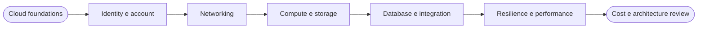

# 00 · Orientamento SAA-C03

La certificazione **AWS Certified Solutions Architect - Associate** verifica la capacità di scegliere servizi e configurazioni AWS a partire da requisiti tecnici e di business. Non premia la semplice memoria dei nomi: una domanda presenta quasi sempre più soluzioni realizzabili e chiede quella che soddisfa meglio vincoli come sicurezza, resilienza, prestazioni, costo o carico operativo.

> [!info|label:Versione di riferimento]
> Il percorso segue l'Exam Guide **SAA-C03 v1.0**, ancora indicato come guida corrente da AWS. Non risulta annunciata una versione successiva nelle fonti ufficiali consultate. *(verificato: 2026-09-04)*

## Come è fatto l'esame

L'esame dura **130 minuti** e contiene **65 domande**. Cinquanta contribuiscono al punteggio; le altre quindici vengono sperimentate da AWS per un possibile uso futuro e non sono riconoscibili durante la prova. Le domande possono essere:

- **multiple choice**, con una risposta corretta e tre distrattori;
- **multiple response**, con due o più risposte corrette fra almeno cinque opzioni.

Una risposta omessa è errata, mentre una risposta sbagliata non comporta penalità aggiuntive: conviene quindi rispondere a ogni domanda. Il risultato usa una scala da **100 a 1.000** e la soglia di superamento è **720**. Il modello è compensatorio, perciò conta il risultato complessivo e non è necessario superare separatamente ogni Domain.

Questi numeri descrivono la prova, ma non consentono di trasformare una percentuale grezza di quiz nel punteggio AWS: lo *scaled score* normalizza forme d'esame con difficoltà leggermente diversa. Anche il futuro simulatore del vault produrrà quindi soltanto un punteggio didattico.

AWS descrive il candidato di riferimento come una persona con almeno **un anno di esperienza pratica** nella progettazione di soluzioni cloud che usano servizi AWS. Il dato non si sostituisce con la sola lettura: per chi parte da zero, i laboratori e il progetto progressivo servono a costruire nel tempo una parte di quell'esperienza, senza promettere una scorciatoia artificiale.

> [!info|label:Lingua dell'esame]
> Il vault mantiene i termini tecnici in inglese e assume che l'esame venga sostenuto in inglese. AWS indica che la localizzazione italiana di SAA-C03 verrà ritirata dopo il **31 dicembre 2026**; la disponibilità effettiva va ricontrollata sulla pagina di prenotazione. *(verificato: 2026-09-04)*

## I quattro Domain

Un **Domain** è una macro-area dell'esame. Il peso indica la quota prevista del contenuto valutato, non una garanzia sul numero esatto di domande visibili in una singola prova.

<figure style="margin:1.3rem 0">
<svg viewBox="0 0 760 270" role="img" aria-label="Pesi dei quattro Domain SAA-C03: sicurezza 30 per cento, resilienza 26 per cento, prestazioni 24 per cento e costo 20 per cento" style="width:100%;max-width:760px;height:auto;color:inherit">
  <g font-family="system-ui,Arial,sans-serif" fill="currentColor">
    <text x="24" y="31" font-size="12" opacity=".62">PESO SUL CONTENUTO VALUTATO</text>
    <g font-size="14">
      <text x="24" y="77">D1 · Secure</text>
      <text x="24" y="125">D2 · Resilient</text>
      <text x="24" y="173">D3 · High-Performing</text>
      <text x="24" y="221">D4 · Cost-Optimized</text>
    </g>
    <g fill="var(--link,#9a4d00)">
      <rect x="205" y="54" width="450" height="30" rx="5" opacity=".95"/>
      <rect x="205" y="102" width="390" height="30" rx="5" opacity=".78"/>
      <rect x="205" y="150" width="360" height="30" rx="5" opacity=".61"/>
      <rect x="205" y="198" width="300" height="30" rx="5" opacity=".44"/>
    </g>
    <g font-size="14" font-weight="700">
      <text x="668" y="75">30%</text>
      <text x="608" y="123">26%</text>
      <text x="578" y="171">24%</text>
      <text x="518" y="219">20%</text>
    </g>
    <path d="M205 242H655" stroke="currentColor" opacity=".25"/>
    <g font-size="10" opacity=".58" text-anchor="middle">
      <text x="205" y="260">0</text>
      <text x="355" y="260">10</text>
      <text x="505" y="260">20</text>
      <text x="655" y="260">30</text>
    </g>
  </g>
</svg>
<figcaption style="font-size:.82rem;opacity:.72;margin-top:.35rem">La sicurezza ha il peso maggiore, ma i quesiti combinano spesso più Domain: una soluzione Multi-AZ può essere resiliente e, nello stesso tempo, più costosa.</figcaption>
</figure>

| Domain | Peso | Domanda architetturale dominante |
|---|---:|---|
| **1 · Design Secure Architectures** | 30% | Chi può accedere, da dove, con quali controlli e come vengono protetti i dati? |
| **2 · Design Resilient Architectures** | 26% | Come si evita un single point of failure e come si recupera da un guasto? |
| **3 · Design High-Performing Architectures** | 24% | Quale soluzione soddisfa access pattern, scala, latenza e throughput richiesti? |
| **4 · Design Cost-Optimized Architectures** | 20% | Quale soluzione soddisfa i requisiti senza capacità o trasferimenti inutili? |

La [matrice di copertura](../exam/matrice-saa-c03.md) scompone questi Domain nei **14 Task Statement** ufficiali e mostra dove ciascuno viene studiato e praticato.

## Il percorso non segue il catalogo dei servizi

Un catalogo ordinato alfabeticamente costringerebbe a imparare prima il servizio e soltanto dopo il problema. Qui l'ordine è inverso. Si costruisce dapprima il vocabolario di base, poi si affrontano identità e rete; soltanto allora compute, storage e database acquistano un posto preciso nell'architettura.

Ogni modulo risponde a quattro domande ricorrenti:

1. Quale requisito si sta soddisfacendo?
2. Quali servizi o configurazioni sono candidati?
3. Quale trade-off distingue la scelta corretta dalle alternative plausibili?
4. Come si verifica il comportamento in un laboratorio controllato?

## Dalla teoria alla pratica

La pratica procede su tre livelli. La **Console** rende visibili relazioni e impostazioni; AWS CloudShell e **AWS CLI** trasformano l'osservazione in interrogazioni ripetibili; **CloudFormation** descrive infine l'infrastruttura come codice e consente di ricrearla e rimuoverla in modo deterministico.

<figure style="margin:1.3rem 0;text-align:center">
<svg viewBox="0 0 720 190" role="img" aria-label="Progressione pratica: osservare in Console, verificare con AWS CLI, rendere ripetibile con CloudFormation e diagnosticare con un failure drill" style="width:100%;max-width:720px;height:auto;color:inherit">
  <defs>
    <marker id="practice-arrow" markerWidth="8" markerHeight="8" refX="7" refY="4" orient="auto">
      <path d="M0 0L8 4L0 8Z" fill="currentColor"/>
    </marker>
  </defs>
  <g fill="var(--bg,#fff)" stroke="currentColor" stroke-width="1.6">
    <rect x="25" y="55" width="140" height="70" rx="10"/>
    <rect x="205" y="55" width="140" height="70" rx="10"/>
    <rect x="385" y="55" width="140" height="70" rx="10"/>
    <rect x="565" y="55" width="130" height="70" rx="10"/>
  </g>
  <g fill="none" stroke="currentColor" stroke-width="1.6" marker-end="url(#practice-arrow)">
    <path d="M165 90h32"/>
    <path d="M345 90h32"/>
    <path d="M525 90h32"/>
  </g>
  <g fill="currentColor" font-family="system-ui,Arial,sans-serif" text-anchor="middle">
    <g font-size="14" font-weight="700">
      <text x="95" y="86">Console</text>
      <text x="275" y="86">AWS CLI</text>
      <text x="455" y="86">CloudFormation</text>
      <text x="630" y="86">Failure drill</text>
    </g>
    <g font-size="11" opacity=".7">
      <text x="95" y="107">osservare</text>
      <text x="275" y="107">verificare</text>
      <text x="455" y="107">ripetere</text>
      <text x="630" y="107">diagnosticare</text>
    </g>
  </g>
</svg>
<figcaption style="font-size:.82rem;opacity:.72;margin-top:.2rem">Le tre interfacce descrivono la stessa infrastruttura da prospettive diverse; il failure drill controllato verifica che il modello mentale regga anche quando qualcosa non funziona.</figcaption>
</figure>

CloudShell è utile per la pratica perché offre AWS CLI v2 già autenticata, ma l'Exam Guide lo elenca fra i servizi **out of scope**. Si usa quindi come strumento, non come materia da memorizzare.

## Come leggere una domanda scenario-based

Una domanda SAA-C03 contiene segnali che hanno peso diverso. I requisiti vincolanti vengono prima delle preferenze: se è richiesto un **RTO di pochi secondi**, una soluzione di backup corretta ma lenta è esclusa; se è richiesto **minimum operational overhead**, una soluzione autogestita può perdere contro un servizio managed anche quando costa meno.

| Segnale nel testo | Dimensione da controllare |
|---|---|
| *least operational overhead* | Quanto lavoro resta al team per patch, scaling, backup e recovery? |
| *highly available* | Quale guasto deve essere assorbito senza interrompere il servizio? |
| *durable* | Con quale probabilità il dato viene conservato, indipendentemente dal fatto che sia subito raggiungibile? |
| *low latency* / *high throughput* | Quale access pattern e quale metrica contano davvero? |
| *most cost-effective* | Quali requisiti restano obbligatori prima di confrontare il prezzo? |
| *decouple* | Quale dipendenza sincrona impedisce ai componenti di scalare o guastarsi separatamente? |

> [!tip]
> Prima si eliminano le opzioni che violano un requisito esplicito; soltanto dopo si confrontano le alternative ancora valide. La risposta più sofisticata non è automaticamente la migliore.

## Ripasso lampo

Quante domande contribuiscono direttamente allo score?

Cinquanta. L'esame presenta altre quindici domande non valutate, che non sono riconoscibili durante la prova.

Una risposta sbagliata produce una penalità aggiuntiva rispetto a una risposta omessa?

No. Le domande senza risposta vengono considerate errate e non esiste una penalità ulteriore per il tentativo, quindi conviene rispondere a tutte.

Perché il 72% di risposte corrette in un quiz non equivale automaticamente allo score <code>720</code>?

Perché AWS usa uno *scaled score* da 100 a 1.000 per compensare differenze di difficoltà fra forme d'esame. Non è una conversione lineare della percentuale grezza.

Quale Domain pesa di più?

**Design Secure Architectures**, con il 30% del contenuto valutato.

Perché CloudShell compare nei laboratori se è fuori dal perimetro SAA-C03?

Perché è uno strumento pratico per eseguire AWS CLI senza installazione né credenziali statiche. Non viene però studiato come servizio sul quale aspettarsi domande.

**In sintesi:** l'esame valuta decisioni architetturali; comprende 50 domande valutate e 15 non valutate; usa quattro Domain e uno score scalato; il percorso collega teoria, pratica e matrice senza confondere gli strumenti del laboratorio con il perimetro d'esame.

## Fonti

- [AWS Certified Solutions Architect - Associate (SAA-C03) Exam Guide](https://docs.aws.amazon.com/aws-certification/latest/solutions-architect-associate-03/solutions-architect-associate-03.html) - verificato 2026-09-04
- [Out-of-Scope AWS Services](https://docs.aws.amazon.com/aws-certification/latest/solutions-architect-associate-03/saa-03-out-of-scope-services.html) - verificato 2026-09-04
- [AWS Certified Solutions Architect - Associate](https://aws.amazon.com/certification/certified-solutions-architect-associate/) - verificato 2026-09-04
