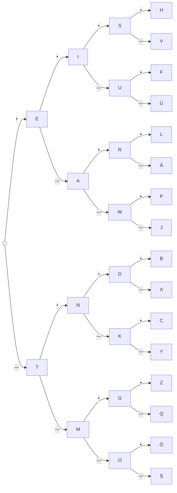

# 02 · Codici e combinazioni
> cap. 2 di «Code» (Petzold, 2ª ed.) — orig. *Codes and Combinations*

Il codice Morse fu inventato attorno al **1837** da Samuel Finley Breese Morse (1791–1872), che il libro incontrerà più avanti, insieme al telegrafo, e perfezionato da altri, in particolare Alfred Vail (1807–1859); la versione usata qui è quella nota come *International Morse code*. Il capitolo precedente ha mostrato *che cos'è* il Morse; questo capitolo guarda alla sua **struttura**: perché i codici sono fatti così, e quale semplice matematica (le **potenze di due**) li governa. È il ponte che porta dal Morse all'idea generale di codice binario.

## Trasmettere è facile, ricevere no

Quasi tutti trovano il Morse più facile da *mandare* che da *ricevere*. Trasmettere è comodo: si ha la tabella lettera → punti-e-linee e si procede. Ricevere è il problema inverso e più faticoso, perché bisogna lavorare **a ritroso**: arriva, poniamo, `—•——` e occorre risalire alla lettera (è la Y). La tabella che abbiamo va in una sola direzione (da **lettera** a **punti e linee**) ma quella opposta, da **punti e linee** a **lettera**, non esiste. E non è chiaro come costruirla: nei punti e nelle linee non c'è nulla da mettere in "ordine alfabetico". Conviene allora abbandonare l'alfabeto e organizzare i codici in un altro modo — per **quantità** di punti e linee.

## Organizzare per numero di simboli

Un codice fatto di **un solo** simbolo può rappresentare due sole lettere:

| Codice | Lettera |
|:--:|:--:|
| `•` | E |
| `—` | T |

Con **due** simboli le combinazioni diventano quattro:

| Codice | Lettera | Codice | Lettera |
|:--:|:--:|:--:|:--:|
| `••` | I | `—•` | N |
| `•—` | A | `——` | M |

Con **tre** simboli se ne ottengono otto:

| Codice | Lettera | Codice | Lettera |
|:--:|:--:|:--:|:--:|
| `•••` | S | `—••` | D |
| `••—` | U | `—•—` | K |
| `•—•` | R | `——•` | G |
| `•——` | W | `———` | O |

E con **quattro** simboli sedici, di cui quattro assegnate a lettere accentate (tre con dieresi, una con cediglia — servono a coprire lingue europee, dato che 30 codici sono più dei 26 dell'alfabeto latino):

| Codice | Lettera | Codice | Lettera |
|:--:|:--:|:--:|:--:|
| `••••` | H | `—•••` | B |
| `•••—` | V | `—••—` | X |
| `••—•` | F | `—•—•` | C |
| `••——` | Ü | `—•——` | Y |
| `•—••` | L | `——••` | Z |
| `•—•—` | Ä | `——•—` | Q |
| `•——•` | P | `———•` | Ö |
| `•———` | J | `————` | Ş |

Guardando le quattro tabelle salta all'occhio una regolarità: **ogni tabella ha il doppio dei codici di quella precedente** (2, 4, 8, 16). Il motivo è semplice e vale la pena fissarlo, perché è il cuore del capitolo: ogni tabella contiene *tutti* i codici della precedente seguiti da un punto, **più** tutti quelli della precedente seguiti da una linea. Aggiungere un simbolo raddoppia le possibilità.

## La formula: potenze di due

Se aggiungere un simbolo raddoppia i codici, allora con `n` simboli i codici sono 2 moltiplicato per sé stesso `n` volte, cioè **2 elevato a `n`**:

> **numero di codici = 2ⁿ** — dove *n* è il numero di punti e linee.

Non serve scrivere tutte le combinazioni per contarle: basta moltiplicare il 2 per sé stesso.

| Simboli (n) | Numero di codici |
|:--:|:--|
| 1 | 2¹ = 2 |
| 2 | 2² = 4 |
| 3 | 2³ = 8 |
| 4 | 2⁴ = 16 |
| 5 | 2⁵ = 32 |
| 6 | 2⁶ = 64 |
| 7 | 2⁷ = 128 |
| 8 | 2⁸ = 256 |
| 9 | 2⁹ = 512 |
| 10 | 2¹⁰ = 1024 |

Le potenze di due compariranno di continuo in questo libro: tenere a mente questa tabellina ripaga.

## L'albero dei punti e delle linee

Per decodificare il Morse senza impazzire si può disegnare un **albero**: si parte da sinistra e, a ogni simbolo ricevuto, si prende il ramo del **punto** (`•`) o quello della **linea** (`—`); la lettera è quella che si trova al nodo raggiunto. Per esempio, per `•—•` si segue punto, poi linea, poi punto e si arriva alla **R**.

Costruire un albero del genere non è solo una comodità per chi decodifica: è, con ogni probabilità, ciò che è servito per **definire** il Morse in primo luogo. L'albero garantisce due cose: che non si usi mai lo stesso codice per due lettere diverse, e che si sfruttino tutte le combinazioni possibili senza allungare le sequenze più del necessario.

## Fino a 64 (e perché tanti restano vuoti)

Volendo, l'albero si estende. Con **cinque** simboli si aggiungono 32 codici (2⁵): è qui che stanno i numeri, che infatti in Morse hanno cinque tra punti e linee. Per includere tutta la punteggiatura si arriva a **sei** simboli, altri 64 codici (2⁶). In totale, fino a sei simboli, si hanno 2 + 4 + 8 + 16 + 32 + 64 = **126** caratteri: molti più di quelli che servono. Il Morse ne lascia perciò parecchi **non definiti** — cioè non associati a nulla. Ricevere un codice non definito è un segnale utile: quasi certamente chi trasmetteva ha commesso un errore.

## Morse è binario

Il Morse si dice **binario** (letteralmente "due per due") perché è fatto di due sole cose: un punto e una linea. È la stessa struttura di una moneta, che può cadere solo su testa o croce. E come dieci lanci di moneta producono 2¹⁰ = 1024 sequenze diverse di teste e croci, così ogni combinazione di oggetti o codici binari si conta con le **potenze di due**.

> [!tip]
> Il numero chiave del libro è **due**. Ogni volta che qualcosa ha due soli stati (punto/linea, testa/croce, acceso/spento) il numero di combinazioni con `n` di questi elementi è `2ⁿ`. Da qui in avanti questa formula tornerà a ogni gradino.

> [!warning]
> Raddoppio, non incremento. Passando da `n` a `n+1` simboli i codici **raddoppiano** (da 2ⁿ a 2ⁿ⁺¹), non aumentano di una quantità fissa. È la differenza tra crescita esponenziale e lineare, ed è il motivo per cui pochi bit bastano a rappresentare tantissime cose.

## Ripasso lampo

Perché ricevere il Morse è più difficile che trasmetterlo?

Perché ricevere impone di lavorare **a ritroso**, dalla sequenza di punti e linee alla lettera. La tabella lettera → codice non aiuta nel verso opposto, e nei punti/linee non c'è alcun "ordine alfabetico" a cui appoggiarsi. Serve un'organizzazione diversa (per numero di simboli, o un albero).

Quanti codici si ottengono con <code>n</code> simboli, e perché?

**2ⁿ**. Ogni tabella contiene tutti i codici della precedente seguiti da un punto **più** tutti quelli seguiti da una linea: aggiungere un simbolo **raddoppia** le possibilità, quindi si moltiplica 2 per sé stesso `n` volte.

Seguendo l'albero, quale lettera è <code>•—•</code>?

**R.** Da sinistra: il punto porta a **E**, poi la linea porta ad **A**, poi il punto porta a **R**.

In che senso il Morse è "binario"?

Perché è composto da **due sole** entità, il punto e la linea — esattamente come una moneta ha solo testa e croce. Le combinazioni di elementi binari si contano sempre con le potenze di due.

Quanti codici in totale fino a sei simboli, e che cosa succede a quelli non usati?

2 + 4 + 8 + 16 + 32 + 64 = **126**. Sono molti più dei caratteri necessari, quindi tanti restano **non definiti**: ricevere un codice non definito indica quasi sempre un errore di trasmissione.

**In sintesi:**

- Ordinare i codici **per numero di simboli** rivela una struttura: ogni gruppo ha il **doppio** dei codici del precedente (2, 4, 8, 16, …).
- Il numero di codici con `n` simboli è **2ⁿ**: le potenze di due, che ricorreranno in tutto il libro.
- L'**albero** punto/linea decodifica ogni sequenza e, in fase di progetto, garantisce codici **unici** e non più lunghi del necessario.
- Il Morse è **binario** (due simboli): le combinazioni di cose e codici binari si contano con le potenze di due. Il **due** è il numero cardine.
