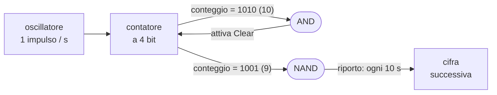

# 18 · Costruiamo un orologio!
> cap. 18 di «Code» (Petzold, 2ª ed.) — orig. *Let's Build a Clock!*

Il capitolo precedente ha messo in tavola due pezzi che, da soli, non facevano ancora nulla di appariscente: un **oscillatore** che batte a ritmo regolare (il clock) e un **contatore** che, mettendo in cascata dei flip-flop, conta gli impulsi in binario. Questo capitolo li fa lavorare insieme in un progetto concreto e persino divertente: costruire un **orologio digitale**. Non un orologio a lancette con ingranaggi e pendolo, ma uno che mostra ore, minuti e secondi come numeri — anzi, nella sua prima versione, addirittura come **luci che lampeggiano in binario**. Sembra un capriccio, e in parte lo è; ma per arrivarci si toccano con mano due idee che torneranno spesso: il BCD e i contatori "a modulo".

## Rappresentare l'ora: il BCD

Un orologio che mostra ore, minuti e secondi ha bisogno di **sei cifre decimali**: due per ciascun gruppo. Un'ora come le dodici e mezza (e quarantasette secondi) si scrive `12:30:47`. Come rappresentarla con dei bit? La strada più ovvia (convertire in binario i tre numeri interi 12, 30 e 47) è scomoda: verrebbero `1100 : 11110 : 101111`, tre gruppi di lunghezza diversa e faticosi da leggere al volo (nel tempo di convertirli a mente, l'ora sarebbe già cambiata).

La strada intelligente è un'altra: codificare **separatamente ogni singola cifra decimale** con quattro bit. Così `12:30:47` diventa una sfilza di sei gruppi da quattro bit, uno per cifra:

<figure>
<svg viewBox="0 0 474 92" role="img" aria-label="L'ora 12:30:47 in BCD: ogni cifra decimale è codificata in quattro bit binari" style="width:100%;max-width:540px;height:auto;color:inherit"><g font-family="system-ui,Arial,sans-serif"><rect x="20" y="42" width="15" height="17" rx="2" fill="none" stroke="currentColor" stroke-width="1.2" opacity=".55"/><text x="27.5" y="55" font-size="11" text-anchor="middle" font-weight="400" opacity=".65" fill="currentColor">0</text><rect x="35" y="42" width="15" height="17" rx="2" fill="none" stroke="currentColor" stroke-width="1.2" opacity=".55"/><text x="42.5" y="55" font-size="11" text-anchor="middle" font-weight="400" opacity=".65" fill="currentColor">0</text><rect x="50" y="42" width="15" height="17" rx="2" fill="none" stroke="currentColor" stroke-width="1.2" opacity=".55"/><text x="57.5" y="55" font-size="11" text-anchor="middle" font-weight="400" opacity=".65" fill="currentColor">0</text><rect x="65" y="42" width="15" height="17" rx="2" fill="var(--link,#059669)" stroke="var(--link,#059669)" stroke-width="1"/><text x="72.5" y="55" font-size="11" text-anchor="middle" font-weight="700" opacity="1" fill="#fff">1</text><text x="50.0" y="34" font-size="19" text-anchor="middle" font-weight="700" opacity="1" fill="currentColor">1</text><rect x="90" y="42" width="15" height="17" rx="2" fill="none" stroke="currentColor" stroke-width="1.2" opacity=".55"/><text x="97.5" y="55" font-size="11" text-anchor="middle" font-weight="400" opacity=".65" fill="currentColor">0</text><rect x="105" y="42" width="15" height="17" rx="2" fill="none" stroke="currentColor" stroke-width="1.2" opacity=".55"/><text x="112.5" y="55" font-size="11" text-anchor="middle" font-weight="400" opacity=".65" fill="currentColor">0</text><rect x="120" y="42" width="15" height="17" rx="2" fill="var(--link,#059669)" stroke="var(--link,#059669)" stroke-width="1"/><text x="127.5" y="55" font-size="11" text-anchor="middle" font-weight="700" opacity="1" fill="#fff">1</text><rect x="135" y="42" width="15" height="17" rx="2" fill="none" stroke="currentColor" stroke-width="1.2" opacity=".55"/><text x="142.5" y="55" font-size="11" text-anchor="middle" font-weight="400" opacity=".65" fill="currentColor">0</text><text x="120.0" y="34" font-size="19" text-anchor="middle" font-weight="700" opacity="1" fill="currentColor">2</text><text x="85.0" y="75" font-size="10.5" text-anchor="middle" font-weight="400" opacity=".7" fill="currentColor">ore</text><circle cx="161.0" cy="45" r="2" fill="currentColor"/><circle cx="161.0" cy="56" r="2" fill="currentColor"/><rect x="172" y="42" width="15" height="17" rx="2" fill="none" stroke="currentColor" stroke-width="1.2" opacity=".55"/><text x="179.5" y="55" font-size="11" text-anchor="middle" font-weight="400" opacity=".65" fill="currentColor">0</text><rect x="187" y="42" width="15" height="17" rx="2" fill="none" stroke="currentColor" stroke-width="1.2" opacity=".55"/><text x="194.5" y="55" font-size="11" text-anchor="middle" font-weight="400" opacity=".65" fill="currentColor">0</text><rect x="202" y="42" width="15" height="17" rx="2" fill="var(--link,#059669)" stroke="var(--link,#059669)" stroke-width="1"/><text x="209.5" y="55" font-size="11" text-anchor="middle" font-weight="700" opacity="1" fill="#fff">1</text><rect x="217" y="42" width="15" height="17" rx="2" fill="var(--link,#059669)" stroke="var(--link,#059669)" stroke-width="1"/><text x="224.5" y="55" font-size="11" text-anchor="middle" font-weight="700" opacity="1" fill="#fff">1</text><text x="202.0" y="34" font-size="19" text-anchor="middle" font-weight="700" opacity="1" fill="currentColor">3</text><rect x="242" y="42" width="15" height="17" rx="2" fill="none" stroke="currentColor" stroke-width="1.2" opacity=".55"/><text x="249.5" y="55" font-size="11" text-anchor="middle" font-weight="400" opacity=".65" fill="currentColor">0</text><rect x="257" y="42" width="15" height="17" rx="2" fill="none" stroke="currentColor" stroke-width="1.2" opacity=".55"/><text x="264.5" y="55" font-size="11" text-anchor="middle" font-weight="400" opacity=".65" fill="currentColor">0</text><rect x="272" y="42" width="15" height="17" rx="2" fill="none" stroke="currentColor" stroke-width="1.2" opacity=".55"/><text x="279.5" y="55" font-size="11" text-anchor="middle" font-weight="400" opacity=".65" fill="currentColor">0</text><rect x="287" y="42" width="15" height="17" rx="2" fill="none" stroke="currentColor" stroke-width="1.2" opacity=".55"/><text x="294.5" y="55" font-size="11" text-anchor="middle" font-weight="400" opacity=".65" fill="currentColor">0</text><text x="272.0" y="34" font-size="19" text-anchor="middle" font-weight="700" opacity="1" fill="currentColor">0</text><text x="237.0" y="75" font-size="10.5" text-anchor="middle" font-weight="400" opacity=".7" fill="currentColor">minuti</text><circle cx="313.0" cy="45" r="2" fill="currentColor"/><circle cx="313.0" cy="56" r="2" fill="currentColor"/><rect x="324" y="42" width="15" height="17" rx="2" fill="none" stroke="currentColor" stroke-width="1.2" opacity=".55"/><text x="331.5" y="55" font-size="11" text-anchor="middle" font-weight="400" opacity=".65" fill="currentColor">0</text><rect x="339" y="42" width="15" height="17" rx="2" fill="var(--link,#059669)" stroke="var(--link,#059669)" stroke-width="1"/><text x="346.5" y="55" font-size="11" text-anchor="middle" font-weight="700" opacity="1" fill="#fff">1</text><rect x="354" y="42" width="15" height="17" rx="2" fill="none" stroke="currentColor" stroke-width="1.2" opacity=".55"/><text x="361.5" y="55" font-size="11" text-anchor="middle" font-weight="400" opacity=".65" fill="currentColor">0</text><rect x="369" y="42" width="15" height="17" rx="2" fill="none" stroke="currentColor" stroke-width="1.2" opacity=".55"/><text x="376.5" y="55" font-size="11" text-anchor="middle" font-weight="400" opacity=".65" fill="currentColor">0</text><text x="354.0" y="34" font-size="19" text-anchor="middle" font-weight="700" opacity="1" fill="currentColor">4</text><rect x="394" y="42" width="15" height="17" rx="2" fill="none" stroke="currentColor" stroke-width="1.2" opacity=".55"/><text x="401.5" y="55" font-size="11" text-anchor="middle" font-weight="400" opacity=".65" fill="currentColor">0</text><rect x="409" y="42" width="15" height="17" rx="2" fill="var(--link,#059669)" stroke="var(--link,#059669)" stroke-width="1"/><text x="416.5" y="55" font-size="11" text-anchor="middle" font-weight="700" opacity="1" fill="#fff">1</text><rect x="424" y="42" width="15" height="17" rx="2" fill="var(--link,#059669)" stroke="var(--link,#059669)" stroke-width="1"/><text x="431.5" y="55" font-size="11" text-anchor="middle" font-weight="700" opacity="1" fill="#fff">1</text><rect x="439" y="42" width="15" height="17" rx="2" fill="var(--link,#059669)" stroke="var(--link,#059669)" stroke-width="1"/><text x="446.5" y="55" font-size="11" text-anchor="middle" font-weight="700" opacity="1" fill="#fff">1</text><text x="424.0" y="34" font-size="19" text-anchor="middle" font-weight="700" opacity="1" fill="currentColor">7</text><text x="389.0" y="75" font-size="10.5" text-anchor="middle" font-weight="400" opacity=".7" fill="currentColor">secondi</text></g></svg>
<figcaption><em>L'ora <strong>12:30:47</strong> in BCD. Ogni cifra decimale (in grande) diventa un gruppo di quattro bit; le celle verdi sono gli 1. Ogni gruppo vale sempre tra 0 e 9, quindi la conversione a mente è immediata.</em></figcaption>
</figure>

Questa rappresentazione ha un nome: **BCD**, *binary-coded decimal* (decimale codificato in binario). Ogni cifra di un numero decimale è codificata con quattro bit, secondo la corrispondenza già vista nel capitolo 9:

| Decimale | BCD | Decimale | BCD |
|:---:|:---:|:---:|:---:|
| 0 | 0000 | 5 | 0101 |
| 1 | 0001 | 6 | 0110 |
| 2 | 0010 | 7 | 0111 |
| 3 | 0011 | 8 | 1000 |
| 4 | 0100 | 9 | 1001 |

> [!tip]
> Il BCD è un compromesso tra binario e decimale: usa i bit (che i circuiti sanno maneggiare) ma tiene le cifre **separate** come nel decimale, così ogni gruppo di quattro bit non supera mai 9. Le sei combinazioni da 1010 a 1111 (10-15) restano **inutilizzate**, ed è proprio su questo "spreco" che si regge il trucco del contatore qui sotto.

## Contare i secondi: il contatore a decade

Il cuore dell'orologio è un contatore che, pilotato da un impulso al secondo, faccia avanzare la cifra bassa dei secondi. Il contatore del capitolo 17 (quattro flip-flop edge-triggered in cascata, ciascuno che dimezza la frequenza del precedente) conta però da `0000` a `1111`, cioè da 0 a 15, e riparte ogni **16** secondi. A noi serve invece che conti da 0 a **9** e poi torni a zero ogni **10** secondi.

Qui entra in gioco l'ingresso **Clear** dei flip-flop (visto a fine capitolo 17): portandolo a 1 si azzera l'uscita Q qualunque cosa facciano gli altri ingressi, e azzerando tutti i Clear insieme il numero mostrato torna a `0000`. Basta allora accorgersi del momento in cui il conteggio raggiunge `1010` (il 10, il primo valore *non valido* per una cifra decimale) e in quell'istante attivare i Clear. Riconoscere `1010` è facile: è l'unico valore, nel percorso 0→10, in cui valgono 1 contemporaneamente il bit del 8 e quello del 2, quindi basta una **porta AND** collegata a quei due bit. Il risultato è un **contatore a decade** (o contatore modulo 10): conta 0, 1, 2, …, 9 e poi riparte.

## Il riporto: incatenare le cifre

Contare da 0 a 9 una cifra sola non basta: quando la cifra bassa dei secondi passa da 9 a 0, quella alta deve avanzare di uno. Serve dunque un segnale che scatti **una volta ogni dieci secondi**, e lo si ottiene con una **porta NAND** che riconosce il valore `1001` (il 9): la sua uscita, normalmente 1, va a 0 quando la cifra è 9 e risale a 1 subito dopo. Quel fronte di salita, che si presenta puntuale ogni 10 secondi, è il **riporto** che pilota il clock del contatore successivo — esattamente come un flip-flop pilotava il prossimo nel contatore del capitolo 17.

La cifra alta dei secondi (e dei minuti) non conta però fino a 9, ma solo fino a **5**: dopo il 5 deve tornare a 0, così i secondi vanno da 00 a 59. È un contatore **modulo 6**: identico a quello a decade, ma con l'AND che riconosce `110` (il 6) per attivare i Clear. Incatenando le cifre (decina di secondi che riporta sui minuti, decina di minuti che riporta sulle ore) l'intero orologio è una collana di contatori BCD, ognuno con il proprio modulo.

> [!warning]
> Il "modulo" di ciascun contatore si sceglie decidendo **quale valore far riconoscere** all'AND che comanda i Clear: `1010` (10) per una cifra 0-9, `110` (6) per una cifra 0-5. È l'AND, non il numero di flip-flop, a fissare quando il contatore torna a zero. Un errore nella combinazione riconosciuta e il contatore conta fino al valore sbagliato.

## Le ore: il caso speciale

Con secondi e minuti il gioco fila liscio, ma le ore introducono un paio di grattacapi. Un orologio a **24 ore** conta le ore da 0 a 23; i paesi anglosassoni però usano il formato a **12 ore**, dove, per convenzione, mezzogiorno e mezzanotte sono le "12" e l'ora successiva è "1", non "0". Le cifre bassa e alta dell'ora, inoltre, non si azzerano più in modo indipendente come per secondi e minuti: vanno considerate **insieme**. La cifra bassa va azzerata quando raggiunge `1010` (il passaggio da 9 a 10), ma **entrambe** le cifre vanno azzerate quando l'ora è 11 e sta per diventare 12, cioè nel salto da `11:59:59` a mezzanotte/mezzogiorno.

Petzold risolve il tutto con cinque flip-flop e un po' di logica combinatoria: una **porta NOR** riconosce il valore `0 0000` e, tramite due OR, fa mostrare al display `1 0010`, cioè **12**, così che mezzogiorno e mezzanotte non appaiano mai come "00"; una **porta NAND** riconosce l'ora `1 0001` (l'11) e comanda un ulteriore flip-flop che fa da **indicatore AM/PM**, ribaltandosi a ogni passaggio delle 12.

## Mettere tutto insieme

Visto da lontano, l'orologio è la cascata di tre stadi (secondi, minuti, ore) ciascuno che passa il proprio riporto al successivo:

<figure>
<svg viewBox="0 0 542 104" role="img" aria-label="Schema a blocchi dell'orologio: il clock da 1 secondo pilota i Secondi, che riportano ai Minuti ogni 60 secondi, che riportano alle Ore ogni 60 minuti" style="width:100%;max-width:560px;height:auto;color:inherit"><g font-family="system-ui,Arial,sans-serif"><rect x="24" y="34" width="98" height="46" rx="7" fill="none" stroke="currentColor" stroke-width="1.8"/><text x="73.0" y="62.0" font-size="14" text-anchor="middle" font-weight="700" opacity="1" fill="currentColor">Ore</text><rect x="214" y="34" width="98" height="46" rx="7" fill="none" stroke="currentColor" stroke-width="1.8"/><text x="263.0" y="62.0" font-size="14" text-anchor="middle" font-weight="700" opacity="1" fill="currentColor">Minuti</text><rect x="404" y="34" width="98" height="46" rx="7" fill="none" stroke="currentColor" stroke-width="1.8"/><text x="453.0" y="62.0" font-size="14" text-anchor="middle" font-weight="700" opacity="1" fill="currentColor">Secondi</text><path d="M404 57.0 L320 57.0" fill="none" stroke="currentColor" stroke-width="1.8" stroke-linecap="round" stroke-linejoin="round"/><path d="M312 57.0 L321 52.0 L321 62.0 Z" fill="currentColor"/><text x="358.0" y="46.0" font-size="11" text-anchor="middle" font-weight="700" opacity="1" fill="currentColor">1 min</text><path d="M214 57.0 L130 57.0" fill="none" stroke="currentColor" stroke-width="1.8" stroke-linecap="round" stroke-linejoin="round"/><path d="M122 57.0 L131 52.0 L131 62.0 Z" fill="currentColor"/><text x="168.0" y="46.0" font-size="11" text-anchor="middle" font-weight="700" opacity="1" fill="currentColor">1 h</text><path d="M532 57.0 L510 57.0" fill="none" stroke="currentColor" stroke-width="1.8" stroke-linecap="round" stroke-linejoin="round"/><path d="M502 57.0 L511 52.0 L511 62.0 Z" fill="currentColor"/><text x="518" y="46.0" font-size="11" text-anchor="start" font-weight="700" opacity="1" fill="currentColor">1 s</text></g></svg>
<figcaption><em>Lo schema d'insieme. Un clock da <strong>1 secondo</strong> alimenta i <strong>Secondi</strong>; ogni 60 secondi parte il riporto <strong>1 min</strong> verso i <strong>Minuti</strong>; ogni 60 minuti il riporto <strong>1 h</strong> verso le <strong>Ore</strong>. Le informazioni scorrono da destra verso sinistra.</em></figcaption>
</figure>

C'è una curiosità dell'accensione: poiché ogni cifra usa una NAND che dà 1 finché i suoi ingressi non sono entrambi 0, all'avvio tutte quelle NAND partono a 1 e fanno scattare i primi flip-flop, così l'orologio si accende segnando `1:11:10`. Simpatico, ma raramente è l'ora giusta.

Serve dunque un modo per **impostare l'ora**. Alcuni orologi la ricevono da Internet, dai satelliti GPS o da appositi segnali radio; qui si sceglie la via più semplice: **due pulsanti**, uno per far avanzare i minuti e uno per le ore. Non è il metodo più efficiente (per passare da 2:55 a 1:50 si preme il pulsante dei minuti 55 volte e quello delle ore 11) ma non richiede istruzioni. Realizzarli è sorprendentemente elegante grazie alla porta **XOR**, la stessa incontrata nel capitolo 14 per la somma: quando uno dei suoi ingressi vale 1, la XOR **inverte** l'altro (è l'inverter controllato già usato per il complemento a uno nel capitolo 16). Basta allora far passare i segnali di riporto "1 minuto" e "1 ora" attraverso una XOR comandata dal pulsante: premendo, il segnale viene ribaltato e si inietta un impulso in più, che fa avanzare la cifra. L'orologio binario completo, con tutti i pezzi montati, è disponibile sul sito di accompagnamento del libro, **CodeHiddenLanguage.com**.

## Mostrare le cifre: dal BCD al display

Finora l'orologio mostra l'ora come luci che lampeggiano in binario: leggibile con un po' di pratica, ma non certo comodo. Per mostrare **cifre decimali** vere e proprie serve un circuito che traduca ogni gruppo di quattro bit BCD nei segnali giusti per accendere un display. Quel circuito è un **decoder**, lo stesso tipo già visto nel capitolo 10 per accendere una tra otto luci a partire da un numero ottale, qui allargato a dieci uscite: il **decoder BCD** ha quattro ingressi (i bit della cifra) e dieci uscite, una per ciascuna cifra da 0 a 9. Internamente sono dieci porte **AND a quattro ingressi**; ognuna riceve una combinazione dei quattro bit e delle loro versioni **invertite**, scelta in modo che quella porta dia 1 per una e una sola cifra. La porta del "5", per esempio, ha in ingresso i bit disposti così da valere tutti 1 soltanto quando la cifra è `0101`.

Con le dieci uscite del decoder in mano, si può pilotare più di un tipo di display. Il più suggestivo è il **tubo Nixie**, introdotto dalla Burroughs Corporation nel 1955: un tubo di vetro con dieci sagome metalliche impilate, le cifre da 0 a 9; alimentando il piedino giusto, la cifra corrispondente si accende di un tenue bagliore arancione (serve un circuito *driver*, perché la tensione richiesta è più alta di quella dei transistor). Più comune è invece il **display a sette segmenti**: sette luci allungate che, accese nelle giuste combinazioni, disegnano qualunque cifra.

<figure>
<svg viewBox="0 0 150 156" role="img" aria-label="Display a sette segmenti: sette luci allungate (etichettate da a a g) che, accese in combinazioni diverse, formano le cifre da 0 a 9" style="width:100%;max-width:170px;height:auto;color:inherit"><g font-family="system-ui,Arial,sans-serif"><path d="M46 22 L94 22" fill="none" stroke="var(--link,#059669)" stroke-width="8" stroke-linecap="round"/><path d="M40 28 L40 68" fill="none" stroke="var(--link,#059669)" stroke-width="8" stroke-linecap="round"/><path d="M100 28 L100 68" fill="none" stroke="var(--link,#059669)" stroke-width="8" stroke-linecap="round"/><path d="M46 74 L94 74" fill="none" stroke="var(--link,#059669)" stroke-width="8" stroke-linecap="round"/><path d="M40 80 L40 120" fill="none" stroke="var(--link,#059669)" stroke-width="8" stroke-linecap="round"/><path d="M100 80 L100 120" fill="none" stroke="var(--link,#059669)" stroke-width="8" stroke-linecap="round"/><path d="M46 126 L94 126" fill="none" stroke="var(--link,#059669)" stroke-width="8" stroke-linecap="round"/><text x="70" y="13" font-size="11" text-anchor="middle" font-weight="700" opacity=".85" fill="currentColor">a</text><text x="27" y="52.0" font-size="11" text-anchor="middle" font-weight="700" opacity=".85" fill="currentColor">f</text><text x="113" y="52.0" font-size="11" text-anchor="middle" font-weight="700" opacity=".85" fill="currentColor">b</text><path d="M96 74 L118 74" fill="none" stroke="currentColor" stroke-width="1" opacity=".5"/><text x="124" y="78" font-size="11" text-anchor="start" font-weight="700" opacity=".85" fill="currentColor">g</text><text x="27" y="104.0" font-size="11" text-anchor="middle" font-weight="700" opacity=".85" fill="currentColor">e</text><text x="113" y="104.0" font-size="11" text-anchor="middle" font-weight="700" opacity=".85" fill="currentColor">c</text><text x="70" y="142" font-size="11" text-anchor="middle" font-weight="700" opacity=".85" fill="currentColor">d</text></g></svg>
<figcaption><em>Il display a sette segmenti: sette luci etichettate da <strong>a</strong> a <strong>g</strong>. Accese tutte insieme formano un <strong>8</strong>; spegnendone alcune si ottengono le altre cifre.</em></figcaption>
</figure>

Da un decoder BCD si ricava facilmente un decoder a sette segmenti, combinando le dieci linee delle cifre con qualche porta. Il segmento in alto, la "a", per esempio, è acceso per le cifre 0, 2, 3, 5, 6, 7, 8 e 9 — cioè per *tutte tranne* 1 e 4: basta allora una porta **NOR** che riceva le linee "1" e "4", la cui uscita è 1 salvo quando la cifra è appunto 1 o 4. Ripetendo il ragionamento per gli altri sei segmenti si accendono le luci giuste per ogni cifra.

Per display più grandi o versatili si usa la **matrice di punti** (*dot matrix*): una griglia di LED, per esempio 7 righe per 5 colonne, con ogni luce all'incrocio di una riga e una colonna. Collegando insieme i terminali di ogni riga e di ogni colonna, i fili di collegamento scendono da 35 a soli 12; il prezzo è che si può accendere una sola riga (o colonna) per volta. Si aggira il problema con il **multiplexing**: righe e colonne vengono accese in sequenza così in fretta che l'occhio, per la persistenza delle immagini, vede l'intera cifra illuminata tutta insieme.

## Una memoria fatta di diodi: la ROM

Resta un'ultima domanda: come si *ricorda* quali punti accendere per disegnare un 3, un 7 o qualsiasi altra cifra sulla matrice? La risposta di Petzold è tanto semplice quanto illuminante: con una **matrice di diodi**. Si mettono dei diodi solo negli incroci riga-colonna che corrispondono ai punti da accendere; la disposizione dei diodi *è* la forma della cifra. Quel groviglio di diodi non fa che una cosa: conserva un'informazione (lo schema dei punti) cablata nella sua stessa struttura.

Un circuito che conserva un'informazione è una **memoria**. E poiché il contenuto di una matrice di diodi non si può cambiare se non risaldando fisicamente i diodi, si tratta più precisamente di una **memoria a sola lettura**, in inglese *read-only memory* o **ROM**. È la prima volta, in tutto il libro, che dei bit vengono *immagazzinati* in modo permanente e riletti selezionando riga e colonna: un'anticipazione in miniatura di ciò che il prossimo capitolo generalizzerà, costruendo una memoria vera e propria in cui i bit non solo si leggono, ma si possono anche **scrivere**.

> [!info]
> Il salto importante di questo capitolo è duplice. Da un lato, oscillatore più contatori più poche porte bastano già a **misurare il tempo**; dall'altro, per *mostrare* quel tempo si incontra, quasi di straforo, in una matrice di diodi, il primo esempio di **memoria** (una ROM). È il filo che porta dritti al capitolo 19.

## Ripasso lampo

Cos'è il <code>BCD</code> e perché conviene rispetto al binario "puro" per un orologio?

Il BCD (*binary-coded decimal*) codifica **ogni singola cifra decimale** con quattro bit, invece di convertire in binario il numero intero. Per un orologio conviene perché ogni gruppo di quattro bit vale sempre tra 0 e 9 (facile da leggere e da far avanzare cifra per cifra), mentre il binario puro di 12, 30, 47 darebbe gruppi di lunghezza diversa e scomodi da interpretare al volo.

Come si trasforma un contatore a 4 bit (che conta 0-15) in un contatore a decade che conta 0-9?

Si sfrutta l'ingresso **Clear**: una porta **AND** riconosce il valore `1010` (decimale 10) e attiva i Clear di tutti i flip-flop, azzerando il conteggio. Così, appena il contatore proverebbe a mostrare 10, torna invece a `0000`, contando di fatto solo da 0 a 9 (modulo 10).

A cosa serve la porta <code>NAND</code> che riconosce il valore <code>1001</code>?

Genera il **riporto** verso la cifra successiva. La sua uscita è normalmente 1, va a 0 quando la cifra vale 9 (`1001`) e risale a 1 subito dopo: quel fronte di salita, che si presenta una volta ogni 10 secondi (o 10 unità della cifra), pilota il clock del contatore dello stadio seguente, facendolo avanzare di uno.

Perché la cifra alta dei secondi e dei minuti è un contatore modulo 6 e non modulo 10?

Perché secondi e minuti vanno da 00 a **59**: la cifra alta deve contare solo da 0 a 5. È quindi un contatore **modulo 6**, identico a quello a decade ma con l'AND che riconosce `110` (decimale 6) al posto di `1010`, per azzerare dopo il 5.

Quali sono le due complicazioni delle ore in un orologio a 12 ore?

Primo: le ore non partono da 0 ma da 12 (mezzogiorno/mezzanotte è "12", poi "1"), quindi serve una logica (una NOR che riconosce `0 0000`) per far mostrare **12** invece di 00. Secondo: le due cifre dell'ora vanno azzerate **insieme** nel passaggio da 11:59:59 a mezzanotte, non in modo indipendente come per secondi e minuti. Una NAND che riconosce l'11 pilota anche l'indicatore **AM/PM**.

Come si usano le porte <code>XOR</code> per impostare l'ora con i pulsanti?

La XOR funziona da **inverter controllato**: quando un suo ingresso è 1 inverte l'altro. Facendo passare i segnali di riporto "1 minuto"/"1 ora" attraverso una XOR comandata dal pulsante, premere il pulsante ribalta il segnale e inietta un impulso extra, facendo avanzare manualmente minuti oppure ore.

A cosa serve un <code>decoder BCD</code> e come pilota un display a sette segmenti?

Il decoder BCD traduce i quattro bit di una cifra nelle dieci linee "0"…"9" (una sola attiva per volta), tramite dieci AND a quattro ingressi che usano i bit e le loro versioni invertite. Da quelle linee, combinandole con poche porte, si accendono i sette segmenti: per esempio il segmento in alto ("a") è pilotato da una NOR delle linee "1" e "4", così resta acceso per tutte le cifre tranne 1 e 4.

Perché una matrice di diodi è considerata una <code>ROM</code>?

Perché conserva un'informazione (lo schema dei punti da accendere per una cifra) cablata nella posizione dei diodi: è quindi una **memoria**. E dato che il suo contenuto non si può modificare senza risaldare fisicamente i diodi, è una **memoria a sola lettura** (*read-only memory*, ROM).

**In sintesi:**
- L'orologio nasce dall'unione dei due pezzi del capitolo 17: un **oscillatore** (clock a 1 Hz) e dei **contatori** fatti di flip-flop.
- L'ora si rappresenta in **BCD**: ogni cifra decimale in quattro bit, sempre tra 0 e 9.
- Un **contatore a decade** (modulo 10) si ottiene da un contatore a 4 bit facendo riconoscere `1010` a una **AND** che attiva i **Clear**; la cifra alta di secondi/minuti è invece **modulo 6** (riconosce `110`).
- Una **NAND** che riconosce il 9 genera il **riporto** verso la cifra successiva, e incatenando i contatori si sale da secondi a minuti a ore.
- Le **ore** a 12 ore sono il caso speciale (mostrare 12, azzeramento congiunto delle due cifre, indicatore AM/PM); l'ora si imposta con due **pulsanti** e porte **XOR** usate come inverter controllati.
- Per mostrare l'ora in decimale, un **decoder BCD** pilota Nixie, display a **sette segmenti** o **dot matrix** (con multiplexing); e lo schema dei punti si conserva in una **matrice di diodi**, cioè una **ROM** — il primo assaggio di memoria, che apre il capitolo 19.
