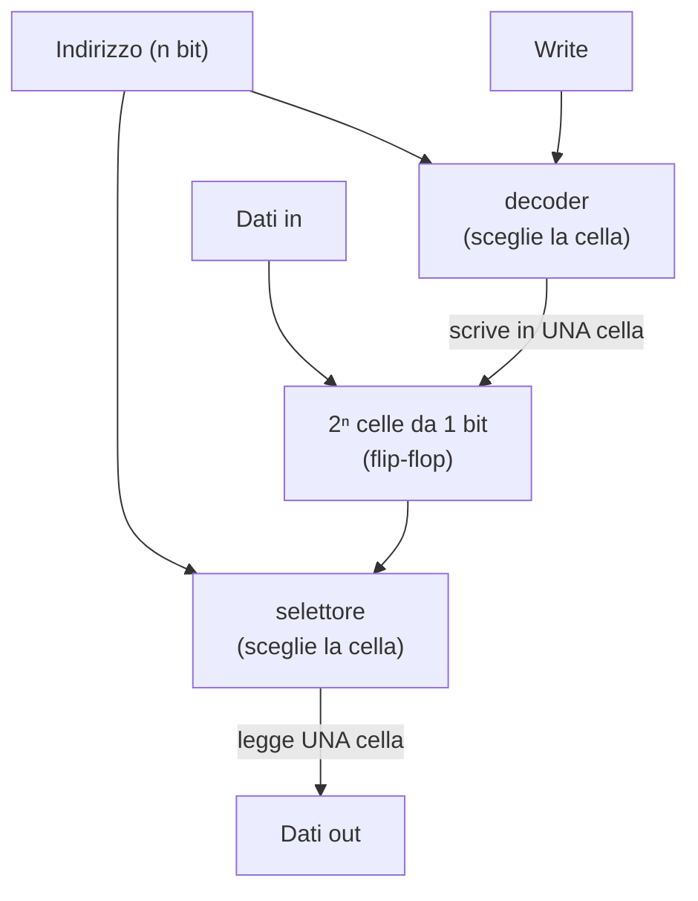

# 19 · Un assemblaggio di memoria
> cap. 19 di «Code» (Petzold, 2ª ed.) — orig. *An Assemblage of Memory*

La memoria è ciò che tiene in vita un'informazione nell'intervallo tra il momento in cui la si mette da parte e quello in cui la si va a riprendere. Si **scrive** e più tardi si **legge**; si **salva** e più tardi si **recupera**; si **memorizza** e più tardi si **accede**. Gli esseri umani lo fanno con il cervello (in modo disordinato e non del tutto affidabile, tanto che la scrittura fu probabilmente inventata proprio per rimediare ai difetti della memoria) e con supporti esterni come la carta, i dischi, il nastro magnetico. Anche i circuiti sanno ricordare: si è visto alla fine del capitolo 18 che una matrice di diodi conserva un'informazione fissa (una ROM). Questo capitolo compie il passo decisivo: costruire, a partire dai flip-flop, una memoria in cui i bit non solo si leggono, ma si possono anche **scrivere** e riscrivere a piacere. È la memoria vera e propria di un computer, e alla fine avrà un nome che tutti conoscono: **RAM**.

## Un bit di memoria

Il mattone di partenza è già in mano dal capitolo 17: il **latch a D** level-triggered. Ha due ingressi — **Write** (che qui prende il posto del "tieni a mente") e **Data In** (il bit da conservare) — e una uscita, **Data Out**. Quando Write vale 1, l'uscita copia l'ingresso Data In; quando Write torna a 0, l'uscita **congela** l'ultimo valore e non cambia più, qualunque cosa faccia Data In. Questo, né più né meno, è **un bit di memoria**: ci si scrive un valore alzando e riabbassando Write, e da quel momento il bit resta disponibile in lettura su Data Out. Come nota Petzold, la posizione fisica di ingressi e uscite non conta: ciò che conta è la funzione.

## Un byte di memoria

Un solo bit è ben poca cosa. Ma metterne insieme otto è immediato: si prendono otto celle da un bit e si **collegano insieme i loro otto segnali Write**, lasciando invece separati gli otto Data In e gli otto Data Out. Il risultato è una **memoria da un byte**: otto ingressi (DI₇…DI₀), otto uscite (DO₇…DO₀) e un unico ingresso Write, normalmente 0. Per salvare un byte si porta Write a 1 e poi di nuovo a 0; da quel momento gli otto bit restano memorizzati. L'intero blocco si può disegnare come una scatola sola, etichettata "8-Bit Memory".

## Indirizzare: scegliere una locazione tra tante

Un byte isolato non è ancora una memoria utile: serve poterne conservare **molti**, e poter raggiungere ciascuno singolarmente per leggerlo o riscriverlo. La soluzione è dare a ogni byte un **indirizzo**, un numero che lo identifica. Per scegliere uno tra otto byte bastano tre bit di indirizzo (perché con tre bit si contano otto combinazioni, da 000 a 111); il circuito deve però tradurre quell'indirizzo in due azioni distinte, una per scrivere e una per leggere.

- In **scrittura**, un **decoder** (già visto nel capitolo 10, e usato anche nel 18) prende l'indirizzo e il segnale Write e li instrada verso una e una sola cella: l'impulso di scrittura arriva soltanto al byte indirizzato, così solo quello viene modificato.
- In **lettura**, un **selettore** fa il percorso inverso: otto porte AND, pilotate dall'indirizzo, lasciano passare l'uscita del solo byte indirizzato; una grande porta OR raccoglie il risultato e lo presenta come Data Out.

Decoder e selettore si somigliano molto (entrambi usano un gruppo di porte AND comandate dai bit dell'indirizzo) al punto che, in una memoria reale, condividono buona parte di quella logica.

## La RAM

Il circuito completo (le celle più la logica di indirizzamento) è una **RAM array**. La più piccola, con otto celle da un bit, si descrive come **8×1** ("otto per uno"): otto locazioni, ognuna di 1 bit. Affiancando otto array 8×1 con gli indirizzi e i Write in comune si ottiene una **8×8** (otto byte); e raddoppiando ancora, una 16×8, e così via. Vista da fuori, qualunque RAM si riassume in una scatola con pochi terminali:

<figure>
<svg viewBox="0 0 422 220" role="img" aria-label="Il blocco RAM: ingressi Indirizzo (16 bit), Dati in (8 bit), Write ed Enable; uscita Dati out (8 bit)" style="width:100%;max-width:460px;height:auto;color:inherit"><g font-family="system-ui,Arial,sans-serif"><rect x="130" y="60" width="176" height="92" rx="6" fill="none" stroke="currentColor" stroke-width="1.9"/><text x="218" y="127" font-size="12.5" text-anchor="middle" font-weight="700" opacity="1" fill="currentColor">65.536 × 8 RAM</text><path d="M180 22 L180 60" fill="none" stroke="currentColor" stroke-width="1.7" stroke-linecap="round" stroke-linejoin="round"/><path d="M180 60 L175 51 L185 51 Z" fill="currentColor"/><text x="180" y="15" font-size="10.5" text-anchor="middle" font-weight="600" opacity="1" fill="currentColor">Dati in (8)</text><text x="144" y="79" font-size="10.5" text-anchor="start" font-weight="700" opacity="1" fill="currentColor">DI</text><path d="M272 22 L272 60" fill="none" stroke="currentColor" stroke-width="1.7" stroke-linecap="round" stroke-linejoin="round"/><path d="M272 60 L267 51 L277 51 Z" fill="currentColor"/><text x="272" y="15" font-size="10.5" text-anchor="middle" font-weight="600" opacity="1" fill="currentColor">Write</text><text x="292" y="79" font-size="10.5" text-anchor="end" font-weight="700" opacity="1" fill="currentColor">W</text><path d="M28 100 L130 100" fill="none" stroke="currentColor" stroke-width="1.7" stroke-linecap="round" stroke-linejoin="round"/><path d="M130 100 L121 95 L121 105 Z" fill="currentColor"/><text x="28" y="94" font-size="10.5" text-anchor="start" font-weight="600" opacity="1" fill="currentColor">Indirizzo (16)</text><text x="138" y="104" font-size="10.5" text-anchor="start" font-weight="700" opacity="1" fill="currentColor">Addr</text><path d="M394 100 L306 100" fill="none" stroke="currentColor" stroke-width="1.7" stroke-linecap="round" stroke-linejoin="round"/><path d="M306 100 L315 95 L315 105 Z" fill="currentColor"/><text x="394" y="94" font-size="10.5" text-anchor="end" font-weight="600" opacity="1" fill="currentColor">Enable</text><text x="298" y="104" font-size="10.5" text-anchor="end" font-weight="700" opacity="1" fill="currentColor">EN</text><text x="218" y="146" font-size="10.5" text-anchor="middle" font-weight="700" opacity="1" fill="currentColor">DO</text><path d="M218 152 L218 196" fill="none" stroke="currentColor" stroke-width="1.7" stroke-linecap="round" stroke-linejoin="round"/><path d="M218 196 L213 187 L223 187 Z" fill="currentColor"/><text x="218" y="210" font-size="10.5" text-anchor="middle" font-weight="600" opacity="1" fill="currentColor">Dati out (8)</text></g></svg>
<figcaption><em>Il blocco RAM riassunto: si presenta un <strong>indirizzo</strong> (qui 16 bit) per scegliere la locazione, un byte di <strong>Dati in</strong> con l'impulso di <strong>Write</strong> per scriverlo, e si legge il byte di <strong>Dati out</strong> (l'ingresso <strong>Enable</strong> serve a collegare o scollegare l'uscita, vedi sotto).</em></figcaption>
</figure>

Questa sigla, **RAM**, sta per *Random Access Memory*, memoria ad **accesso casuale**: qualunque locazione è raggiungibile direttamente, in un colpo solo, indicandone l'indirizzo, senza dover scorrere le altre in sequenza come invece impone un nastro magnetico. A differenza della ROM del capitolo 18, la RAM si può sia leggere sia **scrivere**. Il numero di locazioni è legato in modo diretto ai bit di indirizzo:

> **numero di locazioni = 2 ^ (numero di bit di indirizzo)**

Con 0 bit c'è una sola locazione, con 4 bit se ne hanno 16, con 16 bit se ne hanno **65.536**. Una RAM da 65.536 byte si dice anche da **64 kilobyte** (64 K, 64 KB), e qui c'è una piccola sorpresa: nel mondo dei bit *kilo* non vale 1000 ma **1024**, cioè 2¹⁰. Il motivo è che il sistema metrico ragiona per potenze di 10 e i numeri binari per potenze di 2, e le due scale non coincidono mai esattamente; capita però che si sfiorino, perché 1024 è molto vicino a 1000. Così 65.536 = 64 × 1024 diventa "64 KB".

> [!warning]
> La RAM costruita con i flip-flop è **volatile**: conserva i suoi bit solo finché è alimentata. Togliendo la corrente, tutti i flip-flop perdono il loro stato e il contenuto svanisce. È la differenza pratica con una ROM (che invece mantiene i dati) e il motivo per cui un computer, all'accensione, trova la propria RAM "vuota" e deve ricaricarvi tutto.

## Collegare senza cortocircuiti: il tri-state buffer

Fin qui una regola è sempre valsa: non si collegano tra loro le uscite di più porte, pena il cortocircuito. Ma una memoria deve poter condividere gli stessi fili con altri circuiti, quindi serve un modo per aggirarla. Lo fornisce il **tri-state buffer**: un componente simile a un semplice buffer, ma con un ingresso in più, **Enable**.

<figure>
<svg viewBox="0 0 322 108" role="img" aria-label="Tri-state buffer: con Enable a 1 l'uscita copia l'ingresso, con Enable a 0 l'uscita si scollega" style="width:100%;max-width:340px;height:auto;color:inherit"><g font-family="system-ui,Arial,sans-serif"><path d="M120 36 L120 100 L178 68 Z" fill="none" stroke="currentColor" stroke-width="1.9"/><path d="M34 68 L120 68" fill="none" stroke="currentColor" stroke-width="1.7" stroke-linecap="round" stroke-linejoin="round"/><text x="30" y="72" font-size="11" text-anchor="end" font-weight="600" opacity="1" fill="currentColor">Input</text><path d="M178 68 L268 68" fill="none" stroke="currentColor" stroke-width="1.7" stroke-linecap="round" stroke-linejoin="round"/><path d="M268 68 L259 63 L259 73 Z" fill="currentColor"/><text x="276" y="72" font-size="11" text-anchor="start" font-weight="600" opacity="1" fill="currentColor">Output</text><path d="M149 12 L149 56" fill="none" stroke="currentColor" stroke-width="1.7" stroke-linecap="round" stroke-linejoin="round"/><path d="M149 56 L144 47 L154 47 Z" fill="currentColor"/><text x="149" y="8" font-size="11" text-anchor="middle" font-weight="600" opacity="1" fill="currentColor">Enable</text></g></svg>
<figcaption><em>Il tri-state buffer. Con <strong>Enable = 1</strong> l'uscita copia l'ingresso; con <strong>Enable = 0</strong> l'uscita non vale né 0 né 1: "flotta", cioè si comporta come se fosse fisicamente scollegata.</em></figcaption>
</figure>

Quel terzo stato (oltre a 0 e 1, lo stato "flottante") è la chiave: si possono collegare insieme le uscite di **tanti** tri-state buffer sullo stesso filo senza cortocircuiti, a patto che se ne abiliti **uno solo alla volta**. È esattamente il ruolo dell'ingresso **Enable** della scatola RAM vista sopra: quando è 0, la RAM stacca la propria uscita dal filo condiviso e lascia il posto ad altri. Questa idea (molte sorgenti che si alternano su un filo comune) è il seme del **bus**, che il capitolo 22 svilupperà appieno.

## Caricare la memoria a mano: il pannello di controllo

Resta un'ultima domanda pratica: come si mettono dei valori nella RAM, prima ancora di avere un computer che lo faccia da sé? Con un **pannello di controllo** fatto di interruttori: uno per ciascun bit dell'indirizzo, uno per ciascun bit del dato, un interruttore **Write** per scrivere, e una fila di lampadine per leggere il Data Out. Petzold aggiunge un interruttore ingegnoso, **Takeover**: quando è a 0 il pannello è inerte e la memoria resta a disposizione di altri circuiti; quando è a 1 il pannello prende il **controllo esclusivo** della RAM. Realizzarlo richiede una manciata di **selettori 2-a-1** (un circuitino che, in base a un segnale di Select, lascia passare l'uno o l'altro dei due ingressi): uno per ogni bit di indirizzo e di dato, più Write ed Enable, così che tutti quei segnali provengano dal pannello oppure dagli altri circuiti, a seconda di Takeover.

> [!tip]
> Una RAM non è altro che **tante celle da un bit** (flip-flop) più la **logica di indirizzamento** (decoder in scrittura, selettore in lettura) che sceglie su quale cella agire. Tutto il resto (le dimensioni giganti delle memorie reali) è solo questo schema ripetuto e ingrandito.

Quella memoria, per ora, contiene numeri caricati a mano. Ma nulla vieta che tra quei numeri ce ne siano alcuni che non rappresentano *dati* bensì **istruzioni** — comandi da eseguire uno dopo l'altro. È il salto che compie il capitolo 20: smettere di azionare l'aritmetica a mano e lasciare che sia la macchina, leggendo la propria memoria, ad automatizzarla.

## Ripasso lampo

Qual è il mattone di base di un bit di memoria e come ci si scrive dentro?

È il **latch a D** level-triggered (dal capitolo 17), con ingressi **Write** e **Data In** e uscita **Data Out**. Si scrive portando Write a 1 (l'uscita copia Data In) e poi di nuovo a 0: da quel momento il bit resta congelato sull'ultimo valore, indipendentemente da Data In.

A cosa servono il <code>decoder</code> e il <code>selettore</code> in una RAM?

Traducono l'indirizzo nelle due operazioni fondamentali. Il **decoder** (in scrittura) instrada l'impulso di Write verso la sola cella indirizzata, così solo quella viene modificata. Il **selettore** (in lettura) lascia passare verso Data Out l'uscita della sola cella indirizzata. Entrambi usano porte AND comandate dai bit dell'indirizzo.

Cosa significa <code>RAM</code> e perché "accesso casuale"?

RAM sta per *Random Access Memory*, memoria ad **accesso casuale**: ogni locazione è raggiungibile direttamente indicandone l'indirizzo, in qualsiasi ordine e nello stesso tempo, senza doverle scorrere in sequenza come su un nastro magnetico. A differenza di una ROM, la RAM si può anche **scrivere**.

Quante locazioni ha una RAM con 16 bit di indirizzo, e perché si dice da "64 KB"?

Il numero di locazioni è 2 elevato al numero di bit di indirizzo: con 16 bit sono 2¹⁶ = **65.536**. Si dice "64 KB" perché nel mondo binario *kilo* vale 2¹⁰ = **1024** (non 1000), e 65.536 = 64 × 1024. Il termine "kilobyte" nasce dalla vicinanza tra 1024 e 1000.

Perché serve il <code>tri-state buffer</code> e cosa fa il suo stato "flottante"?

Serve a collegare più uscite sullo stesso filo senza cortocircuiti. Con Enable a 1 l'uscita copia l'ingresso; con Enable a 0 l'uscita "flotta", cioè si comporta come scollegata. Abilitando un solo buffer per volta, tante sorgenti possono condividere lo stesso filo: è l'idea alla base del **bus**.

Che differenza c'è tra una RAM e la ROM del capitolo 18 riguardo all'alimentazione?

La RAM costruita con flip-flop è **volatile**: perde tutto il contenuto quando si toglie la corrente. La ROM (matrice di diodi) è invece permanente: conserva i suoi dati anche senza alimentazione, perché l'informazione è cablata nella struttura fisica.

**In sintesi:**
- Un **bit di memoria** è un latch a D: **Write** cattura **Data In**, poi il bit resta congelato su **Data Out**.
- Otto celle con Write comune fanno un **byte**; molte locazioni, ciascuna con un **indirizzo**, fanno una memoria.
- Un **decoder** (scrittura) e un **selettore** (lettura) usano l'indirizzo per agire su una sola cella: è il cuore della **RAM** (*Random Access Memory*), leggibile **e** scrivibile.
- Le locazioni sono **2^(bit di indirizzo)**: 16 bit → 65.536 byte = 64 KB (dove *kilo* = 1024 = 2¹⁰). La RAM a flip-flop è **volatile**.
- Il **tri-state buffer** (Enable → uscita che "flotta") permette a più uscite di condividere un filo: il seme del **bus**. Un **pannello di controllo** con interruttori e un tasto **Takeover** carica la memoria a mano.
