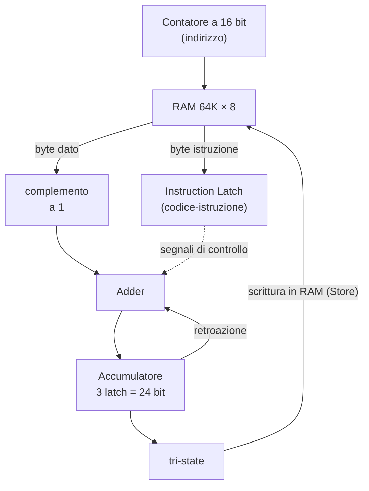

# 20 · Automatizzare l'aritmetica
> cap. 20 di «Code» (Petzold, 2ª ed.) — orig. *Automating Arithmetic*

Gli esseri umani sono inventivi e industriosi ma, allo stesso tempo, profondamente pigri: sono disposti a spendere ore per costruire un aggeggio che risparmi qualche minuto di lavoro. Questo capitolo cavalca proprio quella pigrizia. Si parte dal sommatore-sottrattore del capitolo 16 e, macchina dopo macchina, lo si rende sempre più capace di **fare da solo** i conti, finché non emerge qualcosa che merita davvero il nome di **computer**. È il capitolo più impegnativo finora — nessuno si offende se qualche dettaglio si legge di sfuggita — ma è anche quello in cui tutti i pezzi costruiti nei capitoli precedenti (sommatore, latch, contatore, RAM, tri-state) trovano finalmente il loro posto.

## La macchina accumulatrice

Il primo passo è togliere fatica alla somma ripetuta. Il sommatore del capitolo 16 somma due numeri presi dagli interruttori; ma se si vuole sommare una lunga lista, si finisce per reinserire ogni volta il totale parziale. L'idea è farlo conservare **alla macchina stessa**, collegando l'uscita del sommatore a un **latch** — che diventa così un **accumulatore**, il registro del totale corrente — e rimandando l'uscita del latch all'ingresso del sommatore.

<figure>
<svg viewBox="0 0 372 306" role="img" aria-label="Macchina accumulatrice: un sommatore la cui uscita Sum va in un latch (accumulatore); l'uscita Q del latch rientra nell'ingresso B del sommatore, così a ogni impulso Add il nuovo numero si somma al totale" style="width:100%;max-width:420px;height:auto;color:inherit"><g font-family="system-ui,Arial,sans-serif"><rect x="100" y="54" width="150" height="58" rx="6" fill="none" stroke="currentColor" stroke-width="1.8"/><text x="175" y="88" font-size="12" text-anchor="middle" font-weight="700" opacity="1" fill="currentColor">8-Bit Adder</text><text x="120" y="72" font-size="10.5" text-anchor="middle" font-weight="700" opacity="1" fill="currentColor">A</text><text x="226" y="72" font-size="10.5" text-anchor="middle" font-weight="700" opacity="1" fill="currentColor">B</text><text x="112" y="104" font-size="9.5" text-anchor="start" font-weight="600" opacity="1" fill="currentColor">CI</text><text x="175" y="106" font-size="9.5" text-anchor="middle" font-weight="600" opacity="1" fill="currentColor">Sum</text><rect x="100" y="176" width="150" height="58" rx="6" fill="none" stroke="currentColor" stroke-width="1.8"/><text x="175" y="205" font-size="12" text-anchor="middle" font-weight="700" opacity="1" fill="currentColor">8-Bit Latch</text><text x="175" y="222" font-size="9" text-anchor="middle" font-weight="400" opacity=".7" fill="currentColor">(accumulatore)</text><text x="175" y="190" font-size="10.5" text-anchor="middle" font-weight="700" opacity="1" fill="currentColor">D</text><text x="150" y="232" font-size="10.5" text-anchor="middle" font-weight="700" opacity="1" fill="currentColor">Q</text><text x="112" y="206" font-size="9.5" text-anchor="start" font-weight="600" opacity="1" fill="currentColor">Clk</text><path d="M130 22 L130 54" fill="none" stroke="currentColor" stroke-width="1.7" stroke-linecap="round" stroke-linejoin="round"/><path d="M130 54 L125 45 L135 45 Z" fill="currentColor"/><text x="130" y="15" font-size="10" text-anchor="middle" font-weight="600" opacity="1" fill="currentColor">numero da sommare</text><path d="M175 112 L175 176" fill="none" stroke="currentColor" stroke-width="1.7" stroke-linecap="round" stroke-linejoin="round"/><path d="M175 176 L170 167 L180 167 Z" fill="currentColor"/><path d="M150 234 L150 282" fill="none" stroke="currentColor" stroke-width="1.7" stroke-linecap="round" stroke-linejoin="round"/><path d="M150 282 L145 273 L155 273 Z" fill="currentColor"/><text x="150" y="296" font-size="10" text-anchor="middle" font-weight="600" opacity="1" fill="currentColor">totale corrente</text><circle cx="150" cy="258" r="2.6" fill="currentColor"/><path d="M150 258 L330 258 L330 40 L220 40 L220 54" fill="none" stroke="currentColor" stroke-width="1.7" stroke-linecap="round" stroke-linejoin="round"/><path d="M220 54 L215 45 L225 45 Z" fill="currentColor"/><text x="300" y="33" font-size="9" text-anchor="end" font-weight="400" opacity=".75" fill="currentColor">retroazione (B = totale precedente)</text><path d="M34 206 L100 206" fill="none" stroke="currentColor" stroke-width="1.7" stroke-linecap="round" stroke-linejoin="round"/><path d="M100 206 L91 201 L91 211 Z" fill="currentColor"/><text x="30" y="210" font-size="10.5" text-anchor="end" font-weight="700" opacity="1" fill="currentColor">Add</text><path d="M70 104 L100 104" fill="none" stroke="currentColor" stroke-width="1.7" stroke-linecap="round" stroke-linejoin="round"/><text x="64" y="108" font-size="9.5" text-anchor="end" font-weight="600" opacity="1" fill="currentColor">0</text></g></svg>
<figcaption><em>La macchina accumulatrice. L'ingresso <strong>A</strong> riceve il nuovo numero, l'ingresso <strong>B</strong> il totale precedente (dall'uscita Q del latch); premendo <strong>Add</strong> il latch memorizza la nuova somma. L'accumulatore tiene così il totale corrente senza doverlo reinserire.</em></figcaption>
</figure>

Ogni pressione del pulsante **Add** somma il numero impostato al totale già presente nell'accumulatore. Se il latch parte azzerato, la prima pressione "carica" semplicemente il primo numero; le successive lo sommano ai precedenti. È già un piccolo aiuto, ma i numeri arrivano ancora da interruttori azionati a mano.

## Automatizzare: i numeri vengono dalla memoria

Nel capitolo 19 si è costruita una **RAM** con un pannello di controllo per caricarci dei valori. La si può mettere al servizio della macchina accumulatrice: invece di prendere il numero dagli interruttori, lo si prende dal **Data Out** della RAM; e invece di limitarsi ad accendere lampadine, il risultato può tornare al **Data In**. Ma per sommare una lista di numeri serve che la macchina scorra la memoria **da sola**, indirizzo dopo indirizzo. Il pezzo giusto c'è già: un **contatore** (dal capitolo 17). Il suo valore fa da **indirizzo** per la RAM; a ogni colpo di clock avanza da 0000h a 0001h a 0002h e così via, presentando al sommatore un byte dopo l'altro, e l'accumulatore somma ciascuno al totale.

Perché tutto ciò funzioni, i vari impulsi vanno **sincronizzati**: leggere la memoria e sommare richiede un po' di tempo, quindi il colpo di clock che memorizza il totale nel latch deve arrivare *dopo* quello che fa avanzare il contatore, e il contatore deve avanzare di nuovo solo *dopo* che il latch ha memorizzato. Questi segnali di coordinamento — che Petzold chiama **segnali di controllo** (*control signals*) — si ottengono da un oscillatore seguito da un paio di flip-flop che ne ricavano due impulsi sfalsati. Sono, di solito, la parte più intricata di una macchina come questa.

## L'accumulatore a tre byte e il codice-istruzione

Un accumulatore da un solo byte arriva presto al limite (255). Per numeri più grandi Petzold costruisce l'**accumulatore a tre byte**, capace di 24 bit di precisione: tre latch (basso, medio, alto) con la relativa propagazione del **riporto** da un byte al successivo, e un blocco di **complemento a uno** sulla strada dei dati, per poter anche **sottrarre** (invertendo i bit, come nel capitolo 16). Ma la novità concettuale davvero importante è un'altra: compare un latch speciale, l'**Instruction Latch**, che non conserva un dato bensì un **codice-istruzione** — un byte che dice alla macchina *cosa fare*.

L'idea cambia tutto. La memoria viene organizzata in **gruppi di quattro byte**: il primo è il codice-istruzione, i tre seguenti sono i byte del numero su cui operare. Il contatore scorre la memoria e i suoi due bit più bassi indicano a che punto si è nel gruppo:

| 2 bit bassi dell'indirizzo | byte letto |
|:---:|---|
| 00 | codice-istruzione (va nell'Instruction Latch) |
| 01 | byte **basso** del dato |
| 10 | byte **medio** del dato |
| 11 | byte **alto** del dato |

Il codice-istruzione, una volta caricato nell'Instruction Latch, **resta lì** mentre si leggono i tre byte del dato, e sono i suoi bit a comandare tutto il resto della macchina: se abilitare i clock dei tre latch (per sommare o sottrarre), se invertire i dati (per la sottrazione), se scrivere il totale in memoria, se fermarsi. Vista d'insieme, la macchina è questa:

I codici-istruzione di questa macchina sono quattro, scelti con cura perché i loro bit servano direttamente da segnali di controllo:

| Codice | Istruzione | Effetto |
|:---:|---|---|
| `02h` | **Add** | somma i tre byte seguenti al totale |
| `03h` | **Subtract** | sottrae i tre byte seguenti dal totale |
| `04h` | **Store** | scrive il totale corrente nei tre byte seguenti |
| `08h` | **Halt** | ferma la macchina (blocca l'oscillatore) |

I valori non sono casuali. Add (`02h`) e Subtract (`03h`) condividono il bit di valore 2 (il bit Q₁ dell'Instruction Latch): è quel bit, uguale a 1 in entrambe, ad abilitare i clock che caricano i tre byte nell'accumulatore; il bit di valore 1 (Q₀), acceso solo in Subtract, comanda invece il complemento a uno e il riporto iniziale. Store usa il bit di valore 4 (Q₂) per abilitare i tri-state e scrivere il totale in memoria; Halt usa il bit di valore 8 (Q₃) per spegnere l'oscillatore che "muove" tutta la macchina.

> [!tip]
> Il colpo di genio è **spostare il comando dentro la memoria**: la macchina non esegue una sequenza cablata una volta per tutte, ma legge da sé, byte dopo byte, *cosa* deve fare. Cambiando i byte in memoria si cambia il comportamento della macchina senza toccarne un solo filo.

## La grande rivelazione (e la nascita del computer)

L'accumulatore a tre byte, in sé, è un vicolo cieco: il limite di tre byte è cablato nell'hardware e non si allarga facilmente. Ma lungo la strada si è scoperto qualcosa di enorme: **una macchina può comportarsi seguendo codici conservati in memoria**. Qui i codici erano solo quattro, però un codice sta in un byte, e un byte ha 256 valori: si possono quindi definire fino a **256 istruzioni** diverse. Le singole istruzioni possono restare semplici, ma combinandole se ne ottengono compiti via via più complessi.

È il principio che regge ogni computer, ed è anche il confine tra le sue due metà: i compiti **semplici** si realizzano in **hardware** (i circuiti che eseguono ciascuna istruzione), quelli **complessi** in **software** (sequenze di istruzioni). Da un lato i mattoni cablati, dall'altro la libertà di combinarli a piacere. Una macchina così — che legge istruzioni dalla memoria e le esegue — è, a tutti gli effetti, un **computer**.

> [!info]
> Costruire una macchina del genere nel 1970 sarebbe stato un lavoro immane; nel 1980 bastava **comprarne** una su un chip. Il primo "computer su un chip" fu l'**Intel 4004** (novembre 1971): 4 bit, 2.250 transistor, 4 KB di memoria indirizzabile. Seguirono l'**8008** (1972, 8 bit, 16 KB), pensato per i *sistemi embedded*, e soprattutto l'**Intel 8080** (aprile 1974): 8 bit, circa 4.500 transistor, 64 KB di memoria, in un chip a 40 piedini. Sarà proprio l'8080 il microprocessore di riferimento nei prossimi capitoli.

Il capitolo 21 riprende da qui: quel sommatore al centro della macchina verrà potenziato fino a diventare un'**unità aritmetico-logica** (ALU), capace non solo di sommare e sottrarre ma anche di eseguire le operazioni logiche (AND, OR, XOR) sui bit.

## Ripasso lampo

Che cos'è un <code>accumulatore</code> e come nasce dalla macchina accumulatrice?

È il registro (un latch) che conserva il **totale corrente**. Nasce collegando l'uscita del sommatore a un latch e rimandando l'uscita del latch all'ingresso del sommatore: a ogni impulso di Add, il nuovo numero (ingresso A) si somma al totale già memorizzato (ingresso B, cioè l'uscita del latch), e la nuova somma viene ricongelata nel latch.

Come fa la macchina a sommare una lista di numeri "da sola", senza reinserirli?

I numeri stanno in **RAM**; un **contatore** fornisce indirizzi successivi (0000h, 0001h, …), così a ogni colpo di clock un byte diverso arriva al sommatore e viene aggiunto all'accumulatore. Alcuni **segnali di controllo** (ricavati da un oscillatore più due flip-flop) sincronizzano l'avanzamento del contatore con la memorizzazione nel latch.

Cosa contiene l'<code>Instruction Latch</code> e perché è la vera svolta?

Contiene un **codice-istruzione** (un byte) che dice alla macchina *cosa fare*, non un dato. È la svolta perché il comportamento della macchina non è più cablato una volta per tutte: la macchina legge dalla memoria, byte dopo byte, quali operazioni compiere. Cambiando i byte in memoria si cambia ciò che fa, senza modificarne i circuiti.

Com'è organizzata la memoria di questa macchina?

In **gruppi di quattro byte**: il primo (indirizzo con i 2 bit bassi = 00) è il codice-istruzione, i tre seguenti (01, 10, 11) sono i byte basso, medio e alto del numero su cui operare. Il contatore scorre la memoria e i due bit più bassi dell'indirizzo dicono a che punto del gruppo ci si trova.

Perché Add è <code>02h</code> e Subtract <code>03h</code>, e non 01h e 02h?

Perché così condividono il **bit di valore 2** (Q₁), che in entrambe vale 1 e serve ad abilitare i clock dei latch dell'accumulatore. Il **bit di valore 1** (Q₀), acceso solo in Subtract (`03h`), comanda invece il complemento a uno e il riporto iniziale. I codici sono scelti in modo che i loro bit facciano direttamente da segnali di controllo.

Qual è la "grande rivelazione" del capitolo e cosa distingue hardware e software?

Che una macchina può **eseguire codici conservati in memoria**, e con codici di un byte se ne possono definire fino a **256**. Da qui il confine: i compiti **semplici** sono realizzati in **hardware** (i circuiti che eseguono ogni istruzione), quelli **complessi** in **software** (sequenze di istruzioni). Una macchina così è, a tutti gli effetti, un **computer**.

**In sintesi:**
- Collegando un sommatore a un **latch** (accumulatore) con retroazione si costruisce una **macchina accumulatrice** che tiene il totale corrente.
- Prendendo i numeri dalla **RAM** e usando un **contatore** come indirizzo, la macchina somma una lista **da sola**; alcuni **segnali di controllo** sincronizzano il tutto.
- L'**accumulatore a tre byte** aggiunge precisione (24 bit), il complemento a uno per **sottrarre** e — soprattutto — un **Instruction Latch** che conserva un **codice-istruzione**.
- La memoria è in **gruppi di 4 byte** (istruzione + 3 byte dato); gli opcode sono `02h` Add, `03h` Subtract, `04h` Store, `08h` Halt, scelti così che i loro bit facciano da controllo.
- La **rivelazione**: una macchina che esegue **codici in memoria** è un **computer**; i compiti semplici stanno nell'**hardware**, quelli complessi nel **software**. Storicamente ciò diventa il microprocessore (Intel 4004, 8008, **8080**).
