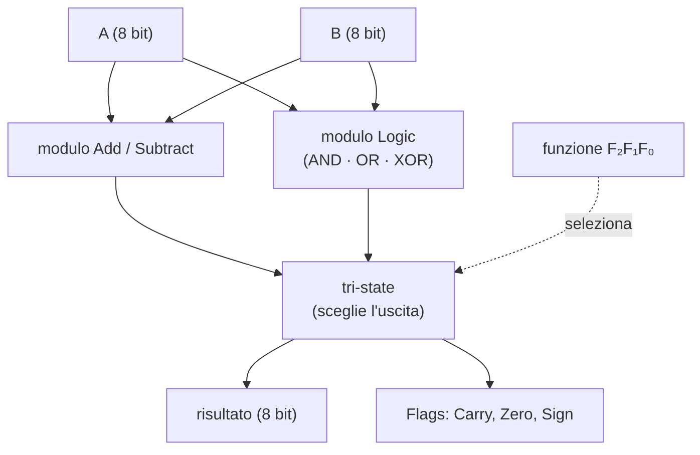

# 21 · L'unità aritmetico-logica
> cap. 21 di «Code» (Petzold, 2ª ed.) — orig. *The Arithmetic Logic Unit*

Un computer moderno, per quanto complesso, si divide grosso modo in tre categorie di componenti: la **memoria** (costruita nel capitolo 19), la **CPU** (*central processing unit*, l'unità centrale di elaborazione) e i dispositivi di **ingresso/uscita** (I/O), spesso chiamati **periferiche**. La memoria, come si è visto, contiene sequenze di byte; alcuni sono **codici-istruzione** — collettivamente il **codice** (*code*) — e tutto il resto sono **dati** (*data*): numeri, testo, immagini, suoni, qualunque cosa si possa rappresentare con 0 e 1. Questo capitolo costruisce il cuore aritmetico della CPU, l'**unità aritmetico-logica** o **ALU**, il circuito che macina i numeri.

## Codice e dati: un vero programma

Prima di costruire la ALU conviene vedere come appare un pezzo di memoria che contiene un programma. Petzold, invece di inventarsi dei codici, usa quelli **reali del microprocessore Intel 8080** — lo stesso che farà da modello per la CPU dei prossimi capitoli. Ecco un programma che somma 1388h (5000 in decimale) e 09C4h (2500), entrambi numeri a 16 bit, e ne scrive il risultato in memoria:

| Indirizzo | Byte | Significato |
|:---:|:---:|---|
| 0000h | `3Eh` | carica nell'accumulatore il byte seguente |
| 0001h | `88h` | byte basso di 1388h (5000) |
| 0002h | `C6h` | somma all'accumulatore il byte seguente |
| 0003h | `C4h` | byte basso di 09C4h (2500) |
| 0004h | `32h` | memorizza il risultato all'indirizzo nei due byte seguenti |
| 0005–6h | `10h 00h` | indirizzo 0010h |
| 0007h | `3Eh` | carica nell'accumulatore il byte seguente |
| 0008h | `13h` | byte alto di 1388h |
| 0009h | `CEh` | somma **con riporto** il byte seguente |
| 000Ah | `09h` | byte alto di 09C4h |
| 000Bh | `32h` | memorizza il risultato… |
| 000C–Dh | `11h 00h` | …all'indirizzo 0011h |
| 000Eh | `76h` | ferma la CPU |

La macchina somma prima i due byte **bassi** (88h e C4h) e ne salva il risultato a 0010h; poi somma i due byte **alti** (13h e 09h) tenendo conto di un eventuale **riporto** dalla prima somma, e salva a 0011h. Il risultato a 16 bit finisce nei due byte 0010h–0011h. Una sequenza di istruzioni come questa ha un nome che si conosce già: è un **programma**. I codici usati non sono inventati ma sono opcode veri dell'8080:

| Opcode | Mnemonico | Operazione |
|:---:|:---:|---|
| `3Eh` | MVI A | *move immediate*: carica il byte seguente nell'accumulatore |
| `C6h` | ADI | *add immediate*: somma il byte seguente all'accumulatore |
| `CEh` | ACI | *add with carry immediate*: somma con riporto il byte seguente |
| `32h` | STA | *store accumulator*: scrive l'accumulatore all'indirizzo indicato |
| `76h` | HLT | *halt*: ferma la CPU |

## Non solo aritmetica: la logica

La "L" di ALU sta per **logica**, e non è un dettaglio: molte manipolazioni utili non sono somme ma **operazioni booleane** bit per bit. L'esempio classico è la conversione tra maiuscole e minuscole in ASCII. Confrontando i codici di una lettera maiuscola e della sua minuscola si scopre che differiscono per **un solo bit**, il terzo da sinistra (quello di valore 20h): la minuscola ha quel bit a 1. Per trasformare una maiuscola in minuscola non serve una somma — che rovinerebbe le lettere già minuscole — ma un'operazione **OR** con 20h, che *forza* quel bit a 1 e lascia intatto tutto il resto:

```
  01010100   (T, maiuscola)
OR 00100000  (20h)
  ─────────
  01110100   (t, minuscola)
```

Fare l'OR con 20h su una lettera già minuscola la lascia invariata (il bit è già 1). Simmetricamente, un **AND** con DFh (il complemento di 20h) *azzera* quel bit e converte in maiuscolo. Sono proprio queste — **AND**, **OR** e **XOR** — le operazioni logiche che la ALU deve saper eseguire accanto a somma e sottrazione.

## Dentro la ALU

La ALU si costruisce affiancando due moduli che lavorano **in parallelo** sugli stessi due ingressi A e B a 8 bit: il modulo **Add/Subtract** (il sommatore-sottrattore del capitolo 16) e il modulo **Logic**, che contiene un blocco AND, uno OR e uno XOR. Tutti calcolano contemporaneamente il proprio risultato; poi dei **tri-state buffer** (dal capitolo 19) lasciano passare all'uscita **uno solo** di quei risultati, scelto in base a un codice di **funzione** a 3 bit — F₂, F₁, F₀.



Il bit F₂ fa da grande interruttore: quando vale 0 è abilitato il modulo aritmetico (somma o sottrazione, distinte dagli altri due bit), quando seleziona una delle combinazioni logiche è abilitato il modulo Logic. È lo stesso identico principio del capitolo 20 — usare i bit di un codice come segnali di controllo — applicato qui per scegliere l'operazione.

## I flag di stato

Oltre al risultato, la ALU produce alcuni bit che ne **riassumono l'esito**: i **flag** (bandiere di stato). Petzold ne usa tre:

- **Carry** (riporto, abbreviato **CY**): segnala che una somma ha prodotto un riporto oltre l'ottavo bit (o un prestito in una sottrazione). È essenziale per l'aritmetica multi-byte: il Carry in uscita **rientra** come *Carry In* nell'operazione successiva, così si sommano numeri più grandi di un byte (come nel programma qui sopra, dove ACI usa il riporto della somma dei byte bassi).
- **Zero** (**Z**): vale 1 quando il risultato è **tutto zeri**. Lo determina una porta **NOR a otto ingressi** applicata al risultato.
- **Sign** (segno, **S**): è semplicemente il **bit più alto** del risultato che, nella notazione in complemento a due del capitolo 16, indica un numero negativo.

I tre flag vengono memorizzati in un latch e trattati come 3 bit di un byte in uscita dalla ALU. La loro utilità piena si vedrà nel capitolo 24: sono ciò che permette a un programma di **prendere decisioni** ("se il risultato è zero, salta a…").

## La ALU completa

Nascondendo tutta questa logica in una scatola, la ALU si presenta con pochi terminali:

<figure>
<svg viewBox="0 0 476 202" role="img" aria-label="La scatola ALU: ingressi funzione (3 bit), A e B (8 bit), Clock ed Enable; uscite Flags e risultato a 8 bit" style="width:100%;max-width:480px;height:auto;color:inherit"><g font-family="system-ui,Arial,sans-serif"><rect x="120" y="66" width="232" height="84" rx="7" fill="none" stroke="currentColor" stroke-width="1.9"/><text x="236.0" y="100" font-size="12.5" text-anchor="middle" font-weight="700" opacity="1" fill="currentColor">Unità aritmetico-logica</text><text x="236.0" y="118" font-size="11" text-anchor="middle" font-weight="700" opacity=".85" fill="currentColor">(ALU)</text><path d="M158 28 L158 66" fill="none" stroke="currentColor" stroke-width="1.7" stroke-linecap="round" stroke-linejoin="round"/><path d="M158 66 L153 57 L163 57 Z" fill="currentColor"/><text x="158" y="21" font-size="10" text-anchor="middle" font-weight="600" opacity="1" fill="currentColor">funzione (3 bit)</text><path d="M236 28 L236 66" fill="none" stroke="currentColor" stroke-width="1.7" stroke-linecap="round" stroke-linejoin="round"/><path d="M236 66 L231 57 L241 57 Z" fill="currentColor"/><text x="236" y="21" font-size="10" text-anchor="middle" font-weight="600" opacity="1" fill="currentColor">A (8)</text><path d="M314 28 L314 66" fill="none" stroke="currentColor" stroke-width="1.7" stroke-linecap="round" stroke-linejoin="round"/><path d="M314 66 L309 57 L319 57 Z" fill="currentColor"/><text x="314" y="21" font-size="10" text-anchor="middle" font-weight="600" opacity="1" fill="currentColor">B (8)</text><path d="M36 108 L120 108" fill="none" stroke="currentColor" stroke-width="1.7" stroke-linecap="round" stroke-linejoin="round"/><path d="M120 108 L111 103 L111 113 Z" fill="currentColor"/><text x="34" y="104" font-size="10" text-anchor="end" font-weight="600" opacity="1" fill="currentColor">Clock</text><path d="M436 108 L352 108" fill="none" stroke="currentColor" stroke-width="1.7" stroke-linecap="round" stroke-linejoin="round"/><path d="M352 108 L361 103 L361 113 Z" fill="currentColor"/><text x="438" y="104" font-size="10" text-anchor="start" font-weight="600" opacity="1" fill="currentColor">Enable</text><path d="M200 150 L200 182" fill="none" stroke="currentColor" stroke-width="1.7" stroke-linecap="round" stroke-linejoin="round"/><path d="M200 182 L195 173 L205 173 Z" fill="currentColor"/><text x="200" y="196" font-size="10" text-anchor="middle" font-weight="600" opacity="1" fill="currentColor">Flags</text><path d="M280 150 L280 182" fill="none" stroke="currentColor" stroke-width="1.7" stroke-linecap="round" stroke-linejoin="round"/><path d="M280 182 L275 173 L285 173 Z" fill="currentColor"/><text x="280" y="196" font-size="10" text-anchor="middle" font-weight="600" opacity="1" fill="currentColor">risultato (8)</text></g></svg>
<figcaption><em>La ALU come scatola. In alto: il codice di <strong>funzione</strong> (3 bit, F₂F₁F₀) che sceglie l'operazione, e i due operandi <strong>A</strong> e <strong>B</strong> a 8 bit. Ai lati <strong>Clock</strong> ed <strong>Enable</strong>. In basso i <strong>Flags</strong> (Carry, Zero, Sign) e il <strong>risultato</strong> a 8 bit.</em></figcaption>
</figure>

L'unità aritmetico-logica è completa. È un componente essenziale della CPU, ma da sola non basta: servono ancora un modo per **portare** i numeri dentro la ALU, per **conservarne** i risultati e per **spostarli** da una parte all'altra. È esattamente ciò che costruisce il capitolo 22, con i **registri** e i **bus**.

## Ripasso lampo

<details>
<summary>In quali tre categorie si dividono i componenti di un computer, e cosa contiene la memoria?</summary>

**Memoria**, **CPU** (unità centrale) e dispositivi di **ingresso/uscita** (I/O, o periferiche). La memoria contiene byte che sono in parte **codice** (i codici-istruzione) e in parte **dati** (numeri, testo, immagini, suoni: tutto ciò che si rappresenta con 0 e 1).

</details>

<details>
<summary>Che cos'è un programma, in termini di ciò che sta in memoria?</summary>

È una **sequenza di codici-istruzione** (con i loro dati) conservata in memoria. La CPU li legge uno dopo l'altro e li esegue. Nell'esempio del capitolo, il programma somma due numeri a 16 bit usando opcode reali dell'Intel 8080 (MVI A, ADI, ACI, STA, HLT).

</details>

<details>
<summary>Perché la ALU deve saper fare operazioni logiche e non solo aritmetiche?</summary>

Perché molte manipolazioni utili sono booleane, bit per bit. L'esempio è la conversione maiuscolo/minuscolo in ASCII: differiscono per un solo bit (valore 20h), e lo si forza con un **OR** (per rendere minuscolo) o lo si azzera con un **AND** (per rendere maiuscolo), senza toccare gli altri bit. La ALU esegue perciò anche AND, OR e XOR.

</details>

<details>
<summary>Come sceglie la ALU quale operazione eseguire?</summary>

I moduli **Add/Subtract** e **Logic** (AND, OR, XOR) lavorano tutti in parallelo sugli stessi A e B; un codice di **funzione** a 3 bit (F₂F₁F₀) comanda dei **tri-state buffer** che lasciano passare all'uscita il risultato di uno solo di essi. È lo stesso principio di usare i bit di un codice come segnali di controllo.

</details>

<details>
<summary>Cosa sono i flag Carry, Zero e Sign?</summary>

Sono bit che riassumono l'esito dell'operazione. **Carry** (CY) segnala un riporto/prestito e rientra nell'operazione successiva per l'aritmetica multi-byte. **Zero** (Z) vale 1 se il risultato è tutto zeri (rilevato da una NOR a 8 ingressi). **Sign** (S) è il bit più alto del risultato, cioè il segno in complemento a due. Servono a far **prendere decisioni** ai programmi.

</details>

**In sintesi:**
- Un computer è **memoria** + **CPU** + **I/O**; la memoria contiene **codice** (istruzioni) e **dati**. Una sequenza di istruzioni è un **programma**.
- Petzold adotta gli opcode reali dell'**Intel 8080** (MVI A, ADI, ACI, STA, HLT) per un programma che somma due numeri a 16 bit.
- La ALU serve anche per la **logica** (AND, OR, XOR): l'esempio è maiuscolo/minuscolo via OR/AND con 20h.
- Dentro la ALU, i moduli **Add/Subtract** e **Logic** lavorano in parallelo e un codice di **funzione** (F₂F₁F₀) seleziona l'uscita tramite tri-state.
- La ALU produce anche i **flag** Carry, Zero e Sign, che riassumono l'esito e permettono di prendere decisioni; la scatola ALU ha ingressi funzione/A/B/Clock/Enable e uscite Flags/risultato.
