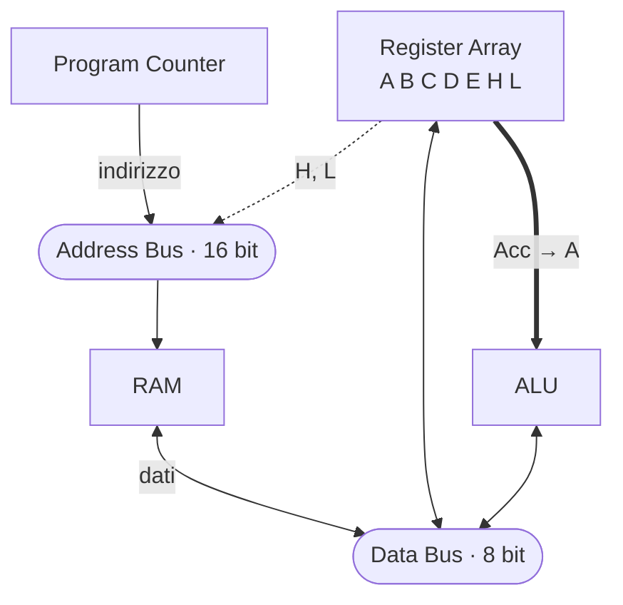

# 22 · Registri e bus
> cap. 22 di «Code» (Petzold, 2ª ed.) — orig. *Registers and Busses*

Molte delle operazioni quotidiane di un computer non sono calcoli spettacolari ma un più umile **spostare byte da una parte all'altra**: caricare un file, salvarlo, riprodurre musica o video. La stessa cosa avviene, in miniatura, *dentro* la CPU: i byte viaggiano dalla memoria alla CPU e all'ALU, i risultati tornano indietro. Questo movimento non è appariscente come il calcolo, ma è altrettanto essenziale. Il capitolo 21 ha costruito la ALU; questo capitolo costruisce ciò che le sta intorno — i **registri**, dove i byte sostano, e i **bus**, le autostrade su cui si spostano.

## I registri

Mentre i byte vengono elaborati, la CPU li tiene in una piccola scorta di latch chiamati **registri**. Il concetto è già familiare dai latch dell'accumulatore a tre byte (capitolo 20), ma la CPU che si sta costruendo (modellata sull'**Intel 8080**) ne ha di più. In particolare ci sono **sette registri a 8 bit** direttamente comandabili dalle istruzioni, il cui scopo primario è custodire i byte che l'ALU deve elaborare:

| Registro | Ruolo |
|:---:|---|
| **A** | l'**accumulatore**: l'operando e il risultato principale dell'ALU |
| **B, C, D, E** | registri di uso generale |
| **H, L** | registri di uso generale che, **insieme**, formano un indirizzo a 16 bit |

I registri **H** e **L** hanno una dote speciale: accoppiati, i loro 16 bit formano un **indirizzo di memoria**, indicato con la notazione **[HL]**. Accedere alla memoria attraverso l'indirizzo contenuto in HL si chiama **indirizzamento indiretto** (*indirect addressing*), e, come si vedrà, è utilissimo: la coppia HL diventa una specie di "dito" che punta a una cella di memoria. Nelle istruzioni, quel byte di memoria si tratta quasi come un ottavo registro, chiamato **M** (da *memory*).

## Istruzioni, opcode e linguaggio assembly

Le istruzioni dell'8080 seguono schemi regolari nei bit. Per esempio, tutte le istruzioni **MVI** (*move immediate*, "carica il byte seguente in un registro") hanno la forma `00DDD110`, dove i tre bit `DDD` scelgono il registro di destinazione:

| Istruzione | Opcode | | Istruzione | Opcode |
|:---|:---:|---|:---|:---:|
| `MVI B,dato` | `06h` | | `MVI L,dato` | `2Eh` |
| `MVI C,dato` | `0Eh` | | `MVI M,dato` | `36h` |
| `MVI D,dato` | `16h` | | `MVI A,dato` | `3Eh` |
| `MVI E,dato` | `1Eh` | | `MVI H,dato` | `26h` |

Scritture come `MVI A,dato` o `ADD E` non sono i byte veri che stanno in memoria (quelli sono gli **opcode** esadecimali), ma la loro forma leggibile: parole brevi (dette **mnemonici**) che stanno per operazioni più lunghe. `ADD` sta per *add*, `SUB` per *subtract*, `MVI` per *move immediate*, e così via. Questo modo di scrivere i programmi con mnemonici e operandi, in corrispondenza uno-a-uno con gli opcode, è il **linguaggio assembly**: molto più maneggevole degli esadecimali, ma pur sempre a diretto contatto con la macchina.

Oltre un quarto di tutti gli opcode dell'8080 sta in un'unica tabella: le otto operazioni aritmetiche e logiche del capitolo 21, combinate con ciascuna delle otto sorgenti (i sette registri più M = [HL]).

| Mnemonico | Operazione |
|:---:|---|
| `ADD` / `ADC` | somma / somma con riporto |
| `SUB` / `SBB` | sottrazione / sottrazione con prestito |
| `ANA` / `XRA` / `ORA` | AND / XOR / OR logici |
| `CMP` | confronto (*compare*) |

Ci sono poi le due istruzioni "gemelle" per l'accumulatore e la memoria: **`STA addr`** (`32h`, *store accumulator*) scrive l'accumulatore all'indirizzo a 16 bit indicato nei due byte seguenti; **`LDA addr`** (`3Ah`, *load accumulator*) fa il contrario, carica nell'accumulatore il byte che sta a quell'indirizzo. E `HLT` (`76h`) ferma la CPU.

> [!tip]
> Un **opcode** è il byte che sta davvero in memoria; il **mnemonico** (`ADD E`, `MVI A,dato`) è la sua forma leggibile in **linguaggio assembly**. Sono due facce della stessa istruzione: l'assembly esiste per gli esseri umani, l'opcode per la macchina.

## Il bus

Registri, ALU e memoria devono scambiarsi byte in continuazione. Collegarli tutti a coppie con fili dedicati sarebbe un groviglio ingestibile. La soluzione è un fascio di fili **comune a tutti**, su cui i byte transitano: un **bus**. Nella CPU ce ne sono due:

- il **data bus**, largo **8 bit**, su cui viaggiano i **dati** (i byte da e verso la memoria, gli operandi e i risultati dell'ALU);
- l'**address bus**, largo **16 bit**, su cui viaggia l'**indirizzo** della cella di memoria a cui si vuole accedere.

Il trucco che rende possibile un filo condiviso è già noto dal capitolo 19: ogni uscita che si affaccia sul bus passa per un **tri-state buffer**, e se ne abilita **una sola alla volta**. Quel byte diventa allora disponibile su tutto il bus e qualunque altro componente può prelevarlo. È così che l'uscita di un registro può finire nell'ALU, il risultato dell'ALU può tornare in un registro o in memoria, e perfino il Data Out della RAM può essere reinstradato al suo stesso Data In.

Nel diagramma si nota un dettaglio: l'uscita dell'accumulatore (**Acc**) va **direttamente** all'ingresso A dell'ALU, senza passare per il data bus, perché l'accumulatore è sempre uno dei due operandi. L'altro operando (B) e il risultato viaggiano invece sul data bus. Sull'address bus, l'indirizzo può arrivare dal Program Counter (qui sotto) oppure dalla coppia di registri H e L.

## Il Program Counter

Perché la CPU esegua un programma, qualcosa deve tenere il conto di **dove** si trova in memoria: quale sarà la prossima istruzione da leggere. Questo compito spetta a un latch speciale a 16 bit, il **Program Counter** (contatore di programma, abbreviato **PC**):

<figure>
<svg viewBox="0 0 440 208" role="img" aria-label="Il Program Counter: latch a 16 bit collegato all'address bus, con segnali Clock, Reset ed Enable; tiene l'indirizzo della prossima istruzione" style="width:100%;max-width:440px;height:auto;color:inherit"><g font-family="system-ui,Arial,sans-serif"><rect x="118" y="64" width="204" height="84" rx="7" fill="none" stroke="currentColor" stroke-width="1.9"/><text x="220.0" y="108.0" font-size="12.5" text-anchor="middle" font-weight="700" opacity="1" fill="currentColor">Program Counter</text><text x="220.0" y="124.0" font-size="10.5" text-anchor="middle" font-weight="700" opacity=".85" fill="currentColor">(PC)</text><path d="M200 26 L200 64" fill="none" stroke="currentColor" stroke-width="1.7" stroke-linecap="round" stroke-linejoin="round"/><path d="M200 64 L195 55 L205 55 Z" fill="currentColor"/><text x="200" y="19" font-size="9.5" text-anchor="middle" font-weight="600" opacity="1" fill="currentColor">Address Bus (16)</text><text x="126" y="79" font-size="9.5" text-anchor="start" font-weight="700" opacity="1" fill="currentColor">In</text><path d="M200 148 L200 174" fill="none" stroke="currentColor" stroke-width="1.7" stroke-linecap="round" stroke-linejoin="round"/><path d="M200 174 L195 165 L205 165 Z" fill="currentColor"/><text x="200" y="188" font-size="9.5" text-anchor="middle" font-weight="600" opacity="1" fill="currentColor">Address Bus (16)</text><text x="126" y="140" font-size="9.5" text-anchor="start" font-weight="700" opacity="1" fill="currentColor">Out</text><path d="M40 90 L118 90" fill="none" stroke="currentColor" stroke-width="1.7" stroke-linecap="round" stroke-linejoin="round"/><path d="M118 90 L109 85 L109 95 Z" fill="currentColor"/><text x="38" y="86" font-size="9.5" text-anchor="end" font-weight="600" opacity="1" fill="currentColor">Clock</text><path d="M40 124 L118 124" fill="none" stroke="currentColor" stroke-width="1.7" stroke-linecap="round" stroke-linejoin="round"/><path d="M118 124 L109 119 L109 129 Z" fill="currentColor"/><text x="38" y="120" font-size="9.5" text-anchor="end" font-weight="600" opacity="1" fill="currentColor">Reset</text><path d="M400 106 L322 106" fill="none" stroke="currentColor" stroke-width="1.7" stroke-linecap="round" stroke-linejoin="round"/><path d="M322 106 L331 101 L331 111 Z" fill="currentColor"/><text x="402" y="102" font-size="9.5" text-anchor="start" font-weight="600" opacity="1" fill="currentColor">Enable</text></g></svg>
<figcaption><em>Il Program Counter tiene l'indirizzo a 16 bit della prossima istruzione. <strong>Enable</strong> lo mette sull'address bus (per leggere quella cella), <strong>Clock</strong> vi carica un nuovo valore (per un salto), e <strong>Reset</strong> lo azzera a <code>0000h</code>, così all'accensione la CPU parte dalla prima cella di memoria.</em></figcaption>
</figure>

All'accensione, il segnale **Reset** azzera il PC a `0000h`: la CPU comincia dunque a leggere le istruzioni dall'inizio della memoria. Insieme al PC, altri tre latch a 8 bit servono a conservare fino a 3 byte dell'istruzione in corso di lettura. A questo punto tutti i grandi pezzi del processore (register array, ALU, Program Counter) sono al loro posto, appesi ai due bus. Manca solo il direttore d'orchestra: il fitto insieme di **segnali di controllo** (Clock, Enable, Select, Write) che, al momento giusto, dice a ciascun componente cosa fare. Costruirli e coordinarli è il compito del capitolo 23.

## Ripasso lampo

Quali sono i sette registri dell'8080 e a cosa serve la coppia <code>HL</code>?

Sono **A** (l'accumulatore), **B, C, D, E** (uso generale) e **H, L** (uso generale). La coppia **HL**, presi insieme i loro 16 bit, forma un **indirizzo di memoria** (`[HL]`): accedere alla memoria tramite quell'indirizzo è l'**indirizzamento indiretto**, e quel byte di memoria si tratta quasi come un registro in più, chiamato **M**.

Che differenza c'è tra un <code>opcode</code> e un mnemonico?

L'**opcode** è il byte esadecimale che sta davvero in memoria (es. `83h`). Il **mnemonico** è la sua forma leggibile in **linguaggio assembly** (es. `ADD E`). Corrispondono uno-a-uno: l'assembly serve agli esseri umani per scrivere programmi, l'opcode è ciò che la macchina esegue.

Cos'è un <code>bus</code> e quali due bus ha questa CPU?

Un bus è un fascio di fili **comune** a più componenti, su cui i byte transitano. Questa CPU ha un **data bus** a 8 bit (per i dati: operandi, risultati, byte da/verso la memoria) e un **address bus** a 16 bit (per l'indirizzo della cella di memoria a cui accedere).

Come fa un filo condiviso a non generare cortocircuiti tra più uscite?

Grazie ai **tri-state buffer**: ogni uscita si affaccia sul bus attraverso uno di essi, e se ne abilita **una sola alla volta**. Il byte di quella sola sorgente diventa disponibile su tutto il bus e ogni altro componente può prelevarlo; le altre uscite restano "scollegate" (flottanti).

A cosa serve il <code>Program Counter</code> e cosa fa il suo segnale Reset?

Il Program Counter (PC) è un latch a 16 bit che tiene l'**indirizzo della prossima istruzione** da leggere in memoria. Il suo **Reset** lo azzera a `0000h`, così all'accensione la CPU comincia a eseguire dalla prima cella di memoria; Enable lo mette sull'address bus, Clock vi carica un nuovo indirizzo (per un salto).

**In sintesi:**
- I **registri** (A accumulatore; B, C, D, E; H, L) sono i latch a 8 bit dove la CPU tiene i byte da elaborare; **HL** forma un indirizzo a 16 bit (`[HL]`), da cui l'**indirizzamento indiretto** e il "registro" **M**.
- Le istruzioni hanno un **opcode** (il byte reale) e un **mnemonico** leggibile: scrivere programmi con i mnemonici è il **linguaggio assembly**.
- Un **bus** è un fascio di fili condiviso: il **data bus** (8 bit) porta i dati, l'**address bus** (16 bit) porta l'indirizzo; i **tri-state buffer** garantiscono una sola sorgente per volta.
- L'accumulatore va **direttamente** all'ingresso A dell'ALU; il resto passa dal data bus.
- Il **Program Counter** (16 bit) tiene l'indirizzo della prossima istruzione e parte da `0000h` al **Reset**. Restano da costruire i **segnali di controllo** (capitolo 23).
