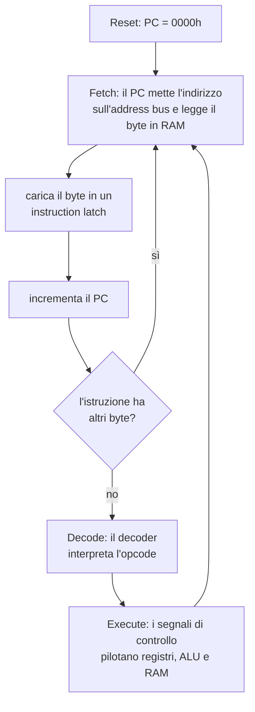
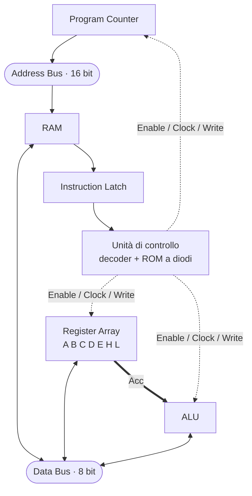

# 23 · I segnali di controllo della CPU
> cap. 23 di «Code» (Petzold, 2ª ed.) — orig. *CPU Control Signals*

Al termine del capitolo 22 tutti i grandi pezzi del processore erano al loro posto (register array, ALU, Program Counter, memoria) appesi ai due bus. Ma erano ancora una collezione di componenti inerti, come un'orchestra di strumenti senza direttore. Ciò che li trasforma in una **CPU** che esegue davvero un programma è l'insieme dei **segnali di controllo**: gli impulsi di Clock, Enable, Select e Write che, al momento giusto e nell'ordine giusto, dicono a ciascun componente cosa fare. Questo capitolo costruisce quel direttore d'orchestra e, con esso, completa la CPU.

## Il ciclo fetch-execute

Il modo in cui la CPU esegue un programma è un ciclo che si ripete senza sosta, chiamato ciclo **fetch-execute** (preleva-esegui). Al momento dell'accensione il segnale **Reset** azzera il Program Counter a `0000h`. Da lì in poi, per ogni istruzione la CPU compie sempre gli stessi passi:



Il **fetch** (prelievo) usa il Program Counter per indirizzare la memoria e portare il byte dell'istruzione in un *instruction latch*; subito dopo il PC viene **incrementato**, così la volta successiva punterà al byte seguente. È questo incremento (realizzato da un circuito chiamato **Incrementer-Decrementer** collegato all'address bus) che fa avanzare la CPU da un'istruzione alla successiva. Se l'istruzione è lunga più di un byte (come `MVI A,27h`, che ne occupa due), il prelievo si ripete finché tutti i byte sono in casa. Poi vengono il **decode** (decodifica) e l'**execute** (esecuzione).

## Decodificare l'istruzione

Perché la CPU sappia *cosa* significa un opcode, i suoi otto bit vanno interpretati. Se ne occupa il **decoder delle istruzioni**: i due bit più alti passano per un decoder 2-a-4, gli altri sei per due decoder 3-a-8 (che riconoscono i campi *destinazione* e *sorgente* dei registri), e una rete di porte AND ne ricava i segnali che identificano ciascun tipo di istruzione — *Move Group* (opcode che iniziano con `01`), *Arithmetic/Logic Group* (che iniziano con `10`), le mosse da/verso memoria, `MVI`, `ADI`, `LDA`, `STA`, `INX`/`DCX HL` e così via. È lo stesso mestiere del decoder del capitolo 10, qui allargato a riconoscere l'intero repertorio di istruzioni.

## Generare i segnali di controllo

Sapere *quale* istruzione si sta eseguendo non basta: bisogna produrre, per ogni componente, i segnali giusti **nell'istante giusto**. Un'operazione come `ADD M` richiede più passi (prima portare l'operando dalla memoria all'ALU, poi far scattare l'ALU, poi salvarne il risultato) e ciascun passo dura un **ciclo macchina** (*machine cycle*). Per ogni combinazione di *istruzione decodificata* e *ciclo macchina corrente*, la CPU deve attivare un preciso sottoinsieme di Enable, Clock, Select e Write.

Il modo elegante con cui Petzold genera questi segnali è una vecchia conoscenza: una **matrice di diodi**, cioè una **ROM** come quella del capitolo 18. Gli ingressi della ROM sono i segnali del decoder e del ciclo macchina; le sue uscite sono i segnali di controllo cablati nella disposizione dei diodi. In pratica, la ROM contiene una piccola "tabella" che dice: *per questa istruzione, in questo ciclo, accendi questi segnali*.

> [!tip]
> Il cervello della CPU è tutto qui: un **decoder** che riconosce l'istruzione e una **ROM di controllo** (matrice di diodi) che, istruzione per istruzione e ciclo per ciclo, decide quali segnali di Enable/Clock/Select/Write attivare. Non c'è nessuna magia: solo logica combinatoria e i mattoni costruiti nei capitoli precedenti.

## La CPU completa

Aggiungendo l'unità di controllo alla struttura del capitolo 22, la CPU è finalmente completa: tutti i componenti dialogano attraverso il **data bus** (8 bit) e l'**address bus** (16 bit), e l'unità di controllo li orchestra.



Questa CPU esegue programmi reali dell'8080. Ecco un esempio che somma **cinque byte** conservati in memoria a partire dall'indirizzo `1000h`, usando la coppia HL come "dito" che scorre la memoria:

```
MVI L,00h    ; L = 00h
MVI H,10h    ; H = 10h  →  HL = 1000h
MOV A,M      ; A ← primo byte (a [HL])
INX HL       ; HL = 1001h
ADD M        ; A ← A + byte a [HL]
INX HL       ; HL = 1002h
ADD M        ; …e così via
INX HL
ADD M
INX HL
ADD M
STA 0011h    ; salva la somma
HLT
```

L'istruzione `INX HL` (*increment*) fa avanzare di uno l'indirizzo in HL, così dopo ogni `ADD M` si passa al byte successivo. Il programma funziona, ma salta all'occhio la **ripetizione**: la coppia `INX HL` / `ADD M` compare quattro volte. Per sommare cento o mille byte questo approccio non regge — bisognerebbe ricopiare le istruzioni cento o mille volte. Non è una soluzione *generalizzata*, e proprio da questo disagio nasce il bisogno del capitolo 24: un'istruzione capace di far **ripetere** un gruppo di istruzioni, cioè il **loop**.

> [!warning]
> Un'istruzione non si esegue in un unico istante: richiede uno o più **cicli macchina**, e in ognuno l'unità di controllo attiva segnali diversi. È il motivo per cui una CPU reale, che compie milioni di operazioni al secondo, dedica una parte del suo lavoro non al calcolo ma al **coordinamento** interno — prelevare, decodificare, instradare i byte.

## Ripasso lampo

<details>
<summary>In cosa consiste il ciclo <code>fetch-execute</code>?</summary>

È il ciclo che la CPU ripete per ogni istruzione: **fetch** (il Program Counter indirizza la memoria e il byte dell'istruzione viene caricato in un instruction latch, poi il PC si incrementa; si ripete se l'istruzione ha più byte), **decode** (il decoder interpreta l'opcode) ed **execute** (i segnali di controllo pilotano registri, ALU e RAM). Poi si ricomincia.

</details>

<details>
<summary>Cosa fa avanzare la CPU da un'istruzione alla successiva?</summary>

L'**incremento del Program Counter** dopo ogni byte prelevato, realizzato da un circuito **Incrementer-Decrementer** collegato all'address bus. Il PC punta così, di volta in volta, al byte successivo in memoria.

</details>

<details>
<summary>A cosa serve il decoder delle istruzioni?</summary>

A interpretare gli otto bit dell'opcode e ricavarne i segnali che identificano il tipo di istruzione (Move Group, Arithmetic/Logic Group, mosse da/verso memoria, MVI, ADI, LDA, STA, INX/DCX…). Usa un decoder 2-a-4 per i due bit alti e due decoder 3-a-8 per i campi dei registri, più porte AND.

</details>

<details>
<summary>Come vengono generati i segnali di controllo veri e propri?</summary>

Da una **matrice di diodi**, cioè una **ROM** (come nel capitolo 18). I suoi ingressi sono l'istruzione decodificata e il ciclo macchina corrente; le sue uscite, cablate nella disposizione dei diodi, sono i segnali di Enable, Clock, Select e Write da attivare in quel preciso passo.

</details>

<details>
<summary>Perché un'istruzione richiede più di un <code>ciclo macchina</code>?</summary>

Perché la sua esecuzione si articola in più passi elementari: per esempio `ADD M` deve prima portare l'operando dalla memoria all'ALU, poi far calcolare l'ALU, poi salvarne il risultato. Ogni passo dura un ciclo macchina, e in ciascuno l'unità di controllo attiva segnali diversi.

</details>

<details>
<summary>Cosa mostra il limite del programma che somma cinque byte?</summary>

Che senza un modo per **ripetere** le istruzioni si è costretti a ricopiare la coppia `INX HL` / `ADD M` una volta per ogni byte: una soluzione non generalizzata, impraticabile per cento o mille byte. Da qui il bisogno del **loop**, introdotto nel capitolo 24.

</details>

**In sintesi:**
- I **segnali di controllo** (Enable, Clock, Select, Write) sono ciò che trasforma i componenti del capitolo 22 in una CPU funzionante.
- La CPU esegue il ciclo **fetch-execute**: preleva i byte dell'istruzione (indirizzati dal **Program Counter**, che poi si incrementa), li **decodifica** e li **esegue**; al Reset il PC parte da `0000h`.
- Un **decoder** interpreta l'opcode; una **ROM a diodi** (dal cap. 18), pilotata da istruzione e **ciclo macchina**, genera i segnali di controllo giusti passo per passo.
- Con l'unità di controllo, la **CPU è completa** e gira programmi 8080 reali sui due bus (dati a 8 bit, indirizzi a 16 bit).
- La ripetizione forzata (INX/ADD ricopiati) mostra il bisogno dei **loop**, tema del capitolo 24.
