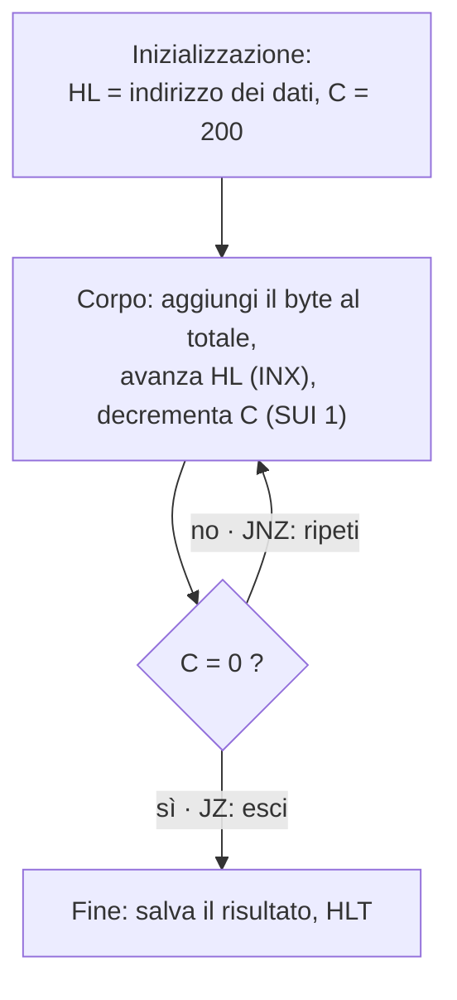

# 24 · Cicli, salti e chiamate
> cap. 24 di «Code» (Petzold, 2ª ed.) — orig. *Loops, Jumps, and Calls*

La ripetizione è, in un certo senso, l'essenza stessa del calcolo automatico: nessuno ha bisogno di un computer per sommare due numeri, ma per sommarne mille o un milione sì. Questa parentela tra calcolo e ripetizione era chiara fin dagli albori: nella sua celebre nota del 1843 sulla macchina analitica di Charles Babbage, **Ada Lovelace** chiamò *ciclo* (*cycle*) un gruppo di operazioni ripetuto, e *ciclo di un ciclo* quello che oggi chiamiamo **ciclo annidato** (*nested loop*). Questo capitolo aggiunge alla CPU le istruzioni che rendono possibile la ripetizione e, più in generale, il **controllo del flusso**: i salti, i salti condizionati, i cicli e le chiamate a subroutine.

## Il salto: JMP

Di norma il Program Counter si incrementa dopo ogni byte prelevato, e la CPU procede così, in linea retta, da un'istruzione alla successiva. L'istruzione **JMP** (*jump*, salto; opcode `C3h`) spezza questa linearità: è seguita da due byte che, invece di indirizzare la memoria come farebbero `LDA` o `STA`, vengono caricati direttamente nel **Program Counter**. L'effetto è che l'esecuzione "salta" a un altro indirizzo e prosegue da lì. È l'istruzione che permette, per esempio, di tornare all'inizio di un gruppo di istruzioni per ripeterlo. *(Nel Motorola 6809 la stessa idea si chiama `BRA`, da* branch*, ramo.)*

## Prendere decisioni: i salti condizionati

Un salto sempre eseguito non basterebbe a fare granché: servono salti che avvengano **solo a certe condizioni**. Qui entrano in gioco i **flag** prodotti dalla ALU (capitolo 21). I **salti condizionati** saltano soltanto se un certo flag è acceso o spento:

| Istruzione | Salta se… |
|:---:|---|
| `JZ addr` | il flag **Zero** è 1 (il risultato precedente era zero) |
| `JNZ addr` | il flag **Zero** è 0 (il risultato *non* era zero) |
| `JC addr` | il flag **Carry** è 1 |
| `JNC addr` | il flag **Carry** è 0 |

È questo il meccanismo con cui un programma **prende decisioni**: esegue un'operazione, guarda com'è andata (i flag), e in base al risultato salta oppure prosegue. Il classico "se… allora…" della programmazione, ridotto ai minimi termini, è un'operazione seguita da un salto condizionato.

## Il loop

Un **ciclo** (*loop*) è fatto di tre parti: l'**inizializzazione** (si preparano i valori di partenza), il **corpo** (le istruzioni da ripetere) e un **salto condizionato** che decide se ripetere ancora o uscire. Ecco la struttura del programma che somma 200 byte in memoria, usando la coppia HL come "dito" che scorre la lista e il registro C come contatore:

Ogni passaggio nel corpo si chiama **iterazione**. Nel programma vero, il corpo decrementa il contatore con `SUI 1` (*subtract immediate*, sottrai 1) e poi usa `JZ` per **uscire dal loop** quando il contatore arriva a zero, oppure `JMP` (incondizionato) per tornare in cima e ripetere. Scrivendo il programma in linguaggio assembly, gli indirizzi di salto non si mettono come numeri fissi ma come **etichette** (`Loop:`, `Done:`): è l'assemblatore a calcolare gli indirizzi reali, e il programma resta leggibile e facile da modificare.

> [!tip]
> Un loop non richiede istruzioni speciali "di ciclo": basta un **salto condizionato** che rimandi indietro finché una condizione è vera. Somma di 200 byte o di un milione, il codice è lo **stesso** — cambia solo il valore iniziale del contatore. È questa la differenza tra ricopiare le istruzioni (capitolo 23) e *generalizzare*.

## Le subroutine: CALL e RET

Spesso lo stesso gruppo di istruzioni serve in più punti di un programma: convertire un byte in cifre, moltiplicare due numeri, e così via. Ricopiarlo ogni volta sarebbe uno spreco. La soluzione è la **subroutine**: un blocco di istruzioni scritto una volta sola e richiamato quando serve. La si invoca con **CALL** (`CDh`) e la si conclude con **RET** (`C9h`, *return*).

`CALL addr` assomiglia a `JMP`: salta all'indirizzo indicato. Ma fa qualcosa in più di cruciale: **ricorda da dove è partito**, così che `RET`, alla fine della subroutine, possa **tornare** esattamente all'istruzione successiva alla chiamata. Questo permette persino di **annidare** le chiamate — una subroutine (`ToAscii`) che ne chiama un'altra (`Digit`) — perché ogni ritorno sa dove tornare.

## Lo stack

Come fa `CALL` a ricordare il punto di ritorno, soprattutto con chiamate annidate? Usando una zona di memoria organizzata a **pila** (*stack*), gestita con la disciplina **LIFO** (*last in, first out*: l'ultimo riposto è il primo ripreso). Un registro speciale, lo **Stack Pointer** (SP), indica sempre la cima della pila.

<figure>
<svg viewBox="0 0 470 210" role="img" aria-label="Lo stack delle chiamate: due indirizzi di ritorno impilati (ToAscii sotto, Digit sopra), con lo Stack Pointer che punta alla cima; CALL impila, RET estrae" style="width:100%;max-width:480px;height:auto;color:inherit"><g font-family="system-ui,Arial,sans-serif"><rect x="176" y="48" width="168" height="36" fill="var(--link,#059669)" stroke="currentColor" stroke-width="1.5"/><text x="260.0" y="70.0" font-size="10" text-anchor="middle" font-weight="600" opacity="1" fill="#fff">indirizzo di ritorno (Digit)</text><text x="168" y="70.0" font-size="9.5" text-anchor="end" font-weight="600" opacity=".8" fill="currentColor">FFFCh</text><rect x="176" y="84" width="168" height="36" fill="var(--link,#059669)" stroke="currentColor" stroke-width="1.5"/><text x="260.0" y="106.0" font-size="10" text-anchor="middle" font-weight="600" opacity="1" fill="#fff">indirizzo di ritorno (ToAscii)</text><text x="168" y="106.0" font-size="9.5" text-anchor="end" font-weight="600" opacity=".8" fill="currentColor">FFFEh</text><rect x="176" y="120" width="168" height="36" fill="none" stroke="currentColor" stroke-width="1.5"/><rect x="176" y="156" width="168" height="36" fill="none" stroke="currentColor" stroke-width="1.5"/><path d="M300 32 L300 48" fill="none" stroke="currentColor" stroke-width="1.7" stroke-linecap="round" stroke-linejoin="round"/><path d="M300 48 L295 39 L305 39 Z" fill="currentColor"/><text x="300" y="26" font-size="9.5" text-anchor="middle" font-weight="700" opacity="1" fill="currentColor">Stack Pointer (SP) → cima</text><path d="M358 56 L358 42 L346 42" fill="none" stroke="currentColor" stroke-width="1.4" stroke-linecap="round" stroke-linejoin="round"/><path d="M346 42 L355 37 L355 47 Z" fill="currentColor"/><text x="364" y="50" font-size="9.5" text-anchor="start" font-weight="600" opacity="1" fill="currentColor">CALL: impila (push)</text><path d="M358 76 L358 92 L346 92" fill="none" stroke="currentColor" stroke-width="1.4" stroke-linecap="round" stroke-linejoin="round" stroke-dasharray="3 3"/><path d="M346 92 L355 87 L355 97 Z" fill="currentColor"/><text x="364" y="96" font-size="9.5" text-anchor="start" font-weight="600" opacity="1" fill="currentColor">RET: estrae (pop)</text></g></svg>
<figcaption><em>Lo stack durante due chiamate annidate. <code>CALL</code> <strong>impila</strong> (push) l'indirizzo di ritorno sulla cima e lo Stack Pointer scende; <code>RET</code> <strong>estrae</strong> (pop) l'indirizzo dalla cima e vi salta, e lo Stack Pointer risale. Essendo una pila LIFO, l'ultima chiamata (Digit) è la prima a tornare.</em></figcaption>
</figure>

Ogni `CALL` **impila** (push) l'indirizzo di ritorno sulla cima dello stack e sposta lo Stack Pointer; ogni `RET` **estrae** (pop) quell'indirizzo, ci salta e riporta indietro lo Stack Pointer. Con chiamate annidate, gli indirizzi si accatastano e si smontano nell'ordine giusto grazie al LIFO. Lo stesso stack serve, con le istruzioni `PUSH` e `POP`, a mettere temporaneamente al sicuro il contenuto dei registri; e quando i registri non bastano, si usa una zona di memoria come **scratchpad** (blocco per gli appunti).

> [!warning]
> Lo stack vive in memoria e cresce a ogni chiamata annidata: se le chiamate si annidano all'infinito senza mai tornare (per esempio una subroutine che chiama sé stessa senza condizione d'uscita), lo stack continua a crescere finché non invade altra memoria. È lo *stack overflow*, un guasto ben noto a chi programma.

Con salti, salti condizionati, cicli e subroutine, quell'"assemblaggio di porte logiche che risponde a codici in memoria", come lo chiama Petzold, combina davvero operazioni semplicissime in compiti complessi: moltiplicazioni, conversioni, elaborazioni di ogni tipo. Nella pratica, però, quasi nessuno scrive più in codice macchina o assembly: si usano i **linguaggi ad alto livello** (capitolo 27), dove qualcun altro ha già fatto il lavoro difficile. E prima ancora, perché un computer sia davvero utile, deve poter comunicare con il mondo esterno: è il tema del capitolo 25, le **periferiche**.

## Ripasso lampo

Cosa fa l'istruzione <code>JMP</code> e in che modo cambia il flusso del programma?

`JMP addr` carica un indirizzo a 16 bit direttamente nel **Program Counter**, così l'esecuzione "salta" a quell'indirizzo invece di proseguire con l'istruzione successiva. Spezza l'avanzamento lineare della CPU e permette, per esempio, di tornare indietro a ripetere un blocco.

Come fa un programma a "prendere una decisione"?

Con i **salti condizionati** (`JZ`, `JNZ`, `JC`, `JNC`…), che saltano solo se un **flag** della ALU (Zero, Carry) è acceso o spento. Il programma esegue un'operazione, guarda i flag che ne risultano e, in base a quelli, salta o prosegue: è il "se… allora…" ridotto all'essenziale.

Di quali tre parti è fatto un loop?

**Inizializzazione** (si preparano i valori di partenza, es. indirizzo e contatore), **corpo** (le istruzioni da ripetere) e un **salto condizionato** che decide se ripetere il corpo o uscire. Ogni passaggio nel corpo è un'**iterazione**.

Che differenza c'è tra <code>CALL</code> e <code>JMP</code>?

Entrambi saltano a un indirizzo, ma `CALL` **ricorda anche il punto di partenza** (l'indirizzo dell'istruzione successiva), così che `RET`, a fine subroutine, possa tornare esattamente lì. `JMP` salta e basta, senza memoria del ritorno.

Cos'è lo <code>stack</code> e come lo usano CALL e RET?

È una zona di memoria gestita a **pila LIFO** (*last in, first out*), con lo **Stack Pointer** che ne indica la cima. `CALL` **impila** (push) l'indirizzo di ritorno sulla cima; `RET` lo **estrae** (pop) e vi salta. Grazie al LIFO, le chiamate annidate ritornano nell'ordine corretto.

Cosa succede se le chiamate si annidano senza mai tornare?

Lo stack cresce a ogni `CALL` senza mai rimpicciolirsi, finché non invade altre zone di memoria: è lo **stack overflow**. Accade tipicamente con una ricorsione priva di condizione d'uscita.

**In sintesi:**
- La **ripetizione** è l'essenza del calcolo; le istruzioni di controllo del flusso la rendono possibile.
- **JMP** carica un indirizzo nel Program Counter e devia l'esecuzione; i **salti condizionati** (JZ, JNZ, JC, JNC) lo fanno solo in base ai **flag**, ed è così che un programma **decide**.
- Un **loop** è inizializzazione + corpo + salto condizionato (ripeti/esci); con le **etichette** assembly gli indirizzi restano leggibili.
- Le **subroutine** (`CALL`/`RET`) sono blocchi riusabili: `CALL` salta e ricorda il ritorno, `RET` torna indietro.
- Il **ritorno** è custodito su uno **stack** (pila LIFO, gestita dallo **Stack Pointer**), che supporta le chiamate annidate; usato all'eccesso dà **stack overflow**.
