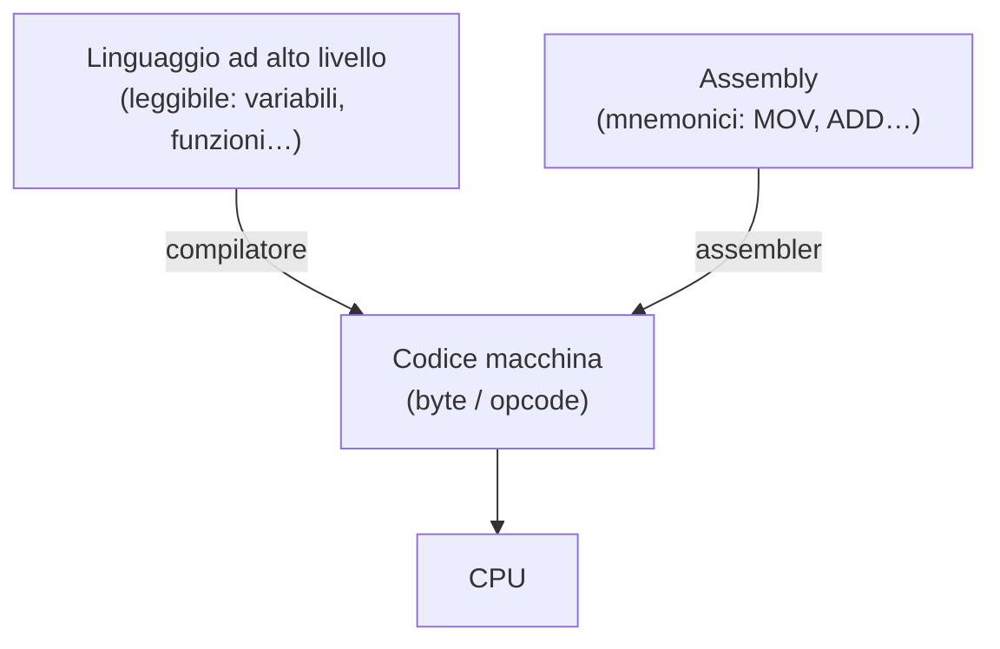

# 27 · Programmare
> cap. 27 di «Code» (Petzold, 2ª ed.) — orig. *Coding*

Tutti i computer eseguono codice macchina, ma programmare direttamente in codice macchina è come mangiare con uno stuzzicadenti: i bocconi sono così piccoli e il procedimento così faticoso che la cena non finisce mai. I byte del codice macchina compiono le operazioni più minute immaginabili — carica un numero, sommane un altro, salva il risultato — al punto che è difficile persino intuire come possano comporre un "pasto" completo. Questo capitolo racconta come, gradino dopo gradino, la programmazione è salita da quei byte fino ai linguaggi che le persone usano davvero.

## Dall'assembly ai linguaggi ad alto livello

Il primo gradino è già noto: ai byte del codice macchina si associano brevi **mnemonici** — `MOV`, `ADD`, `JMP`, `HLT` — che formano il **linguaggio assembly**. È molto più leggibile degli esadecimali, ma richiede pur sempre di convertire ogni riga nel byte corrispondente. All'inizio lo si faceva a mano (*hand-assembling*); poi si è scritto un programma, l'**assembler**, che fa la conversione da sé. Se l'assembler per un nuovo processore si scrive su un computer diverso già funzionante, si parla di **cross-assembler**.

L'assembler toglie la parte più meccanica, ma l'assembly conserva due difetti seri. Primo: è **tedioso**: si lavora al livello della CPU, badando a ogni minimo dettaglio. Secondo: **non è portabile**: un programma scritto in assembly per l'Intel 8080 non gira su un Motorola 6800, e va riscritto da capo. La soluzione a entrambi i problemi è salire ancora di livello, esprimendo le operazioni in una **notazione algebrica** vicina alla matematica:

```
Angolo = 27.5
Ipotenusa = 125.2
Altezza = Ipotenusa × Seno(Angolo)
```

Un testo così è un **linguaggio ad alto livello** (*high-level language*, HLL). La CPU non lo capisce direttamente, quindi un programma apposito — il **compilatore** — lo traduce in codice macchina. Il guadagno è doppio: il programma è molto più **leggibile**, e diventa **portabile**, perché lo stesso testo si può ricompilare per processori diversi. L'assembly, per contrasto, si dice linguaggio a **basso livello**, proprio perché sta a contatto con l'hardware.



## Statement, variabili, funzioni

Poche parole chiave ricorrono in quasi tutti i linguaggi. Ciascuna riga come quelle sopra è uno **statement** (istruzione, che spesso si chiude con un punto e virgola). Nomi come `Angolo` o `Altezza` sono **variabili**, perché possono assumere valori diversi; il segno `=` indica un'**assegnazione** (si *mette* un valore in una variabile). `Seno` è una **funzione**: da qualche parte c'è del codice che calcola il seno di un angolo e ne restituisce il valore. Parole speciali del linguaggio come `let` (in JavaScript) si chiamano **keyword**. E una riga che comincia con un simbolo di **commento** (in JavaScript `//`) è ignorata all'esecuzione: serve solo a chi legge il programma.

## Un po' di storia

L'idea di tradurre automaticamente una notazione più umana in codice macchina fu pionieristica. Il primo vero compilatore funzionante, l'**A-0** (*Arithmetic Language version 0*), fu creato nel **1952** da **Grace Murray Hopper** (1906-1992), che coniò anche il termine *compiler* e aveva iniziato con i computer lavorando al Mark I di Howard Aiken nel 1944.

| Linguaggio | Anno | Ambito |
|:---|:---:|---|
| **FORTRAN** (*FORmula TRANslation*) | metà anni '50 | il più vecchio HLL ancora in uso; scienza e ingegneria |
| **COBOL** (*COmmon Business Oriented Language*) | 1959 | gestionale e finanza; pensato per essere leggibile |
| **ALGOL** (*ALGOrithmic Language*) | fine anni '50 | molto influente, oggi non più in uso |

Da questi capostipiti sono poi discesi BASIC, Pascal, C, C++, Java, Python, JavaScript e moltissimi altri, ognuno con i suoi punti di forza.

## JavaScript: un linguaggio a portata di mano

Per far provare la programmazione senza installare nulla, Petzold sceglie **JavaScript**, perché gira in **qualunque browser web**: basta scriverlo dentro la sezione `<script>` di un file HTML e aprire il file. Un primo programma tipico è:

```javascript
let message = "Ciao dal mio programma JavaScript!";
document.getElementById("result").innerHTML = message;
```

Ci sono due statement, ciascuno chiuso da un punto e virgola. Nel primo, `let` è una keyword che crea la variabile `message` e le assegna una stringa di testo; nel secondo, quel testo viene inserito in un elemento della pagina web. Modificando il file e ricaricando la pagina si vede subito il risultato: un ciclo di prova rapidissimo.

*➕ Fuori dal libro: JavaScript è trattato in profondità nel <a href="../javascript/" target="_blank" rel="noopener">vault JavaScript</a> di questi appunti — questo capitolo ne offre solo un primo assaggio.*

## Il floating-point e le sue sorprese

I numeri con la virgola — come `27.5` o `125.2` — si chiamano numeri **floating-point** (a virgola mobile), e il modo in cui i computer li rappresentano riserva qualche sorpresa. Dal 1985 esiste uno standard, **IEEE 754**, adottato da praticamente tutti i computer; definisce due formati, a **precisione singola** (4 byte) e **doppia** (8 byte). JavaScript usa sempre la doppia:

<figure>
<svg viewBox="0 0 480 148" role="img" aria-label="Formato floating-point a doppia precisione IEEE 754: 1 bit di segno, 11 di esponente, 52 di mantissa, per un totale di 64 bit" style="width:100%;max-width:520px;height:auto;color:inherit"><g font-family="system-ui,Arial,sans-serif"><rect x="30" y="46" width="26" height="42" fill="none" stroke="currentColor" stroke-width="1.6"/><text x="43.0" y="71.0" font-size="10" text-anchor="middle" font-weight="700" opacity="1" fill="currentColor">S</text><rect x="56" y="46" width="96" height="42" fill="none" stroke="currentColor" stroke-width="1.6"/><text x="104.0" y="66.0" font-size="10.5" text-anchor="middle" font-weight="700" opacity="1" fill="currentColor">esponente</text><text x="104.0" y="81.0" font-size="9" text-anchor="middle" font-weight="400" opacity=".7" fill="currentColor">11 bit</text><rect x="152" y="46" width="298" height="42" fill="none" stroke="currentColor" stroke-width="1.6"/><text x="301.0" y="66.0" font-size="10.5" text-anchor="middle" font-weight="700" opacity="1" fill="currentColor">mantissa (significando)</text><text x="301.0" y="81.0" font-size="9" text-anchor="middle" font-weight="400" opacity=".7" fill="currentColor">52 bit</text><text x="30" y="36" font-size="9.5" text-anchor="start" font-weight="600" opacity="1" fill="currentColor">un numero floating-point a doppia precisione = 64 bit (8 byte)</text><text x="240.0" y="116" font-size="11" text-anchor="middle" font-weight="700" opacity="1" fill="currentColor">valore = ± 1,mantissa × 2 elevato all'esponente</text><text x="240.0" y="134" font-size="9" text-anchor="middle" font-weight="400" opacity=".7" fill="currentColor">(notazione scientifica, ma in binario — è lo standard IEEE 754)</text></g></svg>
<figcaption><em>Il formato a doppia precisione IEEE 754: 1 bit di <strong>segno</strong>, 11 di <strong>esponente</strong>, 52 di <strong>mantissa</strong>, in tutto 64 bit. È la notazione scientifica (mantissa × 2 alla esponente), ma in binario.</em></figcaption>
</figure>

Ed ecco la sorpresa: molti numeri decimali **non** hanno una rappresentazione binaria esatta. Il decimale `1.1`, per esempio, in binario è una sequenza che si ripete all'infinito, e con 52 bit va troncata: il valore realmente memorizzato non è `1.1` ma `1,100000000000000008881…`. Quando poi si fanno calcoli con numeri non esatti, anche i risultati sono inesatti — ed è per questo che, in JavaScript, moltiplicare `55.2` per `27.8` dà `1534.5600000000002` invece di `1534.56`. Non è un errore del linguaggio, ma una conseguenza inevitabile del rappresentare un continuo di numeri con una quantità **finita** di bit; la disciplina che studia questi limiti si chiama **matematica discreta**. Da notare che perfino le funzioni "difficili" (radici, logaritmi, seno e coseno) si calcolano in fondo con le sole quattro operazioni: il seno, per esempio, tramite una somma di infiniti termini (una *serie*) che si tronca alla precisione voluta.

> [!warning]
> Non confrontare mai due numeri floating-point con un test di uguaglianza "secco" (`a === b`) aspettandosi che torni sempre giusto: piccoli errori di arrotondamento come quello di `1.1` possono far fallire il confronto. È una delle insidie più classiche per chi inizia a programmare, e discende direttamente dallo standard IEEE 754.

I linguaggi ad alto livello sono ciò che ha reso possibile costruire il software enorme e complesso di oggi senza dover pensare, ogni volta, ai singoli byte della CPU. E quando questi programmi hanno imparato a **comunicare tra loro** attraverso le reti, i computer di tutto il mondo si sono saldati in un unico grande insieme: è la rete, il tema del capitolo finale, il capitolo 28.

## Ripasso lampo

<details>
<summary>Quali due problemi dell'assembly risolve un linguaggio ad alto livello?</summary>

Il fatto che sia **tedioso** (si lavora al livello della CPU, badando a ogni dettaglio) e che **non sia portabile** (un programma per un processore va riscritto per un altro). Un HLL è più leggibile e, ricompilandolo, gira su processori diversi.

</details>

<details>
<summary>Che cos'è un <code>compilatore</code> e in cosa differisce da un assembler?</summary>

Un **compilatore** traduce un programma scritto in un **linguaggio ad alto livello** in codice macchina. Un **assembler** traduce invece il **linguaggio assembly** (i mnemonici come MOV, ADD) nei byte del codice macchina. Il compilatore parte da un livello più astratto e lontano dall'hardware.

</details>

<details>
<summary>Cosa sono <code>statement</code>, <code>variabile</code> e <code>funzione</code>?</summary>

Uno **statement** è un'istruzione del programma (una "riga", spesso chiusa da `;`). Una **variabile** è un nome che contiene un valore modificabile (assegnato con `=`). Una **funzione** è del codice, richiamabile per nome, che esegue un compito e in genere restituisce un valore (per esempio `Seno(Angolo)`).

</details>

<details>
<summary>Chi creò il primo compilatore, e quali sono alcuni linguaggi storici?</summary>

**Grace Hopper** creò nel 1952 il primo compilatore funzionante (A-0) e coniò il termine *compiler*. Tra i linguaggi storici: **FORTRAN** (scienza/ingegneria, il più vecchio ancora in uso), **COBOL** (gestionale, 1959) e **ALGOL** (molto influente, oggi in disuso).

</details>

<details>
<summary>Perché in JavaScript <code>55.2 × 27.8</code> non dà esattamente 1534.56?</summary>

Perché i numeri con la virgola sono memorizzati in **floating-point** secondo lo standard **IEEE 754**, e molti decimali (come `1.1`) non hanno rappresentazione binaria esatta: vanno troncati a un numero finito di bit. Facendo calcoli con valori già approssimati, il risultato porta con sé un piccolo errore, e appare `1534.5600000000002`.

</details>

<details>
<summary>Perché Petzold usa JavaScript per gli esempi di programmazione?</summary>

Perché gira in **qualunque browser web** senza installare strumenti: basta scriverlo dentro la sezione `<script>` di un file HTML e aprire il file. Modificando e ricaricando la pagina si vede subito il risultato, così è ideale per sperimentare.

</details>

**In sintesi:**
- Programmare in codice macchina è faticoso; l'**assembly** (mnemonici + **assembler**) aiuta, ma resta **tedioso** e **non portabile**.
- Un **linguaggio ad alto livello** esprime le operazioni in notazione algebrica; un **compilatore** lo traduce in codice macchina, dando **leggibilità** e **portabilità**.
- Concetti comuni: **statement**, **variabile**, **assegnazione**, **funzione**, **keyword**, **commento**.
- Storia: **Grace Hopper** (primo compilatore, 1952), **FORTRAN**, **COBOL**, **ALGOL**; oggi C, Java, Python, **JavaScript** (che Petzold usa perché gira nel browser).
- I numeri con la virgola sono **floating-point** (**IEEE 754**, doppia precisione in JS): non tutti i decimali sono esatti, da cui sorprese come `55.2 × 27.8 = 1534.5600000000002`.
