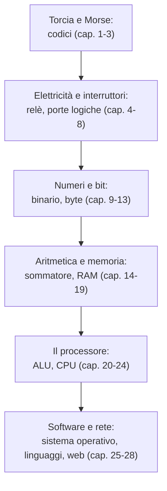

# 28 · Il cervello del mondo
> cap. 28 di «Code» (Petzold, 2ª ed.) — orig. *The World Brain*

Il libro si chiude dove l'informatica, in un certo senso, si dissolve nel mondo: la **rete**. Fin qui si è costruito un singolo computer, dal bit alla CPU al software; questo capitolo racconta cosa succede quando milioni di quei computer si collegano tra loro, fino a formare quel tessuto globale di conoscenza che scrittori e visionari avevano sognato molto prima che fosse tecnicamente possibile. È il capitolo più "storico" e panoramico, e il punto d'arrivo dell'intera salita cominciata con due bambini e una torcia.

## Un sogno più vecchio di internet

L'idea di raccogliere e collegare tutta la conoscenza umana precede di decenni il computer. Nel 1938 lo scrittore **H. G. Wells** (lo stesso di *La macchina del tempo* e *La guerra dei mondi*) pubblicò *World Brain*, proponendo un'enciclopedia mondiale, continuamente aggiornata, che fungesse da "cervello del mondo". Nel 1945 l'ingegnere **Vannevar Bush** immaginò il **Memex**, una scrivania capace di collegare documenti tra loro con percorsi di associazioni. E nel 1965 il visionario **Ted Nelson** coniò la parola **hypertext** (ipertesto) per un corpo di materiale scritto interconnesso in modo così complesso da non poter esistere sulla carta. Tre visioni della stessa cosa (informazioni legate da rimandi) molto prima che ci fosse un modo per realizzarle.

## Come i computer si parlano: internet

Perché quelle visioni diventassero realtà servivano computer capaci di comunicare a distanza. I primi lo facevano attraverso la linea telefonica, con un **modem** (da *modulatore-demodulatore*): un dispositivo come il Bell 103 (AT&T, 1962) che codifica i bit in toni udibili con la tecnica del *frequency-shift keying* (una frequenza per lo 0, un'altra per l'1) e li riconverte all'altro capo. La sua velocità si misurava in **baud** (dal nome di Émile Baudot), il numero di simboli al secondo.

Internet stesso nacque da una ricerca del Dipartimento della Difesa statunitense: **ARPANET**, operativa dal 1971, ne stabilì i concetti fondamentali, primo tra tutti il **packet switching** — spezzare i messaggi in **pacchetti** che viaggiano indipendentemente e vengono riassemblati a destinazione. Oggi tutto è interconnesso da **router** (che instradano i pacchetti da un capo all'altro della rete, contenendo essi stessi delle CPU e delle tabelle di instradamento) e ogni dispositivo ha una scheda di rete, la **NIC**, con un identificatore univoco cablato nell'hardware, il **MAC address** (12 cifre esadecimali).

## Il World Wide Web

La maggior parte delle persone, però, non usa "internet" in astratto: usa il **World Wide Web**, inventato nel 1989 dallo scienziato inglese **Tim Berners-Lee**, che riprese proprio la parola *hypertext* di Nelson. Il documento base del web è la **pagina**, scritta in **HTML** (*Hypertext Markup Language*): un testo con **tag** che ne marcano le parti — `
` per un paragrafo, `<h1>` per un titolo, `` per un'immagine. Il tag più importante è `<a>` (da *anchor*, àncora), che racchiude un **hyperlink**: un testo che, cliccato, carica un'altra pagina. È il collegamento tra le pagine (l'ipertesto di Nelson finalmente realizzato) a fare del web una ragnatela.

Ogni pagina è identificata da una **URL** (*Uniform Resource Locator*), che ne descrive con precisione la posizione:

<figure>
<svg viewBox="0 0 558 114" role="img" aria-label="Anatomia di una URL: protocollo (https), dominio (www.codehiddenlanguage.com), percorso (/Chapter28/) e file (index.html)" style="width:100%;max-width:640px;height:auto;color:inherit"><g><rect x="24" y="44" width="78" height="34" rx="4" fill="none" stroke="currentColor" stroke-width="1.5"/><text x="63.0" y="65.0" font-size="11" text-anchor="middle" font-weight="600" opacity=".95" font-family="ui-monospace,Menlo,Consolas,monospace" fill="currentColor">https://</text><path d="M30 86 L96 86" fill="none" stroke="currentColor" stroke-width="1" opacity=".5"/><text x="63.0" y="102" font-size="10" text-anchor="middle" font-weight="700" opacity="1" font-family="system-ui,Arial,sans-serif" fill="currentColor">protocollo</text><rect x="102" y="44" width="232" height="34" rx="4" fill="none" stroke="currentColor" stroke-width="1.5"/><text x="218.0" y="65.0" font-size="11" text-anchor="middle" font-weight="600" opacity=".95" font-family="ui-monospace,Menlo,Consolas,monospace" fill="currentColor">www.codehiddenlanguage.com</text><path d="M108 86 L328 86" fill="none" stroke="currentColor" stroke-width="1" opacity=".5"/><text x="218.0" y="102" font-size="10" text-anchor="middle" font-weight="700" opacity="1" font-family="system-ui,Arial,sans-serif" fill="currentColor">dominio</text><rect x="334" y="44" width="104" height="34" rx="4" fill="none" stroke="currentColor" stroke-width="1.5"/><text x="386.0" y="65.0" font-size="11" text-anchor="middle" font-weight="600" opacity=".95" font-family="ui-monospace,Menlo,Consolas,monospace" fill="currentColor">/Chapter28/</text><path d="M340 86 L432 86" fill="none" stroke="currentColor" stroke-width="1" opacity=".5"/><text x="386.0" y="102" font-size="10" text-anchor="middle" font-weight="700" opacity="1" font-family="system-ui,Arial,sans-serif" fill="currentColor">percorso</text><rect x="438" y="44" width="96" height="34" rx="4" fill="none" stroke="currentColor" stroke-width="1.5"/><text x="486.0" y="65.0" font-size="11" text-anchor="middle" font-weight="600" opacity=".95" font-family="ui-monospace,Menlo,Consolas,monospace" fill="currentColor">index.html</text><path d="M444 86 L528 86" fill="none" stroke="currentColor" stroke-width="1" opacity=".5"/><text x="486.0" y="102" font-size="10" text-anchor="middle" font-weight="700" opacity="1" font-family="system-ui,Arial,sans-serif" fill="currentColor">file (risorsa)</text><text x="24" y="32" font-size="10" text-anchor="start" font-weight="600" opacity=".8" font-family="system-ui,Arial,sans-serif" fill="currentColor">anatomia di una URL</text></g></svg>
<figcaption><em>Le parti di una URL: il <strong>protocollo</strong> (come recuperare la risorsa), il <strong>dominio</strong> (quale server), il <strong>percorso</strong> (quale cartella) e il <strong>file</strong>. Il protocollo <code>http</code> (*Hypertext Transfer Protocol*) descrive come un browser ottiene le pagine; <code>https</code> è la sua variante cifrata e sicura.</em></figcaption>
</figure>

Digitando una URL, il browser invia una **richiesta HTTP** al server indicato dal dominio; il server risponde con la pagina HTML, che il browser interpreta e disegna, scaricando via via i file collegati (fogli di stile, immagini, script). Le pagine possono essere **statiche** (file già pronti) oppure **dinamiche** (costruite dal server al momento). Il codice **JavaScript**, un tempo interpretato, oggi compilato *just-in-time* dai motori dei browser, gira sul computer dell'utente (*client-side*) e può dialogare con i programmi che girano sul server (*server-side*). Man mano che elaborazione e dati si spostano sui server, questi diventano collettivamente il **cloud**, e l'esperienza d'uso diventa **centrata sull'utente** più che sul singolo dispositivo.

## Il cervello del mondo, oggi

E così il cerchio si chiude. Il sito che più si avvicina alla *World Encyclopedia* di Wells è, con tutta evidenza, **Wikipedia**: un'enciclopedia modificabile dai suoi stessi lettori che, invece di degenerare nel caos, è diventata, sotto la guida di Jimmy Wales, uno dei luoghi più preziosi della rete. È il "cervello del mondo" immaginato quasi un secolo fa, realizzato con i bit, le porte logiche, le CPU e i protocolli costruiti pagina dopo pagina in questo libro.

> [!tip]
> Il messaggio di fondo di tutto «Code» è uno solo, ripetuto a ogni livello: **la complessità nasce dalla combinazione di cose semplici**. Un interruttore che apre e chiude un circuito, ripetuto e collegato con ingegno, diventa una porta logica; le porte diventano aritmetica e memoria; queste diventano una CPU; la CPU esegue software; il software, in rete, diventa il web. Non c'è magia in nessun gradino — solo 0 e 1, e l'ingegno di chi li ha combinati.

Petzold chiude con una nota di misura. Wells credeva che la sola esistenza di un corpo di conoscenza potesse guidare il mondo verso un futuro migliore; l'autore confessa di essere meno ottimista — "costruiscilo e verranno" non è una garanzia, e la natura umana raramente si conforma alle aspettative. Ma l'ultima riga del libro non è di rassegnazione, bensì di responsabilità: **«Eppure ognuno di noi deve fare ciò che può»**. È il congedo giusto per un libro che ha mostrato, un bit alla volta, quanto lontano possa arrivare la comprensione paziente.

## Ripasso lampo

Quali visionari immaginarono la rete prima che esistesse, e con quali idee?

**H. G. Wells** (1938) con la *World Brain*, un'enciclopedia mondiale sempre aggiornata; **Vannevar Bush** (1945) con il **Memex**, che collegava documenti tramite associazioni; **Ted Nelson** (1965) che coniò la parola **hypertext** per materiale scritto interconnesso in modo non lineare.

Cos'è un <code>modem</code> e cosa fu il <code>packet switching</code> di ARPANET?

Un **modem** (modulatore-demodulatore) converte i bit in toni trasmissibili sulla linea telefonica e viceversa (es. Bell 103 con *frequency-shift keying*). Il **packet switching**, concetto centrale di ARPANET (1971), consiste nello spezzare i messaggi in **pacchetti** che viaggiano indipendentemente attraverso la rete e vengono riassemblati a destinazione.

Cos'è il World Wide Web e chi lo inventò?

È il sistema di **pagine** collegate da **hyperlink** che la maggior parte delle persone usa per accedere a internet. Fu inventato nel **1989** da **Tim Berners-Lee**, che riprese il termine *hypertext* di Ted Nelson. Le pagine sono scritte in **HTML**, con tag come `<a>` per i collegamenti.

Da quali parti è composta una URL come <code>https://www.codehiddenlanguage.com/Chapter28/index.html</code>?

Dal **protocollo** (`https`, come recuperare la risorsa), dal **dominio** (`www.codehiddenlanguage.com`, quale server), dal **percorso** (`/Chapter28/`, quale cartella) e dal **file** (`index.html`, la risorsa). Il protocollo `http`/`https` descrive come il browser ottiene le pagine (`https` è la variante cifrata).

Che differenza c'è tra codice <code>client-side</code> e <code>server-side</code>?

Il codice **client-side** (per esempio JavaScript) gira sul computer dell'utente, dentro il browser; il codice **server-side** gira sul server remoto, che può costruire pagine dinamiche al momento. I due dialogano tra loro. Con lo spostamento di dati ed elaborazione sui server nasce il **cloud**.

Qual è il messaggio di fondo dell'intero libro «Code»?

Che **la complessità nasce combinando cose semplici**: un interruttore diventa una porta logica, le porte diventano aritmetica e memoria, queste una CPU, la CPU esegue software, il software in rete diventa il web. A ogni gradino non c'è magia, solo 0 e 1 combinati con ingegno.

**In sintesi:**
- L'idea di una rete globale di conoscenza, il "cervello del mondo", fu immaginata da **Wells** (World Brain), **Bush** (Memex) e **Nelson** (hypertext) prima che fosse realizzabile.
- **Internet** collega i computer con **modem**, **packet switching** (ARPANET, 1971), **router** e schede di rete con **MAC address**.
- Il **World Wide Web** (**Berners-Lee**, 1989) è fatto di pagine **HTML** collegate da **hyperlink** e identificate da **URL**; il browser le ottiene via **HTTP/HTTPS**.
- Il web moderno distingue contenuto **statico**/dinamico, codice **client-side** (JavaScript) e **server-side**, fino al **cloud**.
- **Wikipedia** realizza la visione di Wells; e il libro si chiude sul suo messaggio (la complessità nasce dal combinare cose semplici) con l'invito: *«ognuno di noi deve fare ciò che può»*.
