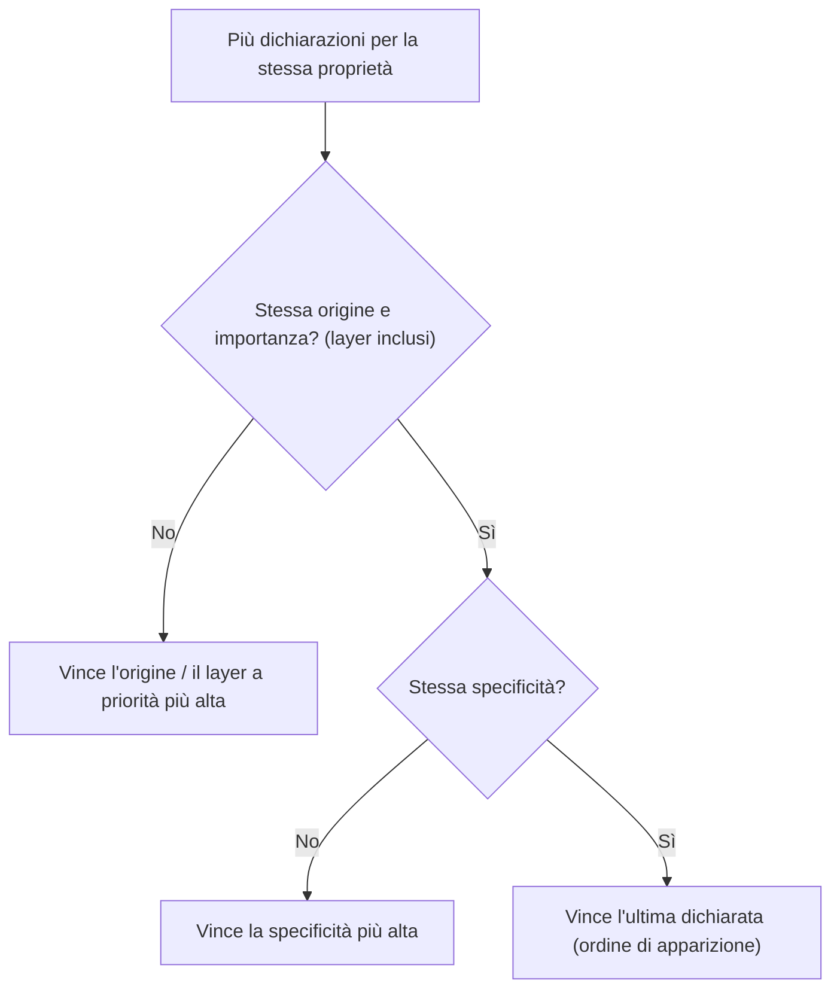

# 04 · Cascade, specificità, ereditarietà
> modulo 4 — *CSS* · rif. MDN

Più regole possono toccare lo stesso elemento e chiedere valori diversi per la stessa proprietà. Chi vince? A deciderlo sono tre meccanismi in cascata: la **cascade** (l'algoritmo che ordina le dichiarazioni), la **specificità** (quanto "pesa" un selettore) e l'**ereditarietà** (i valori che scendono da genitore a figlio). Capirli evita la sindrome del `!important` a tappeto e rende gli stili prevedibili.

## La cascade: come CSS sceglie il valore vincente

Quando due dichiarazioni assegnano valori diversi alla stessa proprietà dello stesso elemento, il browser applica l'[algoritmo della cascade](https://developer.mozilla.org/en-US/docs/Web/CSS/CSS_cascade/Cascade), che confronta i candidati per passi successivi. Si passa al criterio dopo **solo in caso di parità**:

1. **Origine e importanza** — da dove arriva la regola (browser, utente, autore) e se è marcata `!important`. Qui rientrano anche i **cascade layer** (`@layer`, vedi sotto).
2. **Specificità** — quanto è "mirato" il selettore (sezione dedicata).
3. **Ordine di apparizione** — a parità di tutto il resto, **vince l'ultima** dichiarazione nell'ordine del sorgente.



> [!tip]
> L'ordine di apparizione è l'**ultima** spiaggia, non la prima. Se una regola non "prende", spesso non è questione di ordine ma di **specificità** o di **origine/layer** più forte a monte.

### Origine e importanza

Ogni foglio di stile ha un'**origine**: `user-agent` (gli stili di default del browser), `user` (fogli impostati dall'utente) e `author` (i fogli del sito). L'ordine di priorità, dal più debole al più forte, [è questo](https://developer.mozilla.org/en-US/docs/Web/CSS/CSS_cascade/Cascade#origin_types):

| Priorità | Origine | Importanza |
|---|---|---|
| più debole | user-agent | normale |
| ↓ | user | normale |
| ↓ | **author** (i nostri stili) | normale |
| ↓ | animazioni `@keyframes` | — |
| ↓ | **author** | `!important` |
| ↓ | user | `!important` |
| più forte | user-agent | `!important` |

Il dettaglio controintuitivo: con `!important` l'ordine delle origini **si inverte**. Un `!important` dell'user-agent o dell'utente batte un `!important` dell'autore — è un meccanismo pensato per l'**accessibilità** (l'utente deve poter forzare i propri stili). Le transizioni CSS, poi, hanno priorità ancora superiore mentre sono in corso.

## Specificità

Quando origine e importanza pari, vince il selettore più **specifico**. La specificità è un valore a tre "colonne" (si scrive **`a-b-c`**) che [MDN indica](https://developer.mozilla.org/en-US/docs/Web/CSS/CSS_cascade/Specificity) come **ID · CLASS · TYPE**:

| Colonna | Cosa la incrementa | Peso |
|---|---|---|
| **ID** (`a`) | selettori id `#nav` | `1-0-0` |
| **CLASS** (`b`) | classi `.card`, attributi `[type="text"]`, pseudo-classi `:hover` | `0-1-0` |
| **TYPE** (`c`) | selettori di tipo `p`, pseudo-elementi `::before` | `0-0-1` |

Non incrementano nulla (`0-0-0`): il selettore **universale** `*`, i **combinatori** (`>`, `+`, `~`, spazio) e il **nesting** `&`.

```css
#nav              { }   /* 1-0-0 */
.card .title      { }   /* 0-2-0 */
a:hover           { }   /* 0-1-1 */
ul li a           { }   /* 0-0-3 */
nav a[href^="/"]  { }   /* 0-1-2  (nav + a = type; [href^] = attributo) */
```

Il confronto è **colonna per colonna, da sinistra a destra**: prima gli ID, poi le CLASS, poi i TYPE. La prima colonna in cui i due valori differiscono decide, e **le colonne non "riportano"**: nessuna quantità di classi raggiunge un ID.

```css
#titolo            { color: green;  }  /* 1-0-0  → VINCE */
.a .b .c .d .e     { color: orange; }  /* 0-5-0  perde: 0 < 1 in colonna ID */
```

<figure style="margin:1rem 0;text-align:center">
<svg viewBox="0 0 470 168" role="img" aria-label="Specificità a colonne ID-CLASS-TYPE: 1-0-0 batte 0-5-0 perché la colonna ID decide, senza riporto" style="width:100%;max-width:480px;height:auto;color:inherit"><g font-family="system-ui,Arial,sans-serif"><text x="236.0" y="32" font-size="10" text-anchor="middle" font-weight="700" opacity=".8" fill="currentColor" font-family="system-ui,Arial,sans-serif">ID</text><text x="294.0" y="32" font-size="10" text-anchor="middle" font-weight="700" opacity=".8" fill="currentColor" font-family="system-ui,Arial,sans-serif">CLASS</text><text x="352.0" y="32" font-size="10" text-anchor="middle" font-weight="700" opacity=".8" fill="currentColor" font-family="system-ui,Arial,sans-serif">TYPE</text><text x="236.0" y="44" font-size="8" text-anchor="middle" font-weight="400" opacity=".55" fill="currentColor" font-family="system-ui,Arial,sans-serif">a</text><text x="294.0" y="44" font-size="8" text-anchor="middle" font-weight="400" opacity=".55" fill="currentColor" font-family="system-ui,Arial,sans-serif">b</text><text x="352.0" y="44" font-size="8" text-anchor="middle" font-weight="400" opacity=".55" fill="currentColor" font-family="system-ui,Arial,sans-serif">c</text><text x="196" y="78.0" font-size="11" text-anchor="end" font-weight="700" opacity="1" fill="currentColor" font-family="ui-monospace,Menlo,Consolas,monospace">#titolo</text><rect x="210" y="60" width="52" height="28" rx="4" fill="var(--link,#1572b6)" fill-opacity=".16" stroke="var(--link,#1572b6)" stroke-width="1.4" opacity="1"/><text x="236.0" y="78" font-size="13" text-anchor="middle" font-weight="700" opacity="1" fill="currentColor" font-family="system-ui,Arial,sans-serif">1</text><rect x="268" y="60" width="52" height="28" rx="4" fill="var(--link,#1572b6)" fill-opacity=".16" stroke="var(--link,#1572b6)" stroke-width="1.4" opacity="1"/><text x="294.0" y="78" font-size="13" text-anchor="middle" font-weight="700" opacity="1" fill="currentColor" font-family="system-ui,Arial,sans-serif">0</text><rect x="326" y="60" width="52" height="28" rx="4" fill="var(--link,#1572b6)" fill-opacity=".16" stroke="var(--link,#1572b6)" stroke-width="1.4" opacity="1"/><text x="352.0" y="78" font-size="13" text-anchor="middle" font-weight="700" opacity="1" fill="currentColor" font-family="system-ui,Arial,sans-serif">0</text><text x="392" y="78.0" font-size="10" text-anchor="start" font-weight="700" opacity="1" fill="currentColor" font-family="system-ui,Arial,sans-serif">VINCE</text><text x="196" y="118.0" font-size="11" text-anchor="end" font-weight="600" opacity="1" fill="currentColor" font-family="ui-monospace,Menlo,Consolas,monospace">.a .b .c .d .e</text><rect x="210" y="100" width="52" height="28" rx="4" fill="none" stroke="currentColor" stroke-width="1.4" opacity="1"/><text x="236.0" y="118" font-size="13" text-anchor="middle" font-weight="700" opacity="1" fill="currentColor" font-family="system-ui,Arial,sans-serif">0</text><rect x="268" y="100" width="52" height="28" rx="4" fill="none" stroke="currentColor" stroke-width="1.4" opacity="1"/><text x="294.0" y="118" font-size="13" text-anchor="middle" font-weight="700" opacity="1" fill="currentColor" font-family="system-ui,Arial,sans-serif">5</text><rect x="326" y="100" width="52" height="28" rx="4" fill="none" stroke="currentColor" stroke-width="1.4" opacity="1"/><text x="352.0" y="118" font-size="13" text-anchor="middle" font-weight="700" opacity="1" fill="currentColor" font-family="system-ui,Arial,sans-serif">0</text><rect x="206" y="56" width="60" height="76" rx="6" fill="none" stroke="currentColor" stroke-width="1.3" opacity="1" stroke-dasharray="4 3"/><text x="236.0" y="150" font-size="9" text-anchor="middle" font-weight="600" opacity=".8" fill="currentColor" font-family="system-ui,Arial,sans-serif">la colonna ID decide: 1 > 0, senza riporto</text></g></svg>
<figcaption style="font-size:.82rem;opacity:.7;margin-top:.3rem">La specificità è a tre colonne <strong>ID · CLASS · TYPE</strong> e si confronta <strong>da sinistra</strong>, senza riporto: <code>#titolo</code> (<code>1-0-0</code>) batte <code>.a .b .c .d .e</code> (<code>0-5-0</code>) perché nella colonna ID <code>1 &gt; 0</code> — nessun numero di classi raggiunge un id.</figcaption>
</figure>

> [!warning]
> È il grande equivoco della vecchia notazione "id = 100, classe = 10, tipo = 1": suggerisce un conteggio in base 10, dove 11 classi (`110`) supererebbero un id (`100`). **Falso.** Le colonne sono indipendenti: `0-11-0` perde comunque contro `1-0-0`. La notazione a colonne `a-b-c` rende l'errore impossibile.

### Inline e `!important`: fuori scala

- Lo **stile inline** (attributo `style="…"`) batte qualunque selettore: vale come una colonna ancora più a sinistra, di fatto `1-0-0-0`.
- **`!important`** su una dichiarazione la sposta in una fascia di priorità superiore (vedi la tabella origine/importanza): scavalca la specificità di qualunque dichiarazione normale della stessa origine. Fra due `!important` della stessa origine/layer, vince poi quello a specificità maggiore.

> [!warning]
> `!important` va usato con **parsimonia**: spezza il ragionamento della cascade e l'unico modo per sovrascriverlo è un altro `!important` più specifico → spirale di escalation. Prima di ricorrervi, valutare un selettore più mirato o, meglio, i **cascade layer** (`@layer`).

### `:where()`, `:is()`, `:has()`, `:not()`

Queste pseudo-classi funzionali si comportano in modo speciale rispetto alla specificità (dettagli in [[02-selettori-combinatori]]):

- **`:where()`** ha **specificità zero**, sempre, qualunque cosa contenga. Ideale per stili di base **facili da sovrascrivere**.
- **`:is()`**, **`:has()`**, **`:not()`** non aggiungono peso di per sé, ma assumono la specificità del loro argomento **più specifico**.

```css
:where(#tema) a { color: red;  }  /* 0-0-1  — l'#id dentro :where() NON conta */
footer a        { color: blue; }  /* 0-0-2  → VINCE, pur senza id */

:is(p, #falso)  { }   /* 1-0-0  — prende la specificità di #falso */
p:not(.attiva)  { }   /* 0-1-1  — p (type) + .attiva (class) */
```

## Ereditarietà

Alcune proprietà, se non impostate, prendono il **valore calcolato del genitore**: **ereditano**. Riguarda soprattutto proprietà **tipografiche/testuali**:

- **Ereditano**: `color`, tutte le `font-*` (`font-family`, `font-size`, `font-weight`…), `line-height`, `text-align`, `letter-spacing`, `visibility`, `list-style`, `cursor`.
- **Non ereditano**: `margin`, `padding`, `border`, `background`, `width`/`height`, `display`, `position`. Senza un valore proprio, usano il loro **valore iniziale**.

La regola d'oro: eredita ciò che ha senso propagare al testo di tutta la pagina (imposti `color`/`font` sul `body` e vale ovunque), non eredita ciò che è specifico del singolo box (un `border` su un `<div>` non deve comparire su ogni figlio). Ogni proprietà su MDN riporta il campo **"Inherited: yes/no"**.

### Le parole chiave universali

Ogni proprietà accetta cinque [valori di controllo dell'ereditarietà](https://developer.mozilla.org/en-US/docs/Web/CSS/CSS_cascade/Inheritance):

| Keyword | Effetto |
|---|---|
| `inherit` | forza il valore del **genitore** (anche su proprietà che di norma non ereditano) |
| `initial` | riporta al **valore iniziale** definito dalla specifica (non quello del browser) |
| `unset` | si comporta come `inherit` se la proprietà eredita, altrimenti come `initial` |
| `revert` | torna al valore dell'origine precedente (di norma il **foglio user-agent** del browser) |
| `revert-layer` | torna al valore del **cascade layer precedente** (vedi `@layer`) |

```css
.reset {
  all: unset;           /* azzera TUTTE le proprietà al loro stato "naturale" */
}
.card em {
  color: initial;       /* ignora il color ereditato, torna al default della spec */
}
```

La proprietà scorciatoia **`all`** applica una di queste keyword a (quasi) tutte le proprietà in un colpo solo — utile per reset mirati.

> [!tip]
> **`currentColor`** è il ponte fra ciò che eredita e ciò che no: è un valore che vale sempre il `color` calcolato dell'elemento. Così `border: 1px solid currentColor` o `background: currentColor` seguono il colore del testo (che eredita), senza doverlo ripetere.

## Modern — `@layer`: i cascade layer

I **cascade layer** ([`@layer`](https://developer.mozilla.org/en-US/docs/Web/CSS/@layer), Baseline dal 2022) sono la novità che cambia il modo di gestire i conflitti: introducono una priorità **fra gruppi di stili** che agisce **prima della specificità**. Si dichiara l'ordine dei layer una volta sola; **conta l'ordine di dichiarazione, non la specificità interna**:

```css
/* 1. Ordine: prima = priorità più bassa, ultimo = più alta */
@layer base, components, utilities;

/* 2. Si assegnano le regole ai layer, in qualsiasi ordine nel file */
@layer base {
  a { color: blue; }          /* specificità 0-0-1 */
}
@layer utilities {
  .link-muted { color: gray; } /* specificità 0-1-0 */
}
```

Qui `.link-muted` vince su `a` **non** perché più specifico, ma perché `utilities` è dichiarato **dopo** `base`. La specificità torna in gioco solo *dentro* lo stesso layer. Punti chiave:

- Le regole **fuori da qualsiasi layer** hanno priorità **su tutte** quelle nei layer (indipendentemente dalla specificità).
- Con `!important` l'ordine dei layer **si inverte** (coerente con la logica generale dell'importanza): un `!important` nel primo layer batte quello nell'ultimo.
- Si può importare un intero file dentro un layer: `@import "reset.css" layer(base);`.
- I layer si possono annidare e riferire con la notazione a punto: `@layer framework.layout { … }`.

### Il trucco `:where()` a specificità zero

Combinato coi layer (o da solo), `:where()` serve a pubblicare stili **base facilmente sovrascrivibili**. Avvolgendo i selettori in `:where(...)` il loro peso resta `0-0-0`, così qualunque regola successiva dell'utente li supera senza lottare:

```css
:where(.btn) {          /* 0-0-0 → soglia minima */
  padding: .5rem 1rem;
  border-radius: 4px;
}
.btn { padding: 1rem; } /* 0-1-0 → sovrascrive senza sforzo */
```

> [!info] Legacy
> Prima di `@layer`, l'unico modo per governare la priorità fra CSS di terze parti e propri erano l'**ordine dei `<link>`/`@import`** e una guerra di specificità a colpi di selettori sempre più lunghi (o `!important`). I layer rendono quell'ordine **esplicito e indipendente** dalla specificità.

## Emergente — `@scope`

[`@scope`](https://developer.mozilla.org/en-US/docs/Web/CSS/@scope) limita un blocco di regole a un sottoalbero del DOM, con un confine superiore (incluso) e uno inferiore opzionale (escluso — il "donut scope"):

```css
@scope (.card) to (.card__footer) {
  img { border: 2px solid; }   /* solo le img dentro .card, non nel footer */
}
```

Introduce anche un criterio di cascade in più — la **scoping proximity**: a parità di specificità, vince la regola il cui scope-root è **più vicino** (meno "salti" nel DOM) all'elemento. Nell'ordine dell'algoritmo si colloca **fra specificità e ordine di apparizione**.

> [!info] Baseline
> `@scope` è **Baseline "newly available" da fine 2025**: supportato nelle versioni recenti di Chrome, Edge, Firefox e Safari, ma **da verificare** su browser più datati ([Can I Use](https://caniuse.com/css-cascade-scope)). Per ora, in produzione con base utenti eterogenea, valutare un fallback. *(verificato: 2026-08-13)*

Collegamenti: [[01-fondamenti]] · [[02-selettori-combinatori]] · [[03-pseudo-classi-elementi]]

## Ripasso lampo

<details>
<summary>In quale ordine la cascade decide il valore vincente?</summary>

**1) Origine e importanza** (browser/utente/autore + `!important`, layer inclusi) → **2) specificità** → **3) ordine di apparizione** (vince l'ultima). Si passa al criterio successivo solo in caso di parità.

</details>

<details>
<summary>Un selettore con 11 classi (<code>0-11-0</code>) batte uno con un solo id (<code>1-0-0</code>)?</summary>

**No.** Le colonne si confrontano da sinistra e non "riportano": la colonna ID (`1` vs `0`) decide subito a favore dell'id. Nessun numero di classi raggiunge un id.

</details>

<details>
<summary>Che differenza c'è fra <code>unset</code> e <code>revert</code>?</summary>

`unset` = `inherit` se la proprietà eredita, altrimenti `initial` (valore della spec). `revert` invece torna al valore dell'**origine precedente**, di norma il foglio di stile **user-agent** del browser.

</details>

<details>
<summary>Perché <code>@layer</code> è preferibile a <code>!important</code> per gestire i conflitti?</summary>

`@layer` stabilisce una priorità **esplicita fra gruppi di stili** che agisce *prima* della specificità, senza inquinare le singole dichiarazioni. `!important` invece innesca una escalation (si sovrascrive solo con altro `!important`) e rende il CSS fragile.

</details>

<details>
<summary>Qual è la specificità di <code>:where(#app) .btn</code> e di <code>#app .btn</code>?</summary>

`:where(#app) .btn` → **`0-1-0`** (l'`#app` dentro `:where()` non conta). `#app .btn` → **`1-1-0`**. `:where()` azzera sempre il proprio contenuto: utile per stili base sovrascrivibili.

</details>

**In sintesi:**
- La cascade risolve i conflitti in tre passi: **origine/importanza → specificità → ordine**; si scende solo a parità.
- Specificità a colonne **`a-b-c`** (ID · CLASS · TYPE); confronto da sinistra, **niente riporto**; inline e `!important` fuori scala. `:where()` = `0-0-0`.
- **Ereditano** le proprietà del testo (`color`, `font-*`, `line-height`…), **non** quelle del box (`margin`, `border`, `background`); si controlla con `inherit`/`initial`/`unset`/`revert`/`revert-layer` e si riusa il colore con `currentColor`.
- **`@layer`** (Baseline) riordina la priorità *prima* della specificità: la via moderna ai conflitti, al posto del `!important`. **`@scope`** (emergente) aggiunge la *scoping proximity*.
