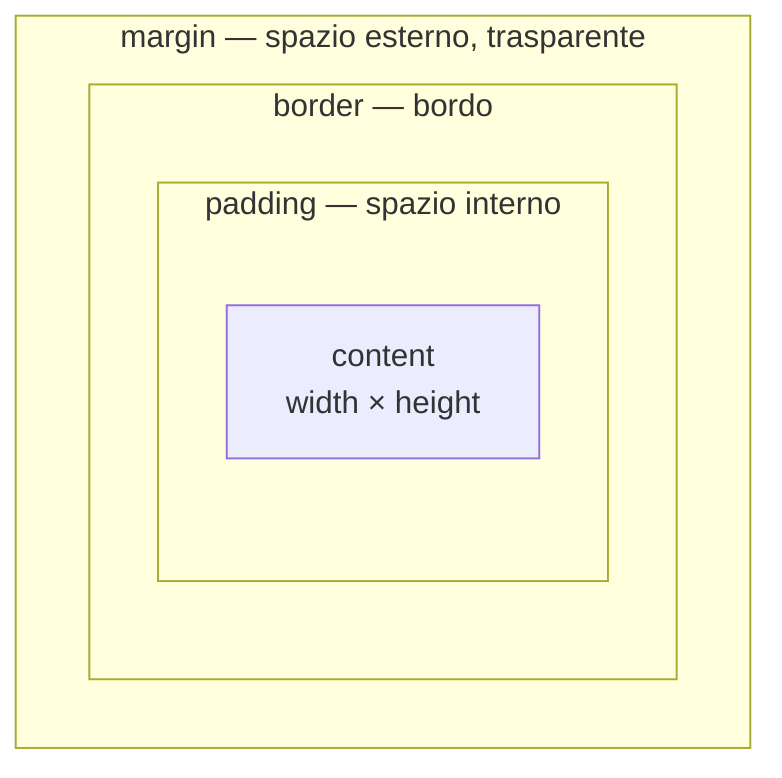

# 05 · Box model
> modulo 5 — *CSS* · rif. MDN

Ogni elemento HTML è, per il layout, una **scatola rettangolare**. Il *box model* descrive come questa scatola è costruita — da un nucleo di contenuto verso l'esterno — e come le sue misure si combinano per occupare lo spazio in pagina. Capirlo bene è il prerequisito di ogni tecnica di layout: senza, i valori di `width`, `padding` e `margin` sembrano "non tornare mai".

## Le quattro aree

Dal centro verso l'esterno, la scatola è fatta di quattro strati concentrici ([MDN](https://developer.mozilla.org/en-US/docs/Learn/CSS/Building_blocks/The_box_model)):



- **content** — il contenuto vero e proprio (testo, immagine, figli). Le sue misure si impostano con `width` e `height`.
- **padding** — lo spazio *interno* tra il contenuto e il bordo. Eredita lo sfondo dell'elemento.
- **border** — il bordo che circonda contenuto e padding.
- **margin** — lo spazio *esterno*, trasparente, che separa la scatola da quelle vicine.

> [!tip]
> Regola pratica per distinguerli: il **padding** spinge il bordo *lontano dal contenuto* (lo sfondo si estende con esso); il **margin** spinge le *altre scatole lontano dal bordo* (è sempre trasparente).

## `width` e `height`: cosa misurano

Di default (`box-sizing: content-box`, vedi sotto) `width` e `height` misurano **solo l'area del contenuto**. Padding e border si **sommano** oltre a quella misura:

```css
.box {
  width: 350px;
  padding: 25px;          /* +25 per lato */
  border: 5px solid;      /* +5 per lato */
}
/* larghezza occupata in pagina: 350 + 25·2 + 5·2 = 410px */
```

Il **margin**, invece, non entra mai nel conteggio della dimensione della scatola: aggiunge spazio *attorno*, non *dentro*.

## `padding`, `border`, `margin`: per lato e shorthand

Ogni area ha quattro proprietà per lato — per esempio `margin-top`, `margin-right`, `margin-bottom`, `margin-left` (e analoghe per `padding-*` e `border-*`). Nella pratica si usa lo **shorthand**, che accetta da uno a quattro valori con la regola **TRBL** (*top, right, bottom, left* — in senso orario partendo dall'alto):

```css
margin: 10px;                 /* 1 valore  → tutti e quattro i lati */
margin: 10px 20px;            /* 2 valori  → verticale | orizzontale */
margin: 10px 20px 30px;       /* 3 valori  → top | orizzontale | bottom */
margin: 10px 20px 30px 40px;  /* 4 valori  → top right bottom left */
```

- **2 valori**: il primo vale per alto e basso, il secondo per destra e sinistra.
- **3 valori**: alto, poi orizzontale (destra = sinistra), poi basso.
- **4 valori**: i quattro lati in senso orario.

> [!warning]
> Il **padding non può essere negativo**; il **margin sì**. Un margin negativo tira la scatola verso l'elemento adiacente (utile per sovrapposizioni mirate, ma va usato con cautela perché può creare overlap difficili da debuggare). ([MDN](https://developer.mozilla.org/en-US/docs/Learn/CSS/Building_blocks/The_box_model))

### `border`: lo shorthand `width style color`

Il bordo si scrive quasi sempre con lo shorthand `border`, che raccoglie **larghezza, stile e colore** in un colpo solo:

```css
.card {
  border: 2px solid crimson;   /* width | style | color */
}
```

Lo **style** è il valore *portante*: il suo default è `none`, quindi senza uno stile esplicito (`solid`, `dashed`, `dotted`, …) il bordo **non appare**, anche se width e color sono impostati. Esistono anche gli shorthand per lato (`border-top`, `border-inline`, …) e le proprietà singole (`border-width`, `border-style`, `border-color`).

## `box-sizing`: `content-box` vs `border-box`

`box-sizing` decide **cosa includono** `width` e `height` ([MDN](https://developer.mozilla.org/en-US/docs/Web/CSS/box-sizing)):

| | `content-box` (default) | `border-box` |
|---|---|---|
| `width`/`height` misurano | solo il contenuto | contenuto + padding + border |
| padding e border | si **sommano** alla misura | stanno **dentro** la misura |
| `width: 350px` con `padding: 25px` e `border: 5px` | occupa **410px** | occupa **350px** (il contenuto si restringe a 290px) |

Con `border-box` la misura dichiarata è quella *effettivamente occupata*: aggiungere padding o cambiare il bordo non allarga la scatola, ma comprime il contenuto. È molto più intuitivo per costruire layout, perché `width: 50%` resta `50%` a prescindere da padding e bordi.

Per questo la pratica standard moderna è **resettare tutto a `border-box`** all'inizio del foglio di stile:

```css
*, *::before, *::after {
  box-sizing: border-box;
}
```

I pseudo-elementi `::before`/`::after` vanno inclusi esplicitamente perché il selettore universale `*` da solo non li copre.

> [!tip]
> Da qui in poi in questi appunti si assume sempre `box-sizing: border-box` attivo: è lo scenario in cui le misure "tornano" senza calcoli a mente.

## Margin collapsing

Un comportamento controintuitivo: due margini **verticali** che si toccano non si sommano, ma **collassano** in un margine unico pari al **maggiore** dei due ([MDN](https://developer.mozilla.org/en-US/docs/Web/CSS/CSS_box_model/Mastering_margin_collapsing)).

```css
/* due paragrafi in colonna */
p        { margin-bottom: 40px; }
p + p    { margin-top: 20px; }
/* spazio effettivo tra loro: 40px, non 60px */
```

Avviene **solo** tra scatole di tipo *block* nel normale flusso, e **solo** sull'asse verticale (block). I casi tipici sono tre:

1. **Fratelli adiacenti** — il `margin-bottom` di uno e il `margin-top` del successivo collassano.
2. **Genitore e primo/ultimo figlio** — se nulla li separa, il margine verticale del figlio "esce" e collassa con quello del genitore (l'effetto sorprendente: il margin-top del figlio finisce *sopra* il genitore).
3. **Blocco vuoto** — senza contenuto, bordo, padding o altezza, il suo margin-top e margin-bottom collassano tra loro.

> [!warning]
> Con margini di segno diverso non vince il maggiore in assoluto: si **sommano algebricamente** (il negativo si sottrae dal positivo). Con due negativi vince il più negativo (il valore più lontano da zero).

**Come evitarlo.** Basta interrompere il contatto diretto o cambiare contesto di formattazione:

- inserire `padding` o `border` tra i due margini (caso genitore-figlio);
- dare al contenitore un `overflow` diverso da `visible` (es. `overflow: hidden` o `auto`) — crea un *block formatting context* — oppure `display: flow-root`;
- usare un contenitore **flex o grid**: al loro interno i margini **non collassano mai**.

Quest'ultimo punto è la vera ragione per cui il problema oggi si incontra di rado: nei layout moderni la spaziatura tra elementi si gestisce con `gap` in flex/grid (vedi sotto), non impilando margini.

## Logical properties: block e inline

Le proprietà fisiche (`top`/`right`/`bottom`/`left`) presuppongono una pagina che scorre dall'alto in basso e da sinistra a destra. Le **logical properties** ragionano invece per **assi logici**, adattandosi da sole a lingue e `writing-mode` diversi ([MDN](https://developer.mozilla.org/en-US/docs/Web/CSS/margin-block)):

- **block** = l'asse in cui si impilano i blocchi (in italiano/inglese: verticale, top↔bottom);
- **inline** = l'asse in cui scorre il testo (per noi: orizzontale, left↔right).

```css
/* logico (moderno)            equivalente fisico in horizontal-tb */
margin-block: 1rem;         /* margin-top + margin-bottom          */
margin-block: 1rem 2rem;    /* margin-top: 1rem; margin-bottom: 2rem */
margin-inline: 2rem;        /* margin-left + margin-right          */
padding-block: 12px;        /* padding-top + padding-bottom        */
padding-inline: 16px;       /* padding-left + padding-right        */
border-inline: 1px solid;   /* border-left + border-right          */
```

Esistono anche le versioni per singolo lato: `margin-block-start`/`-end`, `margin-inline-start`/`-end` (e analoghe per padding e border). Sono **Baseline** dal 2021, quindi utilizzabili senza fallback.

### Centrare con `margin-inline: auto`

L'idioma classico per centrare orizzontalmente un blocco di larghezza definita è un `margin` orizzontale automatico. In forma logica:

```css
.container {
  max-width: 60rem;
  margin-inline: auto;   /* moderno: centra sull'asse inline */
}
```

> [!info] Legacy
> La stessa cosa in sintassi fisica è `margin: 0 auto;` (o `margin-left: auto; margin-right: auto;`). Funziona ancora ovunque; `margin-inline: auto` è la forma preferita perché scala anche in contesti RTL o verticali.

## `gap` al posto dei margini

Per spaziare gli elementi *tra loro* dentro un layout, i margini oggi cedono il passo a **`gap`** (in flex e grid): definisce lo spazio tra gli item una volta sola, senza il rischio di margin collapsing né margini "di troppo" sull'ultimo elemento. I margini restano perfetti per la spaziatura di un **singolo** elemento rispetto a ciò che lo circonda. Approfondimento in [[12-flexbox]] e [[13-grid]].

Collegamenti: [[06-unita-valori-funzioni]] · [[09-display-posizionamento]]

## Ripasso lampo

**1.** Con `box-sizing: content-box`, quanto occupa in larghezza `width: 200px; padding: 20px; border: 5px solid`?
> [!success]- Risposta
> **250px**: `200 + 20·2 + 5·2`. Con `content-box` (default) padding e border si sommano al `width`. Con `border-box` occuperebbe esattamente 200px.

**2.** Cosa fa il reset `*, *::before, *::after { box-sizing: border-box; }` e perché è utile?
> [!success]- Risposta
> Fa sì che `width`/`height` includano padding e border su **tutti** gli elementi (pseudo-elementi compresi). Così la misura dichiarata è quella davvero occupata: `width: 50%` resta 50% qualunque sia il padding, e i layout "tornano" senza calcoli.

**3.** Cos'è il margin collapsing e su quale asse avviene?
> [!success]- Risposta
> Due margini **verticali** (block) di scatole *block* nel normale flusso che si toccano collassano in un margine unico pari al **maggiore** dei due (non si sommano). Avviene solo sull'asse verticale, mai su quello orizzontale.

**4.** Come si spiega la regola TRBL in `margin: 10px 20px 30px`?
> [!success]- Risposta
> Tre valori = **top | orizzontale | bottom**: `margin-top: 10px`, destra e sinistra `20px`, `margin-bottom: 30px`. Con 2 valori sarebbe verticale | orizzontale; con 4, in senso orario top-right-bottom-left.

**5.** Perché `border: 2px crimson` non mostra alcun bordo?
> [!success]- Risposta
> Manca lo **style**, il cui default è `none`. Senza uno stile esplicito (`solid`, `dashed`, …) il bordo non viene disegnato, anche con width e color impostati.

**6.** Quali modi ci sono per impedire il margin collapsing tra genitore e figlio?
> [!success]- Risposta
> Aggiungere `padding` o `border` al genitore, dargli un `overflow` diverso da `visible` (o `display: flow-root`), oppure usare un contenitore **flex/grid** (dove i margini non collassano mai).

**In sintesi:**
- Quattro aree concentriche: **content → padding → border → margin**. `width`/`height` misurano il content; il margin non entra mai nella dimensione della scatola.
- Shorthand con regola **TRBL** (1-2-3-4 valori); `border` = `width style color` e lo *style* è obbligatorio per vedere il bordo.
- Standard moderno: reset globale a **`border-box`**, così le misure includono padding e border e i layout tornano.
- **Margin collapsing**: solo margini verticali tra block nel flusso, vince il maggiore; si evita con padding/border, `overflow`/`flow-root` o passando a flex/grid.
- **Logical properties** (`margin-block`/`margin-inline`, `padding-block`/`padding-inline`, `border-inline`) accanto alle fisiche; `margin-inline: auto` per centrare; per spaziare più item si preferisce `gap`.
