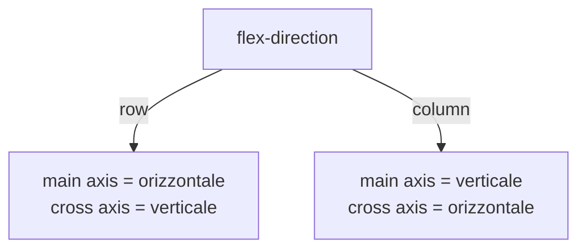

# 12 · Flexbox

> modulo 12 — *CSS* · rif. MDN

**Flexbox** (*Flexible Box Layout*) è un modello di layout **monodimensionale**: dispone gli elementi lungo **un asse** per volta — una riga *oppure* una colonna — e sa distribuire lo spazio libero e allineare gli elementi in modo naturale. È lo strumento giusto per barre di navigazione, gruppi di pulsanti, card affiancate, centrature: ovunque conti come si comportano gli elementi lungo una singola direzione. Per griglie a righe **e** colonne insieme (layout bidimensionale) si usa invece [[13-grid]].

## Container e item

Flexbox nasce da una relazione **genitore-figli**: si attiva sul contenitore, e riguarda solo i suoi **figli diretti**.

```css
.container {
  display: flex;        /* container di livello block */
}
```

- `display: flex` — il container si comporta come un box **block** (occupa tutta la larghezza disponibile) e i suoi figli diretti diventano **flex item**.
- `display: inline-flex` — stesso comportamento interno, ma il container si dispone **in linea** col testo circostante (larghezza pari al contenuto).

I figli diretti sono gli unici coinvolti: i nipoti seguono il flusso normale, a meno che anche il figlio non sia a sua volta un flex container. Il testo libero dentro il container viene avvolto in un flex item anonimo.

> [!tip]
> Attivare Flexbox non richiede markup speciale: basta `display: flex` sul genitore. Da quel momento proprietà come `width`, `float` e i margini automatici sui figli si comportano diversamente dal flusso normale.

## I due assi: main e cross

Tutto in Flexbox ruota attorno a **due assi perpendicolari**:

- **Asse principale** (*main axis*) — la direzione lungo cui gli item vengono disposti. Ha un **main-start** e un **main-end**.
- **Asse trasversale** (*cross axis*) — perpendicolare al principale. Ha un **cross-start** e un **cross-end**.

Quale sia orizzontale e quale verticale **non è fisso**: lo decide `flex-direction`. Questa è la chiave per non confondersi con le proprietà di allineamento.



La regola mnemonica: **`justify-content` allinea sull'asse principale**, **`align-items` sull'asse trasversale**. Se si cambia `flex-direction`, il significato "orizzontale/verticale" di queste due proprietà si scambia di conseguenza.

> [!tip]
> Flexbox ragiona per **logica** (start/end), non per lati fisici (left/right, top/bottom): questo lo rende automaticamente corretto anche nelle lingue da destra a sinistra (RTL) e nei writing mode verticali.

## Proprietà del container

### `flex-direction` — orientare l'asse principale

Stabilisce direzione e verso dell'asse principale.

```css
.container {
  flex-direction: row;            /* default: da sinistra a destra */
  /* row-reverse                     da destra a sinistra */
  /* column                          dall'alto in basso */
  /* column-reverse                  dal basso in alto */
}
```

Con `row`/`row-reverse` il main axis è orizzontale; con `column`/`column-reverse` diventa verticale. Le varianti `-reverse` invertono anche il punto di partenza (main-start e main-end si scambiano).

### `flex-wrap` — andare a capo

Di default gli item stanno tutti su **una sola riga** e, se non c'è spazio, si restringono. `flex-wrap` permette invece di mandarli a capo su più righe.

```css
.container {
  flex-wrap: nowrap;        /* default: tutto su una riga, gli item si restringono */
  /* wrap                      va a capo su più righe */
  /* wrap-reverse              va a capo, ma le righe si impilano in ordine inverso */
}
```

### `flex-flow` — lo shorthand di direzione e wrap

Combina `flex-direction` e `flex-wrap` in una sola dichiarazione:

```css
.container {
  flex-flow: row wrap;      /* = flex-direction: row; flex-wrap: wrap; */
}
```

### `justify-content` — allineamento sull'asse principale

Distribuisce lo **spazio libero** lungo l'asse principale.

```css
.container {
  justify-content: flex-start;      /* default: item impacchettati a main-start */
  /* flex-end          impacchettati a main-end */
  /* center            centrati sull'asse principale */
  /* space-between     primo a inizio, ultimo a fine, spazio uguale in mezzo */
  /* space-around      spazio uguale attorno a ogni item (i bordi valgono metà) */
  /* space-evenly      spazio uguale ovunque, bordi compresi */
}
```

La differenza tra i tre `space-*`:

- `space-between` — nessuno spazio ai bordi; tutto il vuoto va **tra** gli item.
- `space-around` — ogni item ha lo stesso spazio a sinistra e a destra, quindi lo spazio tra due item è **doppio** rispetto a quello ai bordi.
- `space-evenly` — ogni intervallo, bordi inclusi, è **identico**.

### `align-items` — allineamento sull'asse trasversale

Allinea gli item lungo l'asse trasversale, entro l'altezza (o larghezza) della riga.

```css
.container {
  align-items: stretch;         /* default: gli item riempiono il cross axis */
  /* flex-start        allineati a cross-start */
  /* flex-end          allineati a cross-end */
  /* center            centrati sull'asse trasversale */
  /* baseline          allineati sulla linea di base del testo */
}
```

`stretch` agisce solo se l'item non ha una dimensione esplicita sull'asse trasversale (es. nessuna `height` fissata quando il cross axis è verticale).

### `align-content` — allineamento delle righe multiple

Quando gli item vanno a capo (`flex-wrap: wrap`) e occupano **più righe**, `align-content` distribuisce lo spazio **tra le righe** lungo l'asse trasversale.

```css
.container {
  flex-wrap: wrap;
  align-content: flex-start;    /* normal | flex-start | flex-end | center |
                                   space-between | space-around | space-evenly | stretch */
}
```

> [!warning]
> `align-content` non ha **nessun effetto** su un container a riga singola (`flex-wrap: nowrap`, il default): serve solo quando esistono più righe da distribuire. Da non confondere con `align-items`, che allinea gli item **dentro** ciascuna riga.

### `gap` — il modo moderno di spaziare

`gap` imposta lo spazio **tra** gli item (e tra le righe, quando c'è wrap), senza toccare i bordi esterni del container. È il modo standard di gestire la spaziatura in Flexbox.

```css
.container {
  display: flex;
  gap: 1rem;              /* stesso spazio tra tutti gli item */
  /* gap: 1rem 2rem;         row-gap column-gap */
}
```

Rispetto ai margini sui singoli item, `gap` non aggiunge spazio spurio ai margini esterni, non richiede di azzerare il margine sul primo/ultimo elemento e non soffre di *margin collapsing* (vedi [[05-box-model]]). Le sotto-proprietà `row-gap` e `column-gap` permettono di regolare le due direzioni separatamente.

> [!info] Baseline
> `gap` nei flex container è **Baseline widely available**: supportato da tutti i browser correnti dopo l'arrivo in Safari 14.1 (aprile 2021). Oggi è la scelta di default per spaziare in flex. ([MDN — `gap`](https://developer.mozilla.org/en-US/docs/Web/CSS/gap), [Can I Use — flexbox-gap](https://caniuse.com/flexbox-gap))

> [!info] Legacy
> Prima di `gap` si spaziava con i **margini** sugli item (es. `margin-right` su ciascuno tranne l'ultimo, o `margin: 0 0.5rem` sul container per compensare). Tecnica ancora leggibile in codice datato o dove serve supporto a Safari &lt; 14.1, ma superata: preferire `gap`.

### `place-content` e `place-items` — gli shorthand

Due shorthand accorpano le proprietà di allineamento del container:

```css
.container {
  place-content: center space-between;   /* = align-content: center; justify-content: space-between; */
  place-items: center;                   /* = align-items: center; justify-items: center; */
}
```

> [!warning]
> In Flexbox `justify-items` (e `justify-self` sugli item) **non hanno effetto**: l'allineamento sull'asse principale è governato da `justify-content` sul container e dai margini automatici sugli item. Di conseguenza, in un flex container `place-items` finisce per impostare di fatto il solo `align-items`. Queste proprietà tornano pienamente utili in [[13-grid]].

## Proprietà degli item

Le tre proprietà `flex-*` decidono come ogni item **cresce**, **si restringe** e da quale **dimensione base** parte lungo l'asse principale.

### `flex-grow` — crescere

Fattore di crescita: quanta parte dello spazio **libero** l'item si prende, in proporzione agli altri.

```css
.item {
  flex-grow: 0;     /* default: non cresce */
}
```

Con tutti gli item a `flex-grow: 1` lo spazio extra si divide in parti uguali; un item a `2` prende il doppio dello spazio extra rispetto a uno a `1`.

### `flex-shrink` — restringersi

Fattore di restringimento: quanto l'item si contrae quando lo spazio **manca**.

```css
.item {
  flex-shrink: 1;   /* default: può restringersi */
}
```

Con `flex-shrink: 0` l'item **non** si restringe e può causare overflow del container.

### `flex-basis` — la dimensione di partenza

Dimensione dell'item lungo l'asse principale **prima** che grow/shrink entrino in gioco.

```css
.item {
  flex-basis: auto;   /* default: usa width/height o il contenuto */
  /* flex-basis: 200px;  parte da 200px */
  /* flex-basis: 0;      ignora il contenuto, parte da zero */
}
```

### `flex` — lo shorthand (il modo consigliato)

Accorpa `flex-grow`, `flex-shrink` e `flex-basis`. MDN consiglia di usare **lo shorthand** anziché le tre proprietà separate, perché imposta valori sensati per quelle omesse.

```css
.item {
  flex: 1;                /* = 1 1 0%  → cresce/si restringe, base 0 */
  /* flex: 1 1 auto;         forma esplicita a tre valori */
}
```

Valori con espansione da ricordare:

- `flex: 1` → `1 1 0%` — tutti gli item con questo valore si dividono lo spazio **in parti uguali**, ignorando la dimensione del contenuto (base `0`). È il pattern per colonne di pari larghezza.
- `flex: auto` → `1 1 auto` — cresce e si restringe, ma **partendo dalla dimensione del contenuto**: item con più contenuto restano più larghi.
- `flex: none` → `0 0 auto` — dimensione fissa sul contenuto, né cresce né si restringe.
- `flex: initial` → `0 1 auto` — il default: non cresce, ma può restringersi.

> [!tip]
> Differenza chiave tra `flex: 1` e `flex: auto`: entrambi crescono, ma `flex: 1` azzera la base (larghezze **uguali** a prescindere dal contenuto), mentre `flex: auto` parte dal contenuto (larghezze **proporzionali** al contenuto).

### `align-self` — sovrascrivere l'allineamento del singolo

Permette a un singolo item di ignorare l'`align-items` del container sull'asse trasversale.

```css
.item {
  align-self: flex-end;    /* auto | flex-start | flex-end | center | baseline | stretch */
}
```

### `order` — riordinare visivamente

Cambia l'ordine **visivo** degli item (default `0`); a parità di `order` vale l'ordine del sorgente.

```css
.item {
  order: 1;      /* item con order più basso appaiono prima */
}
```

> [!warning]
> `order` altera solo la disposizione visiva, **non** l'ordine del DOM: la navigazione da tastiera e gli screen reader seguono comunque l'ordine del markup. Un disallineamento tra ordine visivo e ordine del sorgente danneggia l'accessibilità (WCAG 1.3). Va usato con parsimonia; l'ordine logico dovrebbe stare nell'HTML. ([MDN — `order`](https://developer.mozilla.org/en-US/docs/Web/CSS/order))

## Pattern comuni

### Centrare perfettamente

Centratura sui due assi in tre righe:

```css
.center {
  display: flex;
  justify-content: center;   /* centra sull'asse principale */
  align-items: center;       /* centra sull'asse trasversale */
}
```

### Navbar con logo a sinistra e link a destra

`justify-content: space-between` spinge i due gruppi ai lati opposti; `gap` spazia i link tra loro.

```html
<nav class="navbar">
  <a class="logo" href="/">Logo</a>
  <ul class="links">
    <li><a href="/chi-siamo">Chi siamo</a></li>
    <li><a href="/contatti">Contatti</a></li>
  </ul>
</nav>
```

```css
.navbar {
  display: flex;
  justify-content: space-between;   /* logo a sinistra, link a destra */
  align-items: center;              /* allineati verticalmente al centro */
}

.links {
  display: flex;
  gap: 1.5rem;                      /* spazio tra i link */
  list-style: none;
}
```

### Footer sempre in fondo (sticky footer)

Un layout a colonna alto quanto la viewport, con il contenuto centrale che **si espande** (`flex: 1`) e spinge il footer in basso anche quando la pagina è corta.

```css
body {
  display: flex;
  flex-direction: column;
  min-height: 100vh;         /* alto almeno quanto la viewport */
}

main {
  flex: 1;                   /* occupa tutto lo spazio residuo */
}
```

Il `footer` non ha bisogno di regole: viene naturalmente spinto in fondo dal `main` che cresce.

## Flexbox (1D) o Grid (2D)?

Regola pratica: se si ragiona su **una direzione** per volta (una fila di elementi che si distribuisce e va a capo), è **Flexbox**. Se si progetta una struttura a **righe e colonne allineate insieme** (una griglia vera), è **Grid**. I due modelli si combinano spesso: Grid per l'impianto della pagina, Flexbox dentro i singoli componenti. Il modulo dedicato: [[13-grid]].

Collegamenti: [[13-grid]] · [[05-box-model]] · [[09-display-posizionamento]]

## Ripasso lampo

<details>
<summary>Qual è la differenza tra <code>justify-content</code> e <code>align-items</code>, e da cosa dipende quale dei due agisce in orizzontale?</summary>

`justify-content` allinea sull'**asse principale**, `align-items` sull'**asse trasversale**. Quale sia orizzontale dipende da `flex-direction`: con `row` il principale è orizzontale, con `column` diventa verticale (i due si scambiano).

</details>

<details>
<summary>Perché si preferisce <code>gap</code> ai margini per spaziare i flex item?</summary>

`gap` mette spazio solo **tra** gli item (non ai bordi esterni), non richiede di azzerare il margine sul primo/ultimo elemento e non soffre di margin collapsing. È **Baseline** dal 2021 (Safari 14.1) ed è il modo standard oggi.

</details>

<details>
<summary>A cosa si espande <code>flex: 1</code> e in cosa differisce da <code>flex: auto</code>?</summary>

`flex: 1` = `1 1 0%`: gli item si dividono lo spazio in **parti uguali** ignorando il contenuto (base `0`). `flex: auto` = `1 1 auto`: crescono anch'essi, ma **partendo dal contenuto**, quindi risultano proporzionali a esso.

</details>

<details>
<summary>Quando <code>align-content</code> ha effetto e quando invece è inutile?</summary>

Ha effetto solo con **più righe** (`flex-wrap: wrap` e item che vanno a capo), perché distribuisce lo spazio tra le righe. Su un container a riga singola (`nowrap`, il default) non fa nulla.

</details>

<details>
<summary>Perché <code>order</code> va usato con cautela?</summary>

Cambia solo l'ordine **visivo**, non quello del DOM: tastiera e screen reader seguono il markup. Il disallineamento danneggia l'accessibilità (WCAG 1.3); l'ordine logico va tenuto nell'HTML.

</details>

<details>
<summary>Flexbox o Grid?</summary>

Flexbox per il layout **monodimensionale** (una riga o una colonna, con eventuale wrap); Grid per il **bidimensionale** (righe e colonne allineate insieme). Spesso si combinano: vedi [[13-grid]].

</details>

**In sintesi:**
- `display: flex`/`inline-flex` sul container rende i **figli diretti** flex item, disposti lungo un **asse principale** (orientato da `flex-direction`) e allineati sull'**asse trasversale**.
- Container: `flex-direction`, `flex-wrap` (`flex-flow` shorthand), `justify-content` (asse principale), `align-items` (trasversale), `align-content` (righe multiple), **`gap`** come modo standard di spaziare.
- Item: `flex-grow`/`flex-shrink`/`flex-basis` (shorthand `flex`, con `flex: 1` per colonne uguali), `align-self`, `order`.
- Flexbox è **1D**; per il layout **2D** a righe e colonne si passa a [[13-grid]].
