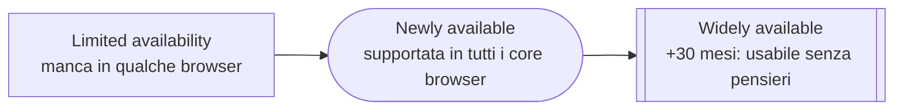

# 16 · Future-proof CSS
> modulo 16 — *CSS* · rif. MDN

Scrivere CSS **a prova di futuro** significa usare feature nuove senza rompere i browser che non le hanno ancora, e appoggiarsi a strumenti e convenzioni che invecchiano bene. Il tema non è tanto *quali* proprietà esistono, ma *come* decidere quando usarle, come degradare con eleganza e quali pratiche del passato (prefissi a mano, hack di specificità, framework monolitici) oggi non servono più. Questo modulo mette in fila gli strumenti attuali — `@supports`, **Baseline**, Autoprefixer — e inquadra il legacy per quello che è: contesto storico, non ricetta.

## Il supporto browser non è un interruttore

Una feature CSS non è "supportata" o "non supportata" in assoluto: lo è **per versione**, e i **motori del browser** — <a href="../glossario/#/docs/web-browser" target="_blank" rel="noopener">Blink (Chrome/Edge), WebKit (Safari), Gecko (Firefox)</a> — la implementano in tempi diversi. Il codice va quindi pensato per un **ventaglio** di browser, non per quello sul proprio schermo.

Due strumenti rispondono alla domanda "posso usarlo?":

- **[Can I Use](https://caniuse.com/)** — tabelle di supporto per singola feature, versione per versione, con percentuali d'uso reali. Utile per il dettaglio granulare.
- **[Baseline](https://web.dev/baseline)** (web.dev) — sintetizza il supporto in **stadi** leggibili a colpo d'occhio, basati sul *core browser set*: Chrome, Edge, Firefox, Safari (desktop e mobile), gestito dalla WebDX Community Group.



Una feature diventa **Newly available** quando è interoperabile su tutti i core browser; diventa **Widely available** dopo **30 mesi**, quando la si può usare senza preoccuparsi del supporto ([definizione ufficiale](https://web.dev/baseline)). Nel 2026 la maggior parte di ciò che questi appunti presentano come "moderno" è già almeno *Newly available*.

### Progressive enhancement vs graceful degradation

Sono due direzioni per gestire il divario di supporto:

- **Progressive enhancement** — si parte da una base che funziona **ovunque** e si *aggiunge* il miglioramento dove il browser lo regge. È la direzione preferita: nessun utente resta senza contenuto.
- **Graceful degradation** — si parte dalla versione ricca e si prevede un ripiego per chi non ce la fa. Ragionamento inverso, più fragile perché la base non è la più solida.

> [!tip]
> In pratica si scrive prima la regola di fallback (senza condizioni), poi si *sovrascrive* con la versione avanzata dentro una feature query. Chi non supporta la feature semplicemente ignora il blocco e resta sul fallback.

## `@supports` — le feature queries

[`@supports`](https://developer.mozilla.org/en-US/docs/Web/CSS/@supports) è **lo strumento moderno** per il progressive enhancement in CSS: applica un blocco di regole **solo se** il browser supporta una data dichiarazione. È il CSS che interroga se stesso, senza JavaScript e senza sniffing dello user-agent.

La condizione base è una coppia `property: value` tra parentesi:

```css
/* base: funziona ovunque, layout a colonne fluide */
.gallery {
  display: flex;
  flex-wrap: wrap;
  gap: 1rem;
}

/* miglioramento: solo dove subgrid è supportato */
@supports (grid-template-columns: subgrid) {
  .gallery {
    display: grid;
    grid-template-columns: repeat(auto-fill, minmax(12rem, 1fr));
  }
}
```

Gli operatori logici compongono condizioni più fini:

```css
/* negazione: fallback per chi NON ha :has() */
@supports not selector(:has(*)) {
  .card { /* stile alternativo */ }
}

/* combinazioni: servono le parentesi quando si mescola and/or */
@supports (display: grid) and (gap: 1rem) {
  .layout { display: grid; gap: 1rem; }
}
```

Oltre al test `property: value`, esistono forme funzionali:

- **`selector(...)`** — verifica il supporto di una **sintassi di selettore**, non di una proprietà: `@supports selector(:has(a))`, `@supports selector(h2 > p)`.
- **`font-tech(...)` / `font-format(...)`** — verificano tecnologie e formati di font (es. `font-format(woff2)`, `font-tech(color-COLRv1)`).
- **`not`, `and`, `or`** — negazione e combinazione; mescolando `and` e `or` **le parentesi sono obbligatorie**, altrimenti la condizione è invalida.

> [!warning]
> `@supports` testa la **sintassi**, non la correttezza del rendering: un browser può "supportare" una dichiarazione e comunque renderla con bug. Per i selettori nuovi (`:has()`) usare la forma `selector(...)`, non `(property: value)`.

## Vendor prefixes — perché oggi contano poco

Un **vendor prefix** (`-webkit-`, `-moz-`, `-ms-`, `-o-`) è un prefisso specifico di motore che, storicamente, marcava una proprietà **sperimentale** prima della standardizzazione ([MDN](https://developer.mozilla.org/en-US/docs/Glossary/Vendor_Prefix)). L'idea si è rivelata problematica: siti interi finivano per dipendere da `-webkit-`, costringendo gli altri browser a implementarlo per compatibilità. Oggi i motori usano piuttosto **flag sperimentali** dietro configurazione, non prefissi in produzione.

> [!info] Legacy
> Blocchi come questo, tipici del CSS pre-2017, oggi sono superflui: tutti i browser supportano `transition` senza prefisso. Se si trovano in una codebase, si tiene **solo l'ultima riga** ([MDN](https://developer.mozilla.org/en-US/docs/Glossary/Vendor_Prefix)).
> ```css
> -webkit-transition: all 4s ease;
> -moz-transition: all 4s ease;
> -ms-transition: all 4s ease;
> -o-transition: all 4s ease;
> transition: all 4s ease; /* ← basta questa */
> ```

Nel 2026 i prefissi **non si scrivono a mano**. Quando servono ancora (poche proprietà di nicchia), il compito è delegato ad **[Autoprefixer](https://github.com/postcss/autoprefixer)**, un plugin di **PostCSS**: legge il codice standard e aggiunge i prefissi necessari in base a una lista di browser-target (config **Browserslist**), togliendoli man mano che diventano inutili. La decisione su cosa prefissare la prende Baseline/Can I Use, non l'intuito.

> [!info] Legacy
> **[shouldiprefix.com](http://shouldiprefix.com/)** è il riferimento storico che elencava, proprietà per proprietà, quali prefissi servissero. Va consultato come reperto: gran parte delle sue voci oggi sono risolte.

## Polyfill

Un **polyfill** è codice (di solito JavaScript) che *ricrea* una feature mancante in un browser che non ce l'ha nativamente, così l'API o il comportamento risultano disponibili anche lì. Sono nati per l'era in cui i browser divergevano molto: **[Modernizr](https://github.com/Modernizr/Modernizr)** rilevava le feature e permetteva di caricare i polyfill giusti.

Oggi servono **raramente** per il CSS: la convergenza dei motori e Baseline hanno reso quasi tutto disponibile nativamente, e per il *feature detection* in CSS c'è già `@supports`. Restano un'opzione di nicchia per API JavaScript recenti su target datati — contesto di transizione, non pratica corrente.

## Naming: BEM

**BEM** (*Block, Element, Modifier*) è una convenzione di nomenclatura delle classi che nasce per rendere il CSS **prevedibile** e a bassa specificità: ogni classe è "piatta" (un solo livello), così non servono selettori annidati profondi e le regole non si sovrascrivono a sorpresa ([getbem.com](http://getbem.com/introduction/)).

- **Block** — componente autonomo: `.card`.
- **Element** — parte del block, con `__`: `.card__title`.
- **Modifier** — variante di block o element, con `--`: `.card--featured`, `.card__button--disabled`.

```css
.card { /* block */ }
.card__title { /* element */ }
.card--featured { /* modifier del block */ }
.card__button--disabled { /* modifier dell'element */ }
```

BEM risolve un problema reale — collisioni di nomi e specificità che sfugge di mano — ma oggi parte di quel problema è affrontabile a livello di linguaggio: le **custom properties** ([[06-unita-valori-funzioni]]) parametrizzano i componenti senza moltiplicare le classi, e i **cascade layer** (`@layer`, [[04-cascade-specificita-ereditarieta]]) governano l'ordine di vittoria a prescindere dalla specificità. BEM resta valido e diffuso, ma non è più l'unica difesa contro il caos della cascade.

## Come si standardizza ed evolve il CSS

Non esiste "il CSS" come singola specifica: dopo CSS 2.1 lo standard è stato spezzato in **moduli** indipendenti (Selectors, Grid Layout, Color, Cascade & Inheritance, …), ognuno con un **livello** proprio (es. *Selectors Level 4*) e un proprio stato di maturità. A curarli è il **[CSS Working Group](https://www.w3.org/TR/tr-groups-all#tr_Cascading_Style_Sheets__CSS__Working_Group)** del W3C. Questo spiega perché feature diverse avanzano a velocità diverse e perché "supporta CSS3" non vuol dire nulla di preciso: ogni modulo fa storia a sé.

Nel nome di un modulo convivono però **due cose diverse** che è facile confondere. Il **livello** (*Level*) è la sua **edizione**: sale quando il gruppo apre una nuova tornata per aggiungere feature, di solito quando la precedente è già solida — è una scelta editoriale, non una metrica automatica (ecco perché a volte un numero viene saltato, come *Cascading and Inheritance 3 → 5*). Lo **stadio** (Working Draft, Candidate Recommendation…) dice invece quanto quella edizione è **matura**. I due assi sono indipendenti: *Selectors Level 3* è una Recommendation conclusa — quella che i browser implementano — mentre *Selectors Level 4*, che aggiunge `:has()`, `:is()` e altro, è ancora un Working Draft. Un livello più alto quindi **non** significa "più pronto": è la versione successiva, spesso ancora acerba.

### Gli stadi di maturità di un modulo

Ogni modulo attraversa una **scala di maturità** fissata dal processo del W3C, che dice quanto la specifica è stabile. Si parte dal **Working Draft** (bozza ancora in movimento), si passa alla **Candidate Recommendation** — la fase di test, in cui la specifica è considerata pronta ma deve dimostrare **due implementazioni indipendenti** di ogni feature prima di andare avanti — poi alla **Proposed Recommendation** (in attesa dell'approvazione formale del W3C) e infine alla **Recommendation**, lo standard concluso. In pratica una feature si considera *instabile* finché non arriva almeno alla Candidate Recommendation ([stato dei moduli CSS](https://www.w3.org/Style/CSS/current-work)).

Il W3C stesso riassume in **tre livelli di stabilità** — WD, CR e REC, con la PR poco prima della fine. Sulla pagina ufficiale, però, si incontrano altre sigle: sono l'inizio, le sotto-forme e i capolinea di questo stesso percorso, non tappe nuove in mezzo. La legenda per intero:

| Sigla | Significato | Ruolo |
|---|---|---|
| **FPWD** | First Public Working Draft | il primissimo WD: il gruppo prende in carico il modulo |
| **WD** | Working Draft | bozza di lavoro, si itera |
| **CR** | Candidate Recommendation | fase di test: servono due implementazioni indipendenti per uscirne |
| **CRD** | Candidate Recommendation Draft | un aggiornamento di lavoro della CR fra una revisione formale e l'altra |
| **PR** | Proposed Recommendation | congelata, in attesa dell'approvazione del W3C |
| **REC** | Recommendation | lo standard concluso |
| **SPSD** | Superseded Recommendation | una REC rimpiazzata da un'edizione più nuova |
| **NOTE** | Working Group Note | fuori dal binario standard: documenti informativi (anche i CSS Snapshot sono NOTE) o moduli abbandonati |

Sulla pagina [CSS Current Work](https://www.w3.org/Style/CSS/current-work) le colonne *Current* e *Upcoming* indicano lo stadio attuale e quello previsto; i raggruppamenti (*Refining*, *Revising*, *Completed*, *Abandoned*…) sono invece i "cassetti" di lavoro del gruppo, non stadi.

### Nessuna edizione annuale: il confronto con ECMAScript

Viene naturale il paragone con JavaScript, che ha un meccanismo simile ma organizzato diversamente. In JS un unico comitato, il **TC39**, fa avanzare le proposte lungo gli **Stage 0–4** e ogni anno raccoglie quelle arrivate in fondo in un'**edizione ECMAScript** datata (ES2015, ES2026…). Il CSS **non ha** un'edizione annuale così: essendo modulare, ogni pezzo procede per conto suo e non esiste un "CSS 2026" che ne raccolga le novità dell'anno. Il documento che gli somiglia di più è il **[CSS Snapshot](https://www.w3.org/TR/css-2026/)** (l'ultimo è *CSS Snapshot 2026*, pubblicato come nota del gruppo), ma non è una release di feature nuove: è solo la fotografia di *quali* moduli, a una certa data, compongano nel loro insieme "il CSS" stabile.

| | JavaScript | CSS |
|---|---|---|
| **Chi decide** | comitato **TC39** | **CSS Working Group** (W3C) |
| **Stadi** | Stage 0 → 4 | WD → CR → PR → REC |
| **"Edizione" annuale** | sì: ECMAScript (ES2015, ES2026…) | no: moduli con *Level* propri; il *CSS Snapshot* è solo una fotografia |
| **"Posso usarlo?"** | supporto dei motori | **Baseline** · Can I Use · Interop |

Il processo TC39 è approfondito nel vault JavaScript, <a href="../javascript/#/docs/moderno/processo-tc39" target="_blank" rel="noopener">Il processo TC39 e gli stage</a>.

### Dove seguire le novità

Senza un'edizione unica, restare aggiornati vuol dire sapere **quale canale guardare per ogni fase** della vita di una feature — dalla proposta ancora in discussione fino al "posso usarlo in produzione":

| Cosa si cerca | Dove guardare |
|---|---|
| Proposte in discussione | repo GitHub **[w3c/csswg-drafts](https://github.com/w3c/csswg-drafts)** (issue + Editor's Draft) |
| Maturità di ogni modulo | **[CSS Current Work](https://www.w3.org/Style/CSS/current-work)** (W3C) |
| Cosa sta arrivando nei motori | **[Chrome Platform Status](https://chromestatus.com/)**, **[WebKit blog](https://webkit.org/blog/)**, [Firefox release notes](https://www.mozilla.org/en-US/firefox/releases/) |
| "Posso già usarlo?" | **[Baseline](https://web.dev/baseline)** (con i *digest mensili*) e **[Can I Use](https://caniuse.com/)** |
| Convergenza tra browser | **[Interop](https://web.dev/blog/interop-2026)** (test comuni, [dashboard](https://github.com/web-platform-tests/interop)) |

Due punti di riferimento pratici, per non perdersi in mezzo a tutti questi. Per le **proposte** ancora acerbe il posto dove si discute davvero è **GitHub `w3c/csswg-drafts`**, l'esatto equivalente di `tc39/proposals` in JavaScript. Per il "cosa è appena diventato usabile", invece, il polso regolare sono i **digest mensili di Baseline** su web.dev — è da lì, per dire, che arrivano notizie come le style query diventate Baseline a maggio 2026. A ridurre le divergenze tra motori lavora infine **Interop**, l'iniziativa annuale in cui Apple, Google, Microsoft, Mozilla e Igalia concordano ogni anno un set di feature prioritarie e ne misurano l'interoperabilità con test comuni: è il motore per cui, anno dopo anno, "funziona in tutti i browser" diventa sempre più vero.

## Sass — cosa aggiunge ancora

**[Sass](https://sass-lang.com/)** è un **preprocessore**: si scrivono file `.scss` con costrutti extra e un compilatore li traduce in CSS standard. Storicamente colmava buchi enormi del CSS (variabili, annidamento, moduli). Oggi molti di quei buchi il CSS li copre **nativamente** — nesting, custom properties, `min()`/`max()`/`clamp()` ([[06-unita-valori-funzioni]]), `color-mix()` ([[07-colori]]) — quindi spesso Sass **non serve**.

Cosa aggiunge ancora rispetto al CSS nativo:

- **Sistema a moduli** `@use` / `@forward` — importa mixin, funzioni e variabili con un namespace, senza inquinare lo scope globale (rimpiazza il vecchio `@import`, deprecato).
- **Mixin** `@mixin` / `@include` — blocchi di dichiarazioni parametrici e riutilizzabili (più potenti di una custom property, che porta *un valore*, non *un blocco*).
- **Funzioni** `@function` e libreria matematica (`math.div()` per la divisione, al posto dell'ambiguo `/`).
- **Cicli e logica** `@each`, `@for`, `@if` — per generare regole a ripetizione in compilazione.
- **Commenti di riga `//`** (che il CSS non ha, [[01-fondamenti]]).

```scss
// _button.scss
@use 'colors';                 // namespace: colors.$primary

$radius: 0.5rem;

@mixin center($gap: 0) {       // mixin parametrico
  display: flex;
  align-items: center;
  gap: $gap;
}

.button {
  @include center(0.5rem);
  border-radius: $radius;
  background: colors.$primary;
  &:hover { background: colors.$primary-dark; }  // & = nesting
}
```

> [!tip]
> Regola pratica 2026: usare Sass quando servono davvero **logica di generazione** (loop, funzioni) o un'organizzazione a moduli con `@use`/`@forward`. Per variabili, nesting e calcoli semplici, il CSS nativo basta e non richiede build step.

## Framework CSS — un accenno

L'approccio dominante oggi è **utility-first**: classi atomiche a singola responsabilità composte direttamente nel markup, come in **[Tailwind CSS](https://tailwindcss.com/)**. Sposta lo stile vicino al componente e riduce il CSS "morto".

> [!info] Legacy
> **Bootstrap** — il framework a componenti pronti (griglia, bottoni, card) che ha dominato gli anni 2010 — resta utile su progetti che già lo usano, ma per un progetto **nuovo** è una scelta datata: le sue griglie e i suoi mixin risolvono problemi che oggi Grid, Flexbox e le custom properties native coprono senza dipendenze.

Collegamenti: [[04-cascade-specificita-ereditarieta]] · [[06-unita-valori-funzioni]] · [[07-colori]]

## Ripasso lampo

<details>
<summary>Qual è la differenza tra *progressive enhancement* e *graceful degradation*?</summary>

**Progressive enhancement**: si parte da una base che funziona ovunque e si *aggiunge* il miglioramento dove supportato (direzione preferita). **Graceful degradation**: si parte dalla versione ricca e si prevede un ripiego per chi non la regge. La prima ha una base più solida.

</details>

<details>
<summary>Come si usa una feature nuova con un fallback, in CSS puro?</summary>

Con `@supports`: si scrive prima la regola di fallback senza condizioni, poi si sovrascrive dentro `@supports (property: value) { … }`. Per i selettori nuovi si usa la forma `@supports selector(:has(a))`. Mescolando `and`/`or` servono le parentesi.

</details>

<details>
<summary>Perché oggi non si scrivono più i vendor prefix a mano?</summary>

Perché quasi tutte le proprietà sono supportate senza prefisso e i motori usano flag sperimentali, non prefissi in produzione. Quando servono ancora, li aggiunge **Autoprefixer** (PostCSS) in base ai browser-target (Browserslist), non l'intuito dello sviluppatore.

</details>

<details>
<summary>Cosa risolve BEM e quali feature native oggi coprono parte dello stesso problema?</summary>

BEM (`block__element--modifier`) tiene classi piatte, a bassa specificità, evitando collisioni di nomi. Oggi le **custom properties** parametrizzano i componenti e i **cascade layer** (`@layer`) governano l'ordine di vittoria a prescindere dalla specificità.

</details>

<details>
<summary>Cosa significa che "il CSS è modulare"?</summary>

Dopo CSS 2.1 lo standard è spezzato in **moduli** indipendenti (Selectors, Grid, Color…), ognuno con un proprio **livello** e stato di maturità, curati dal **CSS Working Group**. Le feature avanzano a velocità diverse; "CSS3" non è una versione precisa.

</details>

<details>
<summary>Il CSS ha un'edizione annuale come ECMAScript?</summary>

No. Il **TC39** raccoglie ogni anno le proposte mature in un'edizione ECMAScript datata; il CSS è **modulare** e ogni modulo avanza per conto suo lungo gli stadi **WD → CR → PR → REC**. Il documento più simile a un riepilogo annuale è il **CSS Snapshot** (l'ultimo è *CSS Snapshot 2026*), ma fotografa solo quali moduli compongono "il CSS" stabile, non raccoglie feature nuove. Il segnale pratico "posso usarlo?" è **Baseline**.

</details>

<details>
<summary>Quando ha ancora senso usare Sass nel 2026?</summary>

Quando servono **logica di generazione** (`@each`/`@for`/`@function`) o organizzazione a moduli con `@use`/`@forward`. Per variabili, nesting e calcoli semplici il CSS nativo (custom properties, nesting, `clamp()`) basta e non richiede build step.

</details>

**In sintesi:**
- Il supporto è **per versione**: si decide con **Can I Use** (dettaglio) e **Baseline** (stadi *Newly*/*Widely available*), preferendo il **progressive enhancement**.
- **`@supports`** è lo strumento moderno per usare feature nuove con fallback; testa `property: value`, `selector(...)`, con `not`/`and`/`or`.
- Legacy relegato a contesto: **prefissi a mano** → oggi Autoprefixer/Baseline; **Modernizr/polyfill** → raramente necessari; **Bootstrap** → datato per progetti nuovi.
- **BEM** resta valido, ma custom properties e `@layer` coprono parte di ciò che risolveva; il CSS è **modulare** (CSS WG + Interop lo rendono sempre più uniforme), matura per stadi (WD → CR → PR → REC) e **non** ha un'edizione annuale come ECMAScript — il *CSS Snapshot* è solo una fotografia.
- **Sass** aggiunge ancora moduli, mixin, funzioni e loop, ma il CSS nativo moderno l'ha reso spesso superfluo.
