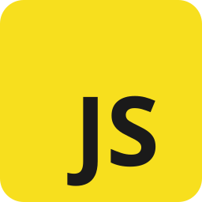

  
  <h1>JavaScript</h1>
  
You Don't Know JS — guida completa in italiano

  
Sintesi ragionata e traduzione della serie di Kyle Simpson: scope, closure, this e prototype, tipi e coercizione, async, ES6 e oltre. 33 capitoli in sei libri, più una sezione sul JavaScript moderno (ES2017→ES2025). Ogni capitolo con ⚡ Ripasso veloce e domande.

  

    <a class="cover-btn is-resume" id="nav-resume" href="#/" style="display:none">▶️Riprendi</a>
    <a class="cover-btn is-primary" href="#/docs/libro1/01-programmazione">🚀Inizia a leggere</a>
    <a class="cover-btn" href="#/docs/libro2/01-scope">🔒Scope &amp; closures</a>
    <a class="cover-btn" href="#/docs/libro3/01-this-introduzione">🧭this &amp; prototypes</a>
    <a class="cover-btn" href="#/docs/libro4/01-tipi">🔤Types &amp; grammar</a>
    <a class="cover-btn" href="#/docs/libro5/01-asincronia">⏳Async &amp; performance</a>
    <a class="cover-btn" href="#/docs/libro6/01-es6-ora-e-futuro">✨ES6 &amp; beyond</a>
    <a class="cover-btn" href="#/docs/moderno/README">🆕JavaScript moderno</a>
  

  
Appunti personali di studio basati sulla serie open source <em>You Don't Know JS</em> di Kyle Simpson: rielaborazione e traduzione, non affiliate all'autore.

