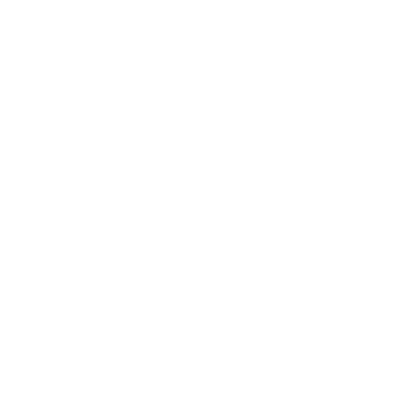

  
  <h1>Appunti Terminale</h1>
  
La riga di comando, spiegata — shell, filesystem, PATH e pacchetti

  
Appunti di studio in italiano sul terminale e la shell: cos'è, come muovercisi, la differenza tra bash e zsh, come la shell trova i comandi (il PATH) e dove finiscono i pacchetti installati globalmente. Otto capitoli visual-first, ognuno con un Ripasso lampo. Ambiente di riferimento macOS/zsh, con le differenze Linux/bash segnalate.

  

    <a class="cover-btn is-resume" id="nav-resume" href="#/" style="display:none"><svg width="18" height="18" viewBox="0 0 24 24" fill="none" stroke="currentColor" stroke-width="2" stroke-linecap="round" stroke-linejoin="round" aria-hidden="true"><path d="M3 12a9 9 0 1 0 9-9 9.75 9.75 0 0 0-6.74 2.74L3 8"/><path d="M3 3v5h5"/></svg>Riprendi</a>
    <a class="cover-btn is-primary" href="#/docs/01-cos-e-il-terminale"><svg width="18" height="18" viewBox="0 0 24 24" fill="none" stroke="currentColor" stroke-width="2" stroke-linecap="round" stroke-linejoin="round" aria-hidden="true"><polygon points="6 3 20 12 6 21 6 3"/></svg>Inizia a leggere</a>
    <a class="cover-btn" href="#/README"><svg width="18" height="18" viewBox="0 0 24 24" fill="none" stroke="currentColor" stroke-width="2" stroke-linecap="round" stroke-linejoin="round" aria-hidden="true"><path d="M8 6h13"/><path d="M8 12h13"/><path d="M8 18h13"/><path d="M3 6h.01"/><path d="M3 12h.01"/><path d="M3 18h.01"/></svg>Indice completo</a>
    <a class="cover-btn" href="#/docs/02-shell-sh-bash-zsh"><svg width="18" height="18" viewBox="0 0 24 24" fill="none" stroke="currentColor" stroke-width="2" stroke-linecap="round" stroke-linejoin="round" aria-hidden="true"><polyline points="4 17 10 11 4 5"/><line x1="12" y1="19" x2="20" y2="19"/></svg>bash vs zsh</a>
    <a class="cover-btn" href="#/docs/05-variabili-ambiente-path"><svg width="18" height="18" viewBox="0 0 24 24" fill="none" stroke="currentColor" stroke-width="2" stroke-linecap="round" stroke-linejoin="round" aria-hidden="true"><path d="M3 12h4l3-9 4 18 3-9h4"/></svg>PATH</a>
    <a class="cover-btn" href="#/docs/07-node-npm-frontend"><svg width="18" height="18" viewBox="0 0 24 24" fill="none" stroke="currentColor" stroke-width="2" stroke-linecap="round" stroke-linejoin="round" aria-hidden="true"><path d="M21 8V16a2 2 0 0 1-1 1.73l-7 4a2 2 0 0 1-2 0l-7-4A2 2 0 0 1 3 16V8a2 2 0 0 1 1-1.73l7-4a2 2 0 0 1 2 0l7 4A2 2 0 0 1 21 8z"/><path d="m3.3 7 8.7 5 8.7-5"/><path d="M12 22V12"/></svg>Node &amp; npm</a>
  

  

    

      <button class="about-head" type="button" aria-expanded="false">Com'è organizzato</button>
      

Otto capitoli in quattro aree:
        <ul>
          <li><strong>Basi</strong>: cos'è il terminale, le shell (sh/bash/zsh).</li>
          <li><strong>Filesystem</strong>: navigare, gestire file e cartelle.</li>
          <li><strong>Ambiente</strong>: variabili e PATH, file di configurazione.</li>
          <li><strong>Pratica</strong>: Node e npm nel frontend, comandi di tutti i giorni.</li>
        </ul>
      

    

    

      <button class="about-head" type="button" aria-expanded="false">Convenzioni</button>
      

        <ul>
          <li>Ambiente di riferimento <strong>macOS/zsh</strong>; differenze Linux/bash segnalate.</li>
          <li>Prosa in <strong>italiano</strong>, comandi e opzioni in <strong>inglese</strong> nel monospace.</li>
          <li>I comandi <strong>distruttivi</strong> sono marcati con ⚠️.</li>
          <li>Ogni comando verificato su <strong>man page</strong> e documentazione ufficiale.</li>
        </ul>
      

    

    

      <button class="about-head" type="button" aria-expanded="false">Struttura di ogni capitolo</button>
      

Ogni capitolo segue lo stesso schema:
        <ul>
          <li><strong>Spiegazione</strong> in prosa, con uno schema visivo.</li>
          <li><strong>Comandi</strong> in tabella, con esempi eseguibili.</li>
          <li><strong>Ripasso lampo</strong> — domande con risposta pieghevole.</li>
        </ul>
      

    

  

  
Appunti personali di studio: rielaborazioni originali, verificate su man page e documentazione ufficiale.

